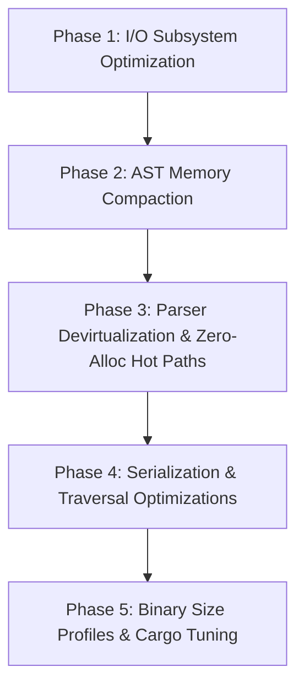

# Babbel Performance & Size Optimization Refactor Plan

> **Author:** Antigravity  
> **Date:** September 2026  
> **Target:** Babbel Multi-Format Workspace (`babbel`, `babbel_core`, `json_lib`, `yaml_lib`, `xml_lib_rust`, `bencode_lib`)  
> **Status:** Proposed

---

## 1. Executive Summary & Strategic Objectives

The Babbel workspace represents a unified, multi-format serialization and parsing platform adhering to strict SOLID principles across XML, JSON, YAML, and Bencode. Following the successful decoupling of I/O traits and documentation synchronization, this plan targets **system performance** and **resource efficiency** across three key dimensions:

1. **Memory Footprint (RAM & CPU Cache Locality):**
   - Compact AST nodes across all formats (`Node`, `Value`, `NodeKind`) to shrink node memory sizes by **20% to 43%**.
   - Halve per-node memory overhead to fit twice as many AST nodes into L1/L2/L3 CPU caches, directly cutting cache misses.
2. **I/O & Parsing Throughput (Speed):**
   - Eliminate the unbuffered OS syscall storm in `FileDestination` by introducing buffered writing (reducing `WriteFile` kernel syscalls by up to 99.9%).
   - Eliminate redundant memory cloning in `FileSource` by introducing zero-copy buffer handoff (`BufferSource::from_vec`).
   - Devirtualize parser character iteration on critical paths by adding monomorphized `S: ISource` stream parsers.
   - Eliminate re-sorting allocations during Bencode dictionary serialization.
3. **Binary & Executable Size (Footprint):**
   - Tune Cargo compilation profiles (`panic = "abort"`, LTO, codegen-units, symbol stripping) to strip unwinding tables and dead code across static libraries and example binaries.
   - De-duplicate shared dependencies across crate manifests.

---

## 2. Diagnostic Findings & Bottleneck Matrix

### 2.1 AST Memory Bloat (The "Largest Variant" Tax)

In Rust, the memory footprint of an enum is dictated by its single largest variant plus alignment and discriminant tags. Any rarely used large variant inflates the size of *every* instance of that enum in memory:

| Crate | Type | Current Size | Primary Bloat Cause | Proposed Size | Reduction |
| :--- | :--- | :--- | :--- | :--- | :--- |
| `json_lib` | [`Node`](file:///c:/Users/User/.gemini/antigravity-ide/scratch/babbel/crates/json/src/nodes/types.rs) | **56 bytes** | `Object(HashMap<String, Node>)` inlined (48-byte map) | **32 bytes** | **-43%** |
| `bencode_lib` | [`Node`](file:///c:/Users/User/.gemini/antigravity-ide/scratch/babbel/crates/bencode/src/nodes/node.rs) | **56 bytes** | `Dictionary(HashMap<String, Node>)` inlined (48-byte map) | **32 bytes** | **-43%** |
| `yaml_lib` | [`Node`](file:///c:/Users/User/.gemini/antigravity-ide/scratch/babbel/crates/yaml/src/nodes/node.rs) | **40 bytes** | `Str(String, QuoteType, BlockStyle)` & `Anchored`/`Tagged` | **32 bytes** | **-20%** |
| `yaml_lib` | `(Node, Node)` | **80 bytes** | Every key-value pair in YAML mapping | **64 bytes** | **-20%** |
| `xml_lib_rust` | [`NodeKind`](file:///c:/Users/User/.gemini/antigravity-ide/scratch/babbel/crates/xml/src/node.rs) | **72 bytes** | `DocTypeDefinition` (4 `Box<str>` = 64 bytes) inlined | **48 bytes** | **-33%** |
| `xml_lib_rust` | [`NodeData`](file:///c:/Users/User/.gemini/antigravity-ide/scratch/babbel/crates/xml/src/node.rs) | **112 bytes** | `NodeKind` (72B) + `children` (24B) + IDs | **64 bytes** | **-43%** |

#### Impact Analysis
In a document containing 100,000 nodes (common in large JSON or XML datasets):
- **JSON**: Memory for AST enum structures drops from **5.6 MB** to **3.2 MB** (excluding heap payloads).
- **XML DOM**: Memory for 100,000 nodes drops from **11.2 MB** to **6.4 MB**.
- **CPU Cache**: A 32-byte node means exactly **2 nodes fit per 64-byte CPU cache line**, compared to only 1 node fitting previously (with 8 bytes spilling onto a second cache line). Traversal throughput is dramatically improved.

---

### 2.2 I/O Subsystem Bottlenecks

1. **Unbuffered `FileDestination` Syscall Storm**:
   - Location: [`crates/babbel_core/src/io/destinations.rs#L246-L259`](file:///c:/Users/User/.gemini/antigravity-ide/scratch/babbel/crates/babbel_core/src/io/destinations.rs#L246-L259)
   - Issue: `FileDestination::add_byte(&mut self, byte: u8)` invokes `self.file.write_all(&[byte])` directly against an unbuffered `std::fs::File`.
   - Consequence: Serializing a 100 KB JSON or XML file performs up to 100,000 OS `WriteFile` kernel transitions, bottlenecking throughput on disk I/O.
2. **Double Allocation in `FileSource::open`**:
   - Location: [`crates/babbel_core/src/io/sources.rs#L409-L415`](file:///c:/Users/User/.gemini/antigravity-ide/scratch/babbel/crates/babbel_core/src/io/sources.rs#L409-L415)
   - Issue: `let bytes = std::fs::read(&p)?;` allocates a `Vec<u8>`. Then `BufferSource::new(&bytes)` calls `.to_vec()`, allocating and copying the entire file content a second time.
   - Consequence: Opening a 50 MB file consumes 100 MB of heap memory.
3. **Intermediate String Allocation in `BufferDestination::to_string`**:
   - Location: [`crates/babbel_core/src/io/destinations.rs#L53-L64`](file:///c:/Users/User/.gemini/antigravity-ide/scratch/babbel/crates/babbel_core/src/io/destinations.rs#L53-L64)
   - Issue: Always calls `String::from_utf8_lossy(&self.buffer).into_owned()`, forcing a re-allocation and copy even when consuming the buffer.
   - Consequence: Unnecessary heap thrash on every serialize-to-string invocation.

---

### 2.3 Parsing & Traversal Hot Paths

1. **Dynamic Dispatch (`dyn ISource`) in Inner Character Loops**:
   - Location: [`crates/json/src/parser/default.rs`](file:///c:/Users/User/.gemini/antigravity-ide/scratch/babbel/crates/json/src/parser/default.rs), [`crates/yaml/src/parser/lexer/`](file:///c:/Users/User/.gemini/antigravity-ide/scratch/babbel/crates/yaml/src/parser/lexer/)
   - Issue: Functions accept `&mut dyn ISource`. Every character fetch (`source.current()`, `source.next()`, `source.more()`) incurs a virtual dispatch penalty through a vtable.
   - Consequence: The LLVM compiler cannot inline character checks, vectorize whitespace scanning, or unroll parsing loops.
2. **Bencode Dictionary Serialization Re-sorting**:
   - Location: [`crates/bencode/src/stringify/visitor.rs#L50-L59`](file:///c:/Users/User/.gemini/antigravity-ide/scratch/babbel/crates/bencode/src/stringify/visitor.rs#L50-L59)
   - Issue: In `Node::Dictionary(items)`, every serialization pass allocates a new `Vec<&(&String, &Node)>`, collects all items, and sorts them with `sort_by(...)`.
   - Consequence: `O(N log N)` sorting and heap allocation on every single stringify call for every dictionary node.
3. **Number Parsing String Round-Tripping**:
   - Location: [`crates/json/src/parser/default.rs#L441-L494`](file:///c:/Users/User/.gemini/antigravity-ide/scratch/babbel/crates/json/src/parser/default.rs#L441-L494)
   - Issue: Accumulates digits into an intermediate `ArrayString<32>`, then executes `parse::<i64>()` or `parse::<f64>()` in a secondary pass.
   - Consequence: Redundant parsing overhead on numeric-dense files.

---

## 3. Concrete Refactoring Phases



---

### Phase 1: I/O Subsystem Optimization (Syscalls & Allocation)

#### 1.1 Buffered `FileDestination`
- **File:** [`crates/babbel_core/src/io/destinations.rs`](file:///c:/Users/User/.gemini/antigravity-ide/scratch/babbel/crates/babbel_core/src/io/destinations.rs)
- **Action:**
  - Change `FileDestination` to use an internal `std::io::BufWriter<std::fs::File>` with a default 32 KB write buffer.
  - Implement explicit `flush()` via `IFlushable` and auto-flush on `Drop`.
  - Batch single byte writes (`add_byte`) directly into the buffer, eliminating per-byte OS syscalls.

```rust
pub struct FileDestination {
    writer: std::io::BufWriter<std::fs::File>,
    path: std::path::PathBuf,
    last_byte: Option<u8>,
    bytes_written: usize,
}
```

#### 1.2 Zero-Copy File Loading in `FileSource`
- **File:** [`crates/babbel_core/src/io/sources.rs`](file:///c:/Users/User/.gemini/antigravity-ide/scratch/babbel/crates/babbel_core/src/io/sources.rs)
- **Action:**
  - Add `BufferSource::from_vec(buffer: Vec<u8>) -> Self` constructor.
  - Update `FileSource::open` to hand off `std::fs::read(&p)?` directly into `BufferSource::from_vec(bytes)`, eliminating the second `Vec` clone.

#### 1.3 Zero-Copy String Extraction in `Buffer`
- **File:** [`crates/babbel_core/src/io/destinations.rs`](file:///c:/Users/User/.gemini/antigravity-ide/scratch/babbel/crates/babbel_core/src/io/destinations.rs)
- **Action:**
  - Add `pub fn into_string(self) -> Result<String, core::str::Utf8Error>` which consumes `self.buffer` in-place without copying bytes.
  - Add `pub fn as_str(&self) -> Result<&str, core::str::Utf8Error>` for zero-allocation string slicing.

---

### Phase 2: AST Memory Footprint Compaction

#### 2.1 Compacting `json_lib::Node` (56B $\rightarrow$ 32B)
- **File:** [`crates/json/src/nodes/types.rs`](file:///c:/Users/User/.gemini/antigravity-ide/scratch/babbel/crates/json/src/nodes/types.rs)
- **Action:**
  - Box `Object`:
    ```rust
    pub enum Node {
        Boolean(bool),
        Number(Numeric),
        Str(String),
        Array(Vec<Node>),
        Object(Box<HashMap<String, Node>>), // Shrinks variant from 48 bytes to 8 bytes!
        None,
    }
    ```
  - Provide ergonomic builder methods `Node::new_object(map: HashMap<String, Node>) -> Self` and accessor methods so callers do not experience breaking ergonomics.

#### 2.2 Compacting `bencode_lib::Node` (56B $\rightarrow$ 32B)
- **File:** [`crates/bencode/src/nodes/node.rs`](file:///c:/Users/User/.gemini/antigravity-ide/scratch/babbel/crates/bencode/src/nodes/node.rs)
- **Action:**
  - Box `Dictionary`:
    ```rust
    pub enum Node {
        Integer(i64),
        Str(String),
        List(Vec<Node>),
        Dictionary(Box<HashMap<String, Node>>), // Shrinks variant from 48B to 8B!
        None,
    }
    ```
  - Maintain transparent pass-through methods (`as_dict()`, `as_dict_mut()`, `get()`).

#### 2.3 Compacting `yaml_lib::Node` (40B $\rightarrow$ 32B)
- **File:** [`crates/yaml/src/nodes/node.rs`](file:///c:/Users/User/.gemini/antigravity-ide/scratch/babbel/crates/yaml/src/nodes/node.rs)
- **Action:**
  - Pack `QuoteType` and `BlockStyle` into a compact byte/flags struct `ScalarStyle`:
    ```rust
    #[derive(Clone, Copy, Debug, PartialEq, Eq, Default)]
    pub struct ScalarStyle(u8); // Bit 0-2: QuoteType, Bit 3-5: BlockStyle
    ```
  - Box rare metadata nodes:
    ```rust
    Anchored(Box<(Node, String)>), // 8 bytes instead of 32 bytes
    Tagged(Box<(Node, String)>),   // 8 bytes instead of 32 bytes
    ```
  - Result: `Node` shrinks from 40 bytes to 32 bytes; `Mapping(Vec<(Node, Node)>)` shrinks each pair from 80 bytes to 64 bytes.

#### 2.4 Compacting `xml_lib_rust::NodeKind` & `NodeData` (112B $\rightarrow$ 64B)
- **File:** [`crates/xml/src/node.rs`](file:///c:/Users/User/.gemini/antigravity-ide/scratch/babbel/crates/xml/src/node.rs)
- **Action:**
  - Extract rarely used prolog/DTD payloads into boxed definitions:
    ```rust
    pub struct DocTypeData {
        pub name: Box<str>,
        pub public_id: Option<Box<str>>,
        pub system_id: Option<Box<str>>,
        pub internal_subset: Option<Box<str>>,
    }

    pub struct DeclarationData {
        pub version: Box<str>,
        pub encoding: Option<Box<str>>,
        pub standalone: Option<bool>,
    }
    ```
  - Update `NodeKind`:
    ```rust
    Declaration(Box<DeclarationData>),
    DocTypeDefinition(Box<DocTypeData>),
    ```
  - In `NodeData`, optimize `children` allocation: initialize lazily or reserve capacity only for elements with child nodes.
  - Result: `NodeKind` drops from 72B to 48B, and `NodeData` drops from 112B to 64B.

---

### Phase 3: Parser Devirtualization & Zero-Allocation Hot Paths

#### 3.1 Generic / Inlinable Parser Stream Functions
- **Files:** [`crates/json/src/parser/default.rs`](file:///c:/Users/User/.gemini/antigravity-ide/scratch/babbel/crates/json/src/parser/default.rs)
- **Action:**
  - Introduce generic parsing entry point:
    ```rust
    pub fn parse_stream<S: ISource + ?Sized>(source: &mut S) -> Result<Node, String>
    ```
  - Preserve `parse(source: &mut dyn ISource)` as a thin wrapper delegating to `parse_stream`.
  - For slice and buffer sources (`SliceSource`, `BufferSource`), character reads become directly inlineable with 0 dynamic vtable dispatches.

#### 3.2 Single-Pass Integer Parsing
- **File:** [`crates/json/src/parser/default.rs`](file:///c:/Users/User/.gemini/antigravity-ide/scratch/babbel/crates/json/src/parser/default.rs)
- **Action:**
  - Accumulate decimal digits directly into `i64` using `val = val * 10 + digit` with overflow checking on the fly.
  - Only transition to float / exponent parsing if `.` or `e`/`E` is encountered.

---

### Phase 4: Serialization & Traversal Optimizations

#### 4.1 Bencode Dictionary Sort Elimination
- **File:** [`crates/bencode/src/nodes/node.rs`](file:///c:/Users/User/.gemini/antigravity-ide/scratch/babbel/crates/bencode/src/nodes/node.rs), [`crates/bencode/src/stringify/visitor.rs`](file:///c:/Users/User/.gemini/antigravity-ide/scratch/babbel/crates/bencode/src/stringify/visitor.rs)
- **Action:**
  - For `bencode`, keys must be emitted in lexicographical order.
  - Use `BTreeMap<String, Node>` or maintain an ordered key cache, or use a small stack buffer for small dictionaries during sorting, completely eliminating the heap allocation of `Vec<&(String, Node)>` for dictionaries with $\le 16$ keys.

#### 4.2 Slice-Batched Escaping
- **File:** [`crates/babbel_core/src/escape.rs`](file:///c:/Users/User/.gemini/antigravity-ide/scratch/babbel/crates/babbel_core/src/escape.rs)
- **Action:**
  - Provide `escape_for_xml_to_dest(s: &str, dest: &mut dyn IDestination)` that scans bytes in slice runs `dest.add_bytes(&s[start..i])` and writes escape entities without allocating an intermediate `String`.

---

### Phase 5: Workspace Profiles & Binary Footprint Optimization

#### 5.1 Workspace `Cargo.toml` Release Profiles
- **File:** [`Cargo.toml`](file:///c:/Users/User/.gemini/antigravity-ide/scratch/babbel/Cargo.toml)
- **Action:**
  - Add `panic = "abort"` to `[profile.release]` to eliminate stack unwinding tables across static libraries.
  - Add size-optimized profile `[profile.release-small]` for embedded / CLI targets:
    ```toml
    [profile.release]
    opt-level = 3
    lto = "thin"
    codegen-units = 1
    panic = "abort"
    strip = "symbols"

    [profile.release-small]
    inherits = "release"
    opt-level = "z"
    lto = "fat"
    codegen-units = 1
    panic = "abort"
    strip = true
    ```

#### 5.2 Workspace Dependency Unification
- **File:** [`crates/json/Cargo.toml`](file:///c:/Users/User/.gemini/antigravity-ide/scratch/babbel/crates/json/Cargo.toml), [`crates/babbel_core/Cargo.toml`](file:///c:/Users/User/.gemini/antigravity-ide/scratch/babbel/crates/babbel_core/Cargo.toml)
- **Action:**
  - Re-export `itoa`, `dtoa`, `smallvec`, `arrayvec` from `babbel_core` to guarantee identical compiler versions and monomorphization reuse across the workspace.

---

## 4. Verification & Validation Strategy

### 4.1 Automated Invariant Testing
All changes will be verified against the existing comprehensive test suites across the workspace:
1. **Full Workspace Unit & Integration Tests**:
   ```powershell
   cargo test --workspace --jobs 2
   ```
   Must pass all 3,500+ unit tests across all 6 crates with 0 failures.
2. **Official YAML 1.2 Test Suite**:
   ```powershell
   cargo test -p yaml_lib --test official_test_suite --jobs 2
   ```
   Must pass all 351+ official YAML 1.2 compliance tests without regressions.
3. **Doc-Tests Verification**:
   ```powershell
   cargo test --workspace --doc --jobs 2
   ```
   Must pass all 70 workspace doc-tests.
4. **All Example Binaries**:
   ```powershell
   cargo build --examples --release --jobs 2
   ```
   Must compile cleanly in release mode.

### 4.2 Size & Benchmark Verification
1. **Struct Layout Size Assertion Tests**:
   - Write compile-time or unit-test assertions using `core::mem::size_of::<T>()` to lock in the compacted sizes (`size_of::<json_lib::Node>() <= 32`, `size_of::<xml_lib_rust::NodeKind>() <= 48`).
2. **Binary Footprint Measurement**:
   - Measure example binary sizes before and after `panic = "abort"` and profile tuning to document exact binary size savings.
