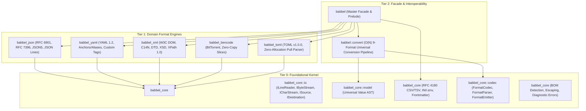

# Babbel Architecture & Design Principles

Babbel is a high-performance, polyglot serialization, parsing, and document manipulation ecosystem in Rust. It unifies **JSON**, **YAML**, **Bencode**, **XML**, **CSV / TSV**, **INI / Properties**, and **JSON Lines** under a cohesive multi-crate architecture adhering strictly to **DRY** (Don't Repeat Yourself) and **SOLID** engineering principles.

---

## 1. 3-Tier Layering Model

Babbel is architected across three distinct, decoupled tiers:



### Layer 0: The Core Kernel (`babbel_core`)
* **Independence**: Has zero dependencies on any format parser. Compiles for both standard library and `no_std` + `alloc` environments.
* **Responsibilities**:
  * **Streaming I/O**: Segregated interfaces for pull-based character streaming (`ICharStream`), binary byte reading (`IByteStream`), line-by-line streaming across mixed CRLF/LF/CR (`ILineReader`), rewindability (`IRewindable`), location awareness (`ILocationAware`), and buffered destinations (`IDestination`).
  * **Universal AST (`Value`)**: Canonically represents arbitrary structured data (`Null`, `Bool`, `Integer(i128)`, `Float`, `String`, `Array`, `Object`, `Bytes`).
  * **Text Engines**:
    * **RFC 4180 Delimited Text (`csv`)**: High-performance CSV & TSV parsing and emission, delimiter auto-sniffing, multi-line quoted fields, and scalar type inference.
    * **Configuration Text (`ini`)**: Section-based INI (`[section]`), `.properties`, and `.env` parsing, comment handling (`#`, `;`, `!`), and emission.
    * **Frontmatter & Line Utilities (`text`)**: Extracting YAML (`---`) and TOML (`+++`) metadata blocks (`split_frontmatter`), indentation trimming (`indent`, `dedent`, `trim_lines`).
  * **Codec Interfaces**: Defines `FormatParser`, `FormatEmitter`, and `FormatCodec` abstractions.
  * **Embedded Systems & Zero-Allocation (`embedded`)**:
    * **Stack Destinations**: `SliceDestination<'a>` and `ArrayVecDestination<const N>` allow writing directly into caller-provided stack memory with zero dynamic allocations.
    * **Streaming Pull Parsers**: `JsonPullParser`, `XmlPullParser`, `CsvPullParser`, and `IniPullParser` enable microcontrollers with 16–64 KB RAM to parse documents of arbitrary size with $O(1)$ stack memory.
    * **Memory Control**: `StackBuffer<const N>`, `MemoryTracker`, `EmbeddedLimits`, and 8-byte `CompactError` ensure deterministic execution without heap fragmentation.
  * **DRY Primitives**: Unicode BOM auto-detection (UTF-8, UTF-16 LE/BE, UTF-32 LE/BE), newline normalization, zero-allocation integer formatting via `itoa`, fast float formatting via `dtoa`, and canonical string escaping.

### Layer 1: Domain Format Engines (`babbel_json`, `babbel_yaml`, `babbel_bencode`, `babbel_xml`, `babbel_toml`)
* **Grammar & Semantics**: Each engine implements parsing, syntax validation, document navigation, and serialization for its specific specification.
* **JSON Lines Streaming**: `babbel_json::lines` provides streaming `JsonLinesReader` and `to_json_lines` over `ILineReader`.
* **Abstractions**: All format engines depend on `babbel_core::io` abstractions rather than hardcoded OS files or heap buffers.
* **Autonomy**: Each crate can be consumed independently with minimal binary footprint.

### Layer 2: Facade & Interoperability (`babbel`)
* **Ergonomics**: Provides unified prelude imports and re-exports all format engines and core text engines under feature flags.
* **$O(N)$ Universal Conversion**: Cross-format conversion pipelines (`babbel::convert`) between JSON, YAML, XML, Bencode, CSV, TSV, INI, and JSON Lines run through the intermediate `Value` AST or streaming codecs without requiring $O(N^2)$ point-to-point converters.

---

## 2. SOLID Principles in Rust

### Single Responsibility Principle (SRP)
* **Transport vs. Syntax**: `FileSource`, `BufferSource`, and `FileDestination` manage strictly binary and character transfer. They contain zero knowledge of JSON brackets, YAML indentation, CSV quotes, or XML tags.
* **Segregated Operations**: Reading (`IByteStream`, `ICharStream`, `ILineReader`), writing (`IByteWriter`), tail inspection (`ITailInspectable`), stream resetting (`IRewindable`), and storage synchronization (`IFlushable`) are decoupled into single-focus traits.

### Open/Closed Principle (OCP)
* **Format Extensibility**: Introducing a new format (e.g. TOML, MessagePack) requires only implementing `FormatParser` and `FormatEmitter` from `babbel_core::codec`. The conversion pipeline (`babbel::convert`) immediately supports the new format without any modifications.
* **Stream Extensibility**: Custom streams (e.g., memory-mapped files, compressed streams, network sockets) implement `ICharStream`, `IByteStream`, or `ILineReader` and can be passed directly to all parsers.

### Liskov Substitution Principle (LSP)
* **Consistent Stream Invariants**:
  * Character streams (`ICharStream`) guarantee valid UTF-8 scalar decoding across all implementations (`SliceSource`, `BufferSource`, `FileSource`). Multi-byte UTF-8 sequences are never truncated by naive byte casts.
  * Line readers (`ILineReader`) correctly handle `\r\n`, `\n`, and `\r` across all sources.
  * Destinations (`IDestination`) guarantee safe tail inspection (`last()`) without file system side-effects or file handle reopening locks on Windows.
* **Substitutability**: Any function expecting `&mut dyn ISource` behaves identically whether given a file on disk or an in-memory buffer.

### Interface Segregation Principle (ISP)
Clients bind only to the minimal interface required for their operation:

| Trait | Focus | Primary Implementor / Consumer |
| :--- | :--- | :--- |
| `ILineReader` | Line-by-line text reading across CRLF/LF/CR (`read_line`, `read_line_into`, `lines`) | Text engines, JSON Lines, CSV |
| `IByteStream` | Forward byte reading (`read_byte`, `peek_byte`, `advance`) | Binary protocols (`babbel_bencode`) |
| `IByteWriter` | Binary byte writing (`write_byte`, `write_bytes`) | Binary serialization |
| `ICharStream` | Minimal forward character pull (`next`, `current`, `more`) | Lightweight parsers |
| `IRewindable` | Stream position reset (`reset`) | Multi-pass parsers |
| `IPositionAware` | Absolute byte offset (`position`) | Token spans and diagnostics |
| `ILocationAware` | Line and column metrics (`line`, `column`) | Diagnostic error reporters |
| `ITailInspectable` | Inspect last written byte (`last_byte`) | Comma-separation formatters |
| `IClearable` | Truncate buffer/storage (`clear`) | Buffer pooling & recycling |
| `IFlushable` | Flush buffered bytes (`flush`) | File and network I/O |
| `IIndentationAware`| Current column / indent calculation | Whitespace-sensitive grammars (`babbel_yaml`) |

### Dependency Inversion Principle (DIP)
* **High-level parsers** depend upon trait abstractions (`ISource`, `ICharStream`, `IByteStream`, `ILineReader`).
* **High-level serializers** depend upon `IDestination` and `IByteWriter`.
* Concrete OS file handles and heap buffers depend upon these abstractions via implementations in `babbel_core::io`.

---

## 3. Universal Data Model & Interoperability

The `Value` enum in `babbel_core::model` acts as the lingua franca of the ecosystem:

```rust
pub enum Value {
    Null,
    Bool(bool),
    Integer(i128),
    Float(f64),
    String(String),
    Bytes(Vec<u8>),
    Array(Vec<Value>),
    Object(Vec<(String, Value)>),
}
```

### Format Mapping Matrix

| `Value` Variant | JSON | YAML | XML | Bencode | TOML | CSV / TSV | INI / .env | JSON Lines |
| :--- | :--- | :--- | :--- | :--- | :--- | :--- | :--- | :--- |
| `Null` | `null` | `null` / `~` | `<item nil="true"/>` / empty | *(omitted/empty)* | `""` / *(omitted)* | empty cell | empty / omitted | `null` |
| `Bool(b)` | `true` / `false` | `true` / `false` | `<item>true</item>` | `i1e` / `i0e` | `true` / `false` | `true` / `false` | `true` / `false` | `true` / `false` |
| `Integer(i)`| Number (`42`) | Integer (`42`) | `<item>42</item>` | `i42e` | Integer (`42`) | Integer string | Integer string | Number (`42`) |
| `Float(f)` | Number (`3.14`) | Float (`3.14`) | `<item>3.14</item>` | Stringified float | Float (`3.14`) | Float string | Float string | Number (`3.14`) |
| `String(s)` | String (`"hi"`) | String (`hi`) | Text node (`hi`) | `2:hi` | String (`"hi"`) | Escaped cell | Quoted / raw string| String (`"hi"`) |
| `Array(v)` | Array (`[...]`) | Sequence (`- ...`)| Elements (`<item>...`) | `l...e` | Array (`[...]`) | Row cells or rows | `<array>` fallback | Single-line arrays |
| `Object(o)` | Object (`{...}`) | Mapping (`k: v`) | Element tags / attrs | `d...e` | Table / inline `{}` | Header $\rightarrow$ cell map| `[section]` & `k = v`| Record per line |
| `Bytes(b)` | Base64 string | `!!binary` (Base64) | Base64 text node | `len:bytes` | Escaped string | `<bytes>` fallback | `<bytes>` fallback | Base64 string |

---

## 4. Performance & Memory Optimizations

1. **Memory Compacted Node Layouts**:
   - `babbel_core::Value`: compacted to **32 bytes**.
   - `babbel_toml::Node`: compacted to **48 bytes**.
   - `babbel_json::Node`: compacted to **56 bytes**.
   - `babbel_xml::NodeKind`: compacted from 72 bytes to **48 bytes** via targeted boxing.
   - `babbel_xml::NodeData`: compacted from 112 bytes to **88 bytes**.
   - `babbel_yaml::Node`: compacted to **40 bytes**.
   - `babbel_bencode::Node`: compacted to **56 bytes**.
   - Validated continuously via automated assertion tests in `crates/babbel/tests/size_checks.rs`.
2. **Zero-Copy Where Feasible**:
   - `babbel_bencode` provides `BorrowedNode<'a>`, slicing directly from input buffers with zero heap allocations.
   - `babbel_xml` provides `slice_range(start, end)` directly over UTF-8 string buffers.
   - `SliceSource<'a>` reads directly from borrowed byte slices and yields line slices with `read_line_slice()`.
3. **Elimination of I/O System Call Overhead**:
   - `FileDestination` maintains in-memory tracking of written length and the last written byte, eliminating disk seeks and handle re-opening.
   - `FileSource` buffers disk reads in memory, preventing individual 1-byte system calls.
4. **Small-Vector & Inlining**:
   - Short string escaping utilizes stack-allocated buffers for ASCII sequences before falling back to heap allocations.
   - Numerical conversions use `itoa` and `dtoa` without allocating intermediate strings.
