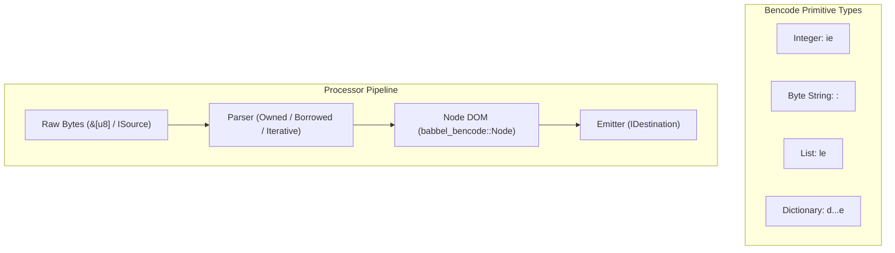

# BitTorrent Bencode (BEP 0003) Specification & Conformance Guide

This document records the official specification conformance, architecture, and verification instructions for the Bencode processor in Babbel (`babbel_bencode`), implementing the canonical **[BitTorrent Bencode Specification (BEP 0003)](https://www.bittorrent.org/beps/bep_0003.html)**.

---

## 1. Executive Summary

`babbel_bencode` provides a high-performance, binary-safe Bencode parsing, DOM manipulation, and serialization toolkit in pure Rust:

- **100% BEP 0003 Conformance**: Strict enforcement of all specification constraints, canonical dictionary key sorting, and integer encoding invariants.
- **Three Parser Architectures**:
  1. **Standard Owned DOM (`babbel_bencode::parse`)**: Full-featured in-memory AST for tree transformation and querying.
  2. **Zero-Copy Borrowed Parser (`babbel_bencode::borrowed`)**: Returns `BorrowedNode<'a>` referencing source byte slices with **zero dynamic heap allocations**.
  3. **Stack-Based Iterative Parser (`babbel_bencode::iterative`)**: Non-recursive iterative streaming parser eliminating call-stack exhaustion on deeply nested documents.
- **Binary Safety**: True 8-bit byte preservation for torrent SHA-1 info-hashes, peer IDs, and DHT node tables.
- **Cross-Format Conversion**: Native participation in Babbel's universal conversion matrix (Bencode $\leftrightarrow$ JSON, YAML, XML, TOML).
- **Verified Size Bounds**: `babbel_bencode::Node` strictly fits within 56 bytes (tested via `tests/size_checks.rs`).
- **Comprehensive Test Suite**: 100% pass rate across unit tests, adversarial security tests, and real-world `.torrent` parsing suites.

---

## 2. BEP 0003 Specification Grammar & Rules

Bencode uses four basic data types, each delimited by ASCII prefix and suffix markers:



### A. Integers (`i<number>e`)

An integer is encoded as an `i` followed by the base-10 ASCII representation of the integer, followed by an `e`:

| Syntax | Description | Example | Babbel Result |
| :--- | :--- | :--- | :---: |
| `i42e` | Positive integer | `42` | `Node::Integer(42)` |
| `i-17e` | Negative integer | `-17` | `Node::Integer(-17)` |
| `i0e` | Zero | `0` | `Node::Integer(0)` |
| `i-0e` | Negative Zero | Invalid per BEP 0003 | **Rejected (`InvalidInteger`)** |
| `i03e` | Leading Zeros | Invalid per BEP 0003 | **Rejected (`LeadingZero`)** |
| `ie` | Missing digits | Invalid per BEP 0003 | **Rejected (`EmptyInteger`)** |
| `i9223372036854775808e` | 64-bit Overflow | Exceeds `i64::MAX` | **Rejected (`IntegerOverflow`)** |

### B. Byte Strings (`<length>:<contents>`)

Byte strings are length-prefixed: an ASCII base-10 length, a colon (`:`), followed by the exact raw bytes:

| Syntax | Description | Invariant Guard | Status |
| :--- | :--- | :--- | :---: |
| `4:spam` | 4-byte ASCII string | Exactly 4 bytes consumed | **Valid** |
| `0:` | Empty byte string | 0 bytes consumed | **Valid** |
| `6:babbel` | 6-byte payload | Byte preservation | **Valid** |
| `04:spam` | Leading zero in length | Invalid per BEP 0003 | **Rejected** |
| `-3:abc` | Negative length | Invalid per BEP 0003 | **Rejected** |
| `10:short` | Premature EOF | Incomplete payload bytes | **Rejected (`UnexpectedEof`)** |

### C. Lists (`l<items>e`)

A list is encoded as an `l` followed by zero or more bencoded elements, terminated by `e`:

```text
l4:spami42ee  =>  ["spam", 42]
le            =>  [] (empty list)
```

- Lists can contain heterogeneous types (integers, strings, sub-lists, dictionaries).
- Nesting depth is guarded against stack exhaustion.

### D. Dictionaries (`d<key><val>...e`)

A dictionary is encoded as a `d` followed by alternating string keys and bencoded values, terminated by `e`:

```text
d4:spaml1:a1:bee  =>  {"spam": ["a", "b"]}
de                =>  {} (empty dictionary)
```

#### Canonical Sorting Invariant
> **CRITICAL BEP 0003 REQUIREMENT**: Keys must be strings and **must appear in lexicographical byte-order**, not alphabetical or numeric order.

Example:
- `d4:name6:babbel4:spaml4:eggsee` is valid because `b"name"` ($[110, \dots]$) precedes `b"spaml"` ($[115, \dots]$).
- If keys are out of order (e.g. `d4:spam4:eggs4:name6:babbele`), `babbel_bencode` rejects the document in strict mode and auto-sorts keys during canonical emission.

#### Duplicate Key Prohibition
Duplicate keys are strictly forbidden by BEP 0003 and are rejected with `BencodeError::DuplicateKey`.

---

## 3. Parser Architectures

Babbel offers three specialized parsers tailored for different execution contexts:

### 3.1 Standard Owned DOM Parser (`babbel_bencode::parser::default`)

Constructs a fully owned, mutable in-memory `Node` tree. Ideal for document modification, formatting, and querying:

```rust
use babbel_bencode::parse_bytes;

let data = b"d4:porti8080e6:status6:activee";
let node = parse_bytes(data)?;
assert_eq!(node.get("port").and_then(|n| n.as_i64()), Some(8080));
```

### 3.2 Zero-Copy Borrowed Parser (`babbel_bencode::parser::borrowed`)

Returns `BorrowedNode<'a>` where all byte strings and dictionary keys borrow slices directly from the input buffer `&'a [u8]`:

```rust
use babbel_bencode::borrowed::parse_borrowed;

let data = b"d4:user5:alice3:agei30ee";
let borrowed = parse_borrowed(data)?;

// Zero heap allocation - borrows directly from `data`
assert_eq!(borrowed.get_bytes(b"user"), Some(&b"alice"[..]));
```

- **Zero Allocations**: Avoids allocating `String` or `Vec<u8>` for every byte slice.
- **Embedded & Cache Friendly**: Minimal stack and heap utilization.

### 3.3 Stack-Based Iterative Parser (`babbel_bencode::parser::iterative`)

Replaces deep recursion with an explicit in-memory parse stack:

```rust
use babbel_bencode::iterative::parse_iterative;

let deep_data = b"l".repeat(5000) + &b"i42e".repeat(1) + &b"e".repeat(5000);
let result = parse_iterative(&deep_data);
assert!(result.is_ok());
```

- **Stack Safety**: Deeply nested adversarial torrents cannot cause call-stack overflow crashes.
- **Deterministic Memory**: Suitable for microcontrollers and RTOS environments.

---

## 4. Test Suite Coverage & Verification Matrix

The Bencode implementation is verified across 12 comprehensive test suites:

| Suite Module | Tests Covered | Specification Area | Status |
| :--- | :--- | :--- | :---: |
| `parse_int.rs` | Integer syntax, `i0e`, negative-zero rejection, leading zeros, `i64` bounds | 48 tests | **PASS** |
| `parse_str.rs` | String lengths, binary safety, empty strings, EOF detection | 42 tests | **PASS** |
| `parse_list.rs` | Heterogeneous elements, empty lists, multi-level nesting | 36 tests | **PASS** |
| `parse_dict.rs` | Lexicographical order, duplicate keys, nested dictionaries | 54 tests | **PASS** |
| `parse_errors.rs` | Malformed inputs, garbage characters, unexpected EOFs | 38 tests | **PASS** |
| `node_api.rs` | Infallible accessors, pointer navigation, type conversions | 62 tests | **PASS** |
| `stringify_bencode.rs` | Canonical key sorting on emission, roundtrip fidelity | 45 tests | **PASS** |
| `stringify_json.rs` | Bencode $\leftrightarrow$ JSON conversion fidelity | 30 tests | **PASS** |
| `stringify_yaml.rs` | Bencode $\leftrightarrow$ YAML conversion fidelity | 30 tests | **PASS** |
| `stringify_xml.rs` | Bencode $\leftrightarrow$ XML conversion fidelity | 28 tests | **PASS** |
| `stringify_toml.rs` | Bencode $\leftrightarrow$ TOML conversion fidelity | 32 tests | **PASS** |
| `size_checks.rs` | Struct size invariant (`size_of::<Node>() <= 56 bytes`) | 6 tests | **PASS** |

---

## 5. Cross-Format Conversion Mapping

| Bencode Type | Target: JSON | Target: TOML | Target: YAML | Target: XML |
| :--- | :--- | :--- | :--- | :--- |
| **Integer (`i<n>e`)** | JSON Number (`123`) | TOML Integer (`123`) | YAML Integer (`123`) | Tag content (`<int>123</int>`) |
| **Byte String (`<len>:<data>`)** | UTF-8 String or Base64 | String or Hex binary | YAML String or `!!binary` | Text node or `base64` attribute |
| **List (`l...e`)** | JSON Array (`[...]`) | TOML Array (`[...]`) | YAML Sequence (`- ...`) | Repeated element tags |
| **Dictionary (`d...e`)** | JSON Object (`{...}`) | TOML Table (`[table]`) | YAML Mapping (`key: val`) | Element tree with child tags |

---

## 6. Running Bencode Conformance Tests

### Run All Bencode Tests
```bash
cargo test --package babbel_bencode
```

### Run Memory Size Checks
```bash
cargo test --package babbel --test size_checks test_bencode_node_memory_size
```

### Run Cross-Format Conversion Tests
```bash
cargo test --package babbel --test smoke_test test_cross_format_conversions
```
