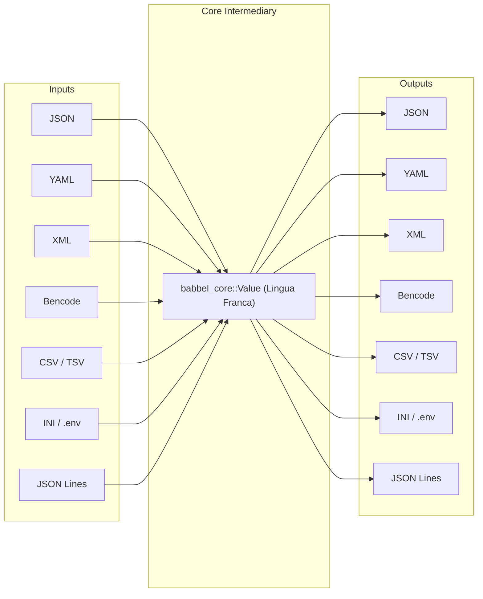

# Babbel Cross-Format Conversion Matrix

Babbel provides an open-ended, $O(N)$ universal conversion pipeline between **JSON**, **YAML**, **XML**, **Bencode**, **CSV**, **TSV**, **INI**, and **JSON Lines**.

---

## 1. The $O(N)$ Architecture

In traditional multi-format toolkits, converting between $M$ formats requires $O(M^2)$ point-to-point converters (e.g. `json_to_yaml`, `json_to_xml`, `yaml_to_xml`, `csv_to_json`, etc.). This leads to explosive code duplication, inconsistent edge-case behavior, and exponential maintenance costs.

Babbel solves this by utilizing the **Open-Closed Principle (OCP)** and **Dependency Inversion Principle (DIP)**:



Every format simply implements:
- [`FormatParser`](../crates/babbel_core/src/codec.rs): Parses native bytes/text into `Value`.
- [`FormatEmitter`](../crates/babbel_core/src/codec.rs): Emits `Value` into native bytes/text.

With $M$ formats, adding support for format $M+1$ requires **only 1 parser and 1 emitter** ($2$ implementations), immediately enabling conversions to and from all existing $M$ formats!

---

## 2. Generic Conversion Pipelines

Babbel exposes two universal pipeline functions in [`babbel::convert`](../crates/babbel/src/convert.rs):

### Text-to-Text Pipeline (`convert_text`)
```rust
pub fn convert_text<P: FormatParser, E: FormatEmitter>(
    input: &str,
    parser: &P,
    emitter: &E,
) -> Result<String, BabbelError>
```

### Byte-to-Byte Pipeline (`convert_bytes`)
```rust
pub fn convert_bytes<P: FormatParser, E: FormatEmitter>(
    input: &[u8],
    parser: &P,
    emitter: &E,
) -> Result<Vec<u8>, BabbelError>
```

---

## 3. Supported Format Conversion Matrix

The table below outlines semantic behavior across conversion pairs:

| From \ To | JSON | YAML | XML | Bencode | TOML | CSV / TSV | INI / .env | JSON Lines |
| :--- | :--- | :--- | :--- | :--- | :--- | :--- | :--- | :--- |
| **JSON** | Formatting / minification | 1:1 structural mapping | Tag/attribute mapping | String keys, ints, lists | Object $\rightarrow$ TOML tables | Array of objects $\rightarrow$ columns | Nested objects $\rightarrow$ `[sections]` | Array $\rightarrow$ 1 record/line |
| **YAML** | Full mapping, drops anchors | Direct emission | Structured tags | Ints, dicts, byte strings | 1:1 table/array mapping | Sequence of mappings $\rightarrow$ table | Mapping $\rightarrow$ sections & keys | Sequence $\rightarrow$ line records |
| **XML** | Element tree $\rightarrow$ JSON | Elements $\rightarrow$ mapping | C14N Canonicalization | Encoded element nodes | Elements $\rightarrow$ TOML tables | Flat row elements $\rightarrow$ CSV | Key elements $\rightarrow$ properties | Sequence elements $\rightarrow$ JSONL |
| **Bencode** | Dictionary $\rightarrow$ Object | Dict $\rightarrow$ Map, lists | Bytes $\rightarrow$ Base64 nodes | Re-sorting dictionary keys | Dictionaries $\rightarrow$ tables | List of dicts $\rightarrow$ CSV | Dict $\rightarrow$ key-value pairs | List of dicts $\rightarrow$ JSONL |
| **TOML** | Table $\rightarrow$ JSON Object | Tables $\rightarrow$ Mappings | Tables $\rightarrow$ XML nodes | Dicts, ints, byte strings | Standard / pretty format | Array of tables $\rightarrow$ rows | Sections $\leftrightarrow$ tables | Array of tables $\rightarrow$ JSONL |
| **CSV / TSV**| Array of row objects | Sequence of mapping rows | Rows $\rightarrow$ `<row>` elements | List of dictionary rows | Rows $\rightarrow$ array of tables | Delimiter swap (CSV $\leftrightarrow$ TSV) | Not recommended (flat table) | 1 record per line |
| **INI / .env**| Nested object of sections| Section mappings | Properties $\rightarrow$ XML nodes| Key-value dictionary | Sections $\rightarrow$ tables | Sections $\rightarrow$ table records | Delimiter swap (`=` $\leftrightarrow$ `:`) | Section objects $\rightarrow$ JSONL |
| **JSON Lines**| Array of all records | Multi-document stream | Line records $\rightarrow$ XML | List of dictionary rows | Records $\rightarrow$ array of tables| Unified header table | Object records $\rightarrow$ sections | Filter / re-chunk stream |

---

## 4. High-Level Convenience Functions

Babbel provides direct, ergonomic convenience functions for common format pairs:

### Tabular Conversions (CSV / TSV)
```rust
use babbel::convert;

// CSV <-> JSON
let json_str = convert::csv_to_json("id,name\n1,Alice\n")?;
let csv_str  = convert::json_to_csv(&json_str)?;

// TSV <-> JSON
let json_tsv = convert::tsv_to_json("id\tname\n1\tAlice\n")?;
let tsv_str  = convert::json_to_tsv(&json_tsv)?;

// CSV <-> YAML
let yaml_str = convert::csv_to_yaml("id,name\n1,Alice\n")?;
let csv_back = convert::yaml_to_csv(&yaml_str)?;

// CSV <-> JSON Lines
let jsonl_str = convert::csv_to_jsonlines("id,name\n1,Alice\n")?;
let csv_out   = convert::jsonlines_to_csv(&jsonl_str)?;
```

### Configuration Conversions (INI / .env)
```rust
use babbel::convert;

// INI <-> JSON
let ini_data = "[server]\nhost = localhost\nport = 8080\n";
let json_doc = convert::ini_to_json(ini_data)?;
let ini_doc  = convert::json_to_ini(&json_doc)?;

// INI <-> YAML
let yaml_doc = convert::ini_to_yaml(ini_data)?;
let ini_back = convert::yaml_to_ini(&yaml_doc)?;

// INI <-> TOML
let toml_doc = convert::ini_to_toml(ini_data)?;
let ini_back = convert::toml_to_ini(&toml_doc)?;
```

### Stream Conversions (JSON Lines)
```rust
use babbel::convert;

// JSON Lines <-> JSON
let jsonl_input = "{\"id\": 1}\n{\"id\": 2}\n";
let json_array   = convert::jsonlines_to_json(jsonl_input)?;
let jsonl_output = convert::json_to_jsonlines(&json_array)?;
```

### Core Hierarchical Conversions (JSON, YAML, XML, Bencode, TOML)
```rust
use babbel::convert;

// JSON <-> YAML
let yaml = convert::json_to_yaml(r#"{"service": "auth"}"#)?;
let json = convert::yaml_to_json(&yaml)?;

// JSON <-> TOML
let toml = convert::json_to_toml(r#"{"service": "auth", "port": 8080}"#)?;
let json = convert::toml_to_json(&toml)?;

// TOML <-> YAML
let yaml = convert::toml_to_yaml("service = \"auth\"\nport = 8080\n")?;
let toml = convert::yaml_to_toml(&yaml)?;

// JSON <-> XML
let xml  = convert::json_to_xml(r#"{"status": "ok"}"#)?;

// JSON <-> Bencode
let bencode_bytes = convert::json_to_bencode(r#"{"user": "alice", "age": 30}"#)?;
let json_from_benc = convert::bencode_to_json(&bencode_bytes)?;
```

---

## 5. Adding a New Format to the Matrix

To integrate a new custom format (e.g. MessagePack) into the conversion matrix:

1. **Implement `FormatParser`**:
   ```rust
   use babbel::core::{BabbelError, FormatParser, Value};

   pub struct MsgPackParser;

   impl FormatParser for MsgPackParser {
       fn parse_bytes(&self, input: &[u8]) -> Result<Value, BabbelError> {
           // Decode MsgPack bytes into universal Value AST
           todo!()
       }
   }
   ```

2. **Implement `FormatEmitter`**:
   ```rust
   use babbel::core::{BabbelError, FormatEmitter, IDestination, Value};

   pub struct MsgPackEmitter;

   impl FormatEmitter for MsgPackEmitter {
       fn emit(&self, value: &Value, dest: &mut dyn IDestination) -> Result<(), BabbelError> {
           // Encode universal Value AST into MsgPack bytes
           todo!()
       }
   }
   ```

3. **Convert Effortlessly**:
   ```rust
   use babbel::convert::{convert_bytes, JsonParser};

   let msgpack_bytes = convert_bytes(json_str.as_bytes(), &JsonParser, &MsgPackEmitter)?;
   ```
