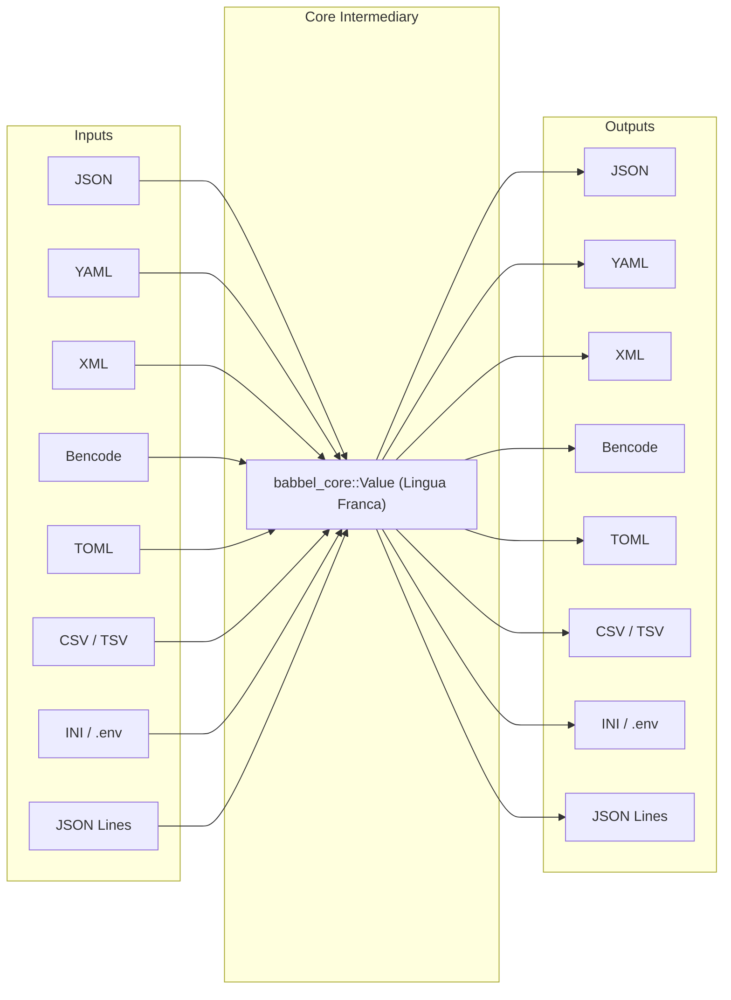

# Babbel Cross-Format Conversion Matrix

Babbel provides an open-ended, $O(N)$ universal conversion pipeline between **JSON**, **YAML**, **XML**, **Bencode**, **TOML**, **CSV**, **TSV**, **INI**, and **JSON Lines**.

---

## 1. The $O(N)$ Architecture

In traditional multi-format toolkits, converting between $M$ formats requires $O(M^2)$ point-to-point converters (e.g. `json_to_yaml`, `json_to_xml`, `yaml_to_xml`, `csv_to_json`, etc.). This leads to explosive code duplication, inconsistent edge-case behavior, and exponential maintenance costs.

Babbel solves this by utilizing the **Open-Closed Principle (OCP)** and **Dependency Inversion Principle (DIP)**:



Every format implements:
- [`FormatEngine`](../crates/babbel_core/src/engine.rs): Unified facade providing parsing, serialization, MIME detection, and extension queries.
- [`FormatParser`](../crates/babbel_core/src/codec.rs): Parses native bytes or text into universal `Value`.
- [`FormatEmitter`](../crates/babbel_core/src/codec.rs): Emits universal `Value` into native bytes or text with optional indentation.

With $M$ formats, adding support for format $M+1$ requires **only 1 parser and 1 emitter** (or 1 `FormatEngine`), immediately enabling bidirectional conversions across all existing formats!

---

## 2. Universal Conversion Pipelines

Babbel exposes two families of conversion pipelines in [`babbel::convert`](../crates/babbel/src/convert.rs):

### 2.1 Engine-Driven Pipelines (Recommended)

Engine-driven pipelines accept any type implementing [`FormatEngine`](../crates/babbel_core/src/engine.rs) (including trait objects `dyn FormatEngine`):

```rust
use babbel::convert::{convert_format, convert_format_bytes, convert_format_bytes_to_str, ConversionOptions};
use babbel_json::JsonEngine;
use babbel_toml::TomlEngine;

// Text to text
let toml_str = convert_format(
    r#"{"service": "auth", "port": 8080}"#,
    &JsonEngine,
    &TomlEngine,
    &ConversionOptions::pretty(),
)?;

// Byte to byte
let bencode_bytes = convert_format_bytes(
    toml_str.as_bytes(),
    &TomlEngine,
    &babbel_bencode::BencodeEngine,
    &ConversionOptions::default(),
)?;

// Byte to UTF-8 String
let json_str = convert_format_bytes_to_str(
    &bencode_bytes,
    &babbel_bencode::BencodeEngine,
    &JsonEngine,
    &ConversionOptions::pretty(),
)?;
```

#### Pipeline Signatures
- `pub fn convert_format<F: FormatEngine + ?Sized, T: FormatEngine + ?Sized>(input: &str, from: &F, to: &T, options: &ConversionOptions) -> Result<String, BabbelError>`
- `pub fn convert_format_bytes<F: FormatEngine + ?Sized, T: FormatEngine + ?Sized>(input: &[u8], from: &F, to: &T, options: &ConversionOptions) -> Result<Vec<u8>, BabbelError>`
- `pub fn convert_format_bytes_to_str<F: FormatEngine + ?Sized, T: FormatEngine + ?Sized>(input: &[u8], from: &F, to: &T, options: &ConversionOptions) -> Result<String, BabbelError>`

### 2.2 Parser/Emitter Pipelines

Low-level pipelines accepting types implementing [`FormatParser`](../crates/babbel_core/src/codec.rs) and [`FormatEmitter`](../crates/babbel_core/src/codec.rs):

```rust
use babbel::convert::{convert_text, convert_text_with_options, convert_bytes, ConversionOptions};
use babbel::convert::{JsonParser, YamlEmitter};

let yaml_out = convert_text(r#"{"key": "value"}"#, &JsonParser, &YamlEmitter)?;
```

- `pub fn convert_text<P: FormatParser, E: FormatEmitter>(input: &str, parser: &P, emitter: &E) -> Result<String, BabbelError>`
- `pub fn convert_text_with_options<P: FormatParser, E: FormatEmitter>(input: &str, parser: &P, emitter: &E, options: &ConversionOptions) -> Result<String, BabbelError>`
- `pub fn convert_bytes<P: FormatParser, E: FormatEmitter>(input: &[u8], parser: &P, emitter: &E) -> Result<Vec<u8>, BabbelError>`

---

## 3. Supported Format Conversion Matrix

The table below outlines semantic behavior across conversion pairs:

| From \ To | JSON | YAML | XML | Bencode | TOML | CSV / TSV | INI / .env | JSON Lines |
| :--- | :--- | :--- | :--- | :--- | :--- | :--- | :--- | :--- |
| **JSON** | Formatting / minification | 1:1 structural mapping | Tag/attribute mapping | String keys, ints, lists | Object $\rightarrow$ TOML tables | Array of objects $\rightarrow$ columns | Nested objects $\rightarrow$ `[sections]` | Array $\rightarrow$ 1 record/line |
| **YAML** | Full mapping, drops anchors | Direct emission | Structured tags | Ints, dicts, byte strings | 1:1 table/array mapping | Sequence of mappings $\rightarrow$ table | Mapping $\rightarrow$ sections & keys | Sequence $\rightarrow$ line records |
| **XML** | Element tree $\rightarrow$ JSON | Elements $\rightarrow$ mapping | C14N Canonicalization | Encoded element nodes | Elements $\rightarrow$ TOML tables | Flat row elements $\rightarrow$ CSV | Key elements $\rightarrow$ properties | Sequence elements $\rightarrow$ JSONL |
| **Bencode** | Dictionary $\rightarrow$ Object | Dict $\rightarrow$ Map, lists | Bytes $\rightarrow$ Base64 nodes | Re-sorting dictionary keys | Dictionaries $\rightarrow$ tables | List of dicts $\rightarrow$ CSV | Dict $\rightarrow$ key-value pairs | List of dicts $\rightarrow$ JSONL |
| **TOML** | Table $\rightarrow$ JSON Object | Tables $\rightarrow$ Mappings | Tables $\rightarrow$ XML nodes | Dicts, ints, byte strings | Standard / pretty format | Array of tables $\rightarrow$ rows | Sections $\leftrightarrow$ tables | Array of tables $\rightarrow$ JSONL |
| **CSV / TSV**| Array of row objects | Sequence of mapping rows | Rows $\rightarrow$ `<row>` elements | List of dictionary rows | Rows $\rightarrow$ array of tables | Delimiter swap (CSV $\leftrightarrow$ TSV) | Not recommended (flat table) | 1 record per line |
| **INI / .env**| Nested object of sections| Section mappings | Properties $\rightarrow$ XML nodes| Key-value dictionary | Sections $\rightarrow$ tables | Sections $\rightarrow$ table records | Delimiter swap (`=` $\leftrightarrow$ `:`) | Section objects $\rightarrow$ JSONL |
| **JSON Lines**| Array of all records | Multi-document stream | Line records $\rightarrow$ XML | List of dictionary rows | Records $\rightarrow$ array of tables| Unified header table | Object records $\rightarrow$ sections | Filter / re-chunk stream |

---

## 4. High-Level Convenience Functions

Babbel provides direct, ergonomic convenience functions for common format pairs in [`babbel::convert`](../crates/babbel/src/convert.rs):

### 4.1 Hierarchical Conversions (JSON, YAML, XML, Bencode, TOML)
```rust
use babbel::convert;

// JSON <-> YAML
let yaml = convert::json_to_yaml(r#"{"service": "auth"}"#)?;
let json = convert::yaml_to_json(&yaml)?;

// JSON <-> TOML
let toml = convert::json_to_toml(r#"{"service": "auth", "port": 8080}"#)?;
let json = convert::toml_to_json(&toml)?;

// TOML <-> YAML
let yaml = convert::toml_to_yaml("service = \"auth\"\nport = 8080\n")?;
let toml = convert::yaml_to_toml(&yaml)?;

// TOML <-> XML
let xml  = convert::toml_to_xml("title = \"System\"\n")?;
let toml = convert::xml_to_toml(&xml)?;

// TOML <-> Bencode
let bencode = convert::toml_to_bencode("id = 42\n")?;
let toml    = convert::bencode_to_toml(&bencode)?;

// JSON <-> XML
let xml  = convert::json_to_xml(r#"{"status": "ok"}"#)?;
let json = convert::xml_to_json(&xml)?;

// JSON <-> Bencode
let bencode_bytes = convert::json_to_bencode(r#"{"user": "alice", "age": 30}"#)?;
let json_from_benc = convert::bencode_to_json(&bencode_bytes)?;

// YAML <-> XML
let xml = convert::yaml_to_xml("status: ok\n")?;

// Bencode <-> YAML & XML
let yaml_str = convert::bencode_to_yaml(&bencode_bytes)?;
let xml_str  = convert::bencode_to_xml(&bencode_bytes)?;
```

### 4.2 Tabular Conversions (CSV / TSV)
```rust
use babbel::convert;

// CSV <-> JSON
let json_str = convert::csv_to_json("id,name\n1,Alice\n")?;
let csv_str  = convert::json_to_csv(&json_str)?;

// TSV <-> JSON
let json_tsv = convert::tsv_to_json("id\tname\n1\tAlice\n")?;
let tsv_str  = convert::json_to_tsv(&json_tsv)?;

// CSV <-> YAML
let yaml_str = convert::csv_to_yaml("id,name\n1,Alice\n")?;
let csv_back = convert::yaml_to_csv(&yaml_str)?;

// CSV <-> TOML
let toml_str = convert::csv_to_toml("id,name\n1,Alice\n")?;
let csv_back = convert::toml_to_csv(&toml_str)?;

// CSV <-> JSON Lines
let jsonl_str = convert::csv_to_jsonlines("id,name\n1,Alice\n")?;
let csv_out   = convert::jsonlines_to_csv(&jsonl_str)?;
```

### 4.3 Configuration Conversions (INI / .env)
```rust
use babbel::convert;

let ini_data = "[server]\nhost = localhost\nport = 8080\n";

// INI <-> JSON
let json_doc = convert::ini_to_json(ini_data)?;
let ini_doc  = convert::json_to_ini(&json_doc)?;

// INI <-> YAML
let yaml_doc = convert::ini_to_yaml(ini_data)?;
let ini_back = convert::yaml_to_ini(&yaml_doc)?;

// INI <-> TOML
let toml_doc = convert::ini_to_toml(ini_data)?;
let ini_back = convert::toml_to_ini(&toml_doc)?;
```

### 4.4 Stream Conversions (JSON Lines)
```rust
use babbel::convert;

let jsonl_input = "{\"id\": 1}\n{\"id\": 2}\n";

// JSON Lines <-> JSON
let json_array   = convert::jsonlines_to_json(jsonl_input)?;
let jsonl_output = convert::json_to_jsonlines(&json_array)?;

// JSON Lines <-> TOML
let toml_out  = convert::jsonlines_to_toml(jsonl_input)?;
let jsonl_out = convert::toml_to_jsonlines(&toml_out)?;
```

---

## 5. Dynamic Conversions with `FormatRegistry`

When formats are determined dynamically at runtime (e.g. HTTP `Content-Type` headers, file extensions, or user CLI arguments), Babbel provides [`FormatRegistry`](../crates/babbel_core/src/engine.rs) and static lookup helpers:

```rust
use babbel::{default_registry, convert::convert_format, convert::ConversionOptions};
use babbel_core::{find_engine_by_extension, find_engine_by_mime};

// 1. Dynamic lookup by extension
let from_engine = find_engine_by_extension("json").expect("JSON engine found");
let to_engine   = find_engine_by_extension("toml").expect("TOML engine found");

let toml_output = convert_format(
    r#"{"title": "Config"}"#,
    from_engine,
    to_engine,
    &ConversionOptions::default(),
)?;

// 2. Dynamic lookup by MIME type
let from_mime = find_engine_by_mime("application/json").unwrap();
let to_mime   = find_engine_by_mime("application/yaml").unwrap();

// 3. Dynamic lookup via custom populated FormatRegistry
let registry = default_registry();
if let (Some(from), Some(to)) = (registry.get_by_id("bencode"), registry.get_by_id("toml")) {
    // Perform dynamic conversion between any registered engines
    let output = convert_format(
        "title = \"System\"\n",
        to.as_ref(),
        from.as_ref(),
        &ConversionOptions::default(),
    )?;
}
```

---

## 6. Adding a New Format to the Matrix

To integrate a new custom format (e.g. MessagePack or CBOR) into the universal matrix:

1. **Implement `FormatEngine` (or `FormatParser` + `FormatEmitter`)**:
   ```rust
   use babbel_core::{BabbelError, FormatEngine, FormatOptions, IDestination, Value};

   pub struct MsgPackEngine;

   impl FormatEngine for MsgPackEngine {
       fn format_id(&self) -> &'static str { "msgpack" }
       fn mime_types(&self) -> &'static [&'static str] { &["application/msgpack"] }
       fn file_extensions(&self) -> &'static [&'static str] { &["msgpack", "mp"] }

       fn parse_bytes(&self, input: &[u8]) -> Result<Value, BabbelError> {
           // Decode MsgPack bytes into universal Value AST
           todo!()
       }

       fn serialize(&self, value: &Value, dest: &mut dyn IDestination, _options: &FormatOptions) -> Result<(), BabbelError> {
           // Encode universal Value AST into MsgPack bytes
           todo!()
       }
   }
   ```

2. **Convert Effortlessly Across the Entire Matrix**:
   ```rust
   use babbel::convert::{convert_format_bytes, ConversionOptions};
   use babbel_json::JsonEngine;

   let mp_bytes = convert_format_bytes(
       json_str.as_bytes(),
       &JsonEngine,
       &MsgPackEngine,
       &ConversionOptions::default(),
   )?;
   ```
