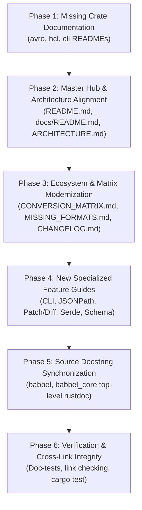

# Comprehensive Documentation Expansion & Synchronization Plan for Babbel

This document outlines a concrete, source-verified, and phased architectural plan to expand, synchronize, and modernize the entire documentation suite of the **Babbel** polyglot serialization workspace.

Following the addition of **HashiCorp HCL (`babbel_hcl`)**, **Apache Avro (`babbel_avro`)**, **Universal CLI (`babbel-cli`)**, **RFC 9535 JSONPath Querying**, **RFC 6902/7396 Patch & Diff Engines**, and **Draft 7/2020-12 Schema Validation**, this plan details:
1. The **exact documents to create** (new crate READMEs, user manuals, and specialized feature guides).
2. The **exact documents to modify** (synchronizing stale statistics, outdated diagrams, missing crates, and version drift).
3. The **source code docstring alignments** required across the workspace.

---

## 1. Executive Summary & Audit Findings

A complete audit of the 17 workspace crates and 17 existing documentation files in `docs/` identified key documentation drifts:

| Area | Current State & Identified Gaps | Target Files | Priority |
| :--- | :--- | :--- | :--- |
| **Missing Crate READMEs** | `crates/avro/`, `crates/hcl/`, and `crates/cli/` have **no `README.md`** files, despite `Cargo.toml` declaring `readme = "README.md"`. | `crates/avro/README.md`<br>`crates/hcl/README.md`<br>`crates/cli/README.md` | **Critical** |
| **Root Workspace README** | Describes only 8 formats (omits MsgPack, CBOR, BSON, RON, KDL, Parquet, HCL, Avro), shows an outdated crate table, lacks links to HCL/Avro conformance, and has an outdated test badge ("3,500+" vs actual 6,500+). | `README.md` | **High** |
| **Documentation Hub** | `docs/README.md` lists only 10 crates (missing 7), lists 11 conformance suites (missing Avro), and still quotes HCL pass rate as 86.4% (now **100.0%**). | `docs/README.md` | **High** |
| **3-Tier Architecture Model** | `docs/ARCHITECTURE.md` Tier 1 diagram only includes 5 original format engines. Missing all 8 newly added engines (`msgpack`, `cbor`, `bson`, `ron`, `kdl`, `parquet`, `hcl`, `avro`) and `babbel-cli` in Tier 2. | `docs/ARCHITECTURE.md` | **High** |
| **Cross-Format Conversion Matrix** | `docs/CONVERSION_MATRIX.md` diagrams and tables claim 9 formats; actual workspace supports **16 formats** with bidirectional $O(N)$ translation. | `docs/CONVERSION_MATRIX.md` | **High** |
| **Missing Formats Analysis** | `docs/MISSING_FORMATS_ANALYSIS.md` still lists HCL and Avro as "Trade-off" and "Future / Specialized" rather than **Implemented**. | `docs/MISSING_FORMATS_ANALYSIS.md` | **Medium** |
| **Changelog & Migration Guide** | `docs/MIGRATION_AND_CHANGELOG.md` ends at v0.2.0. Needs comprehensive release notes for v0.2.1 covering all new format additions, query/diff/patch engines, and CLI. | `docs/MIGRATION_AND_CHANGELOG.md` | **High** |
| **Missing User Guides** | No standalone user guides exist for the `babbel` CLI utility, RFC 9535 JSONPath querying, AST diffing & RFC 6902 patching, Serde integration, or schema validation. | `docs/CLI_GUIDE.md`<br>`docs/JSONPATH_QUERY_GUIDE.md`<br>`docs/JSON_PATCH_AND_DIFF_GUIDE.md`<br>`docs/SERDE_INTEGRATION_GUIDE.md`<br>`docs/SCHEMA_VALIDATION_GUIDE.md` | **High** |
| **Source Docstring Alignment** | `crates/babbel/src/lib.rs` and `crates/babbel_core/src/lib.rs` top-level docstrings omit several recently added format submodules and kernel capabilities. | `crates/babbel/src/lib.rs`<br>`crates/babbel_core/src/lib.rs` | **Medium** |

---

## 2. Phased Implementation Plan



---

### Phase 1: Missing Crate-Level Documentation

Create comprehensive, production-grade `README.md` files for crates currently missing documentation.

#### 1.1 `crates/avro/README.md` [NEW]
- **Target File**: `crates/avro/README.md`
- **Scope & Sections**:
  - **Overview**: Pure-Rust, zero-external-dependency Apache Avro binary & Object Container File (OCF) parser and serializer.
  - **Features**:
    - Schema-driven record decoding (`from_bytes_with_schema`, `to_vec_with_schema`).
    - Full OCF container processing (`from_bytes_ocf`, `to_vec_ocf`) with embedded `"avro.schema"` parsing via `babbel_json`.
    - Variable-length zigzag varint codec (`i32`, `i64`).
    - IEEE 754 float & double Little-Endian support.
    - OCF block headers, compression codec negotiation, and 16-byte sync marker validation.
    - `FormatEngine` trait integration (`AvroEngine`) with automatic OCF magic (`Obj\x01`) detection.
    - Embedded `no_std` / `alloc` compatibility.
  - **Quickstart Code Examples**:
    - Encoding/decoding with schema.
    - Reading and writing `.avro` Object Container Files.
    - Registering with `FormatRegistry`.
  - **Conformance**: Reference official `drnice/AvroTest` 100.0% pass rate.

#### 1.2 `crates/hcl/README.md` [NEW]
- **Target File**: `crates/hcl/README.md`
- **Scope & Sections**:
  - **Overview**: Fast, modular HashiCorp Configuration Language (HCL v2) parser, serializer, and `FormatEngine`.
  - **Features**:
    - Terraform (`.tf`) and HCL (`.hcl`) structural block parsing (labels, types, nested blocks).
    - Attribute key-value mapping with universal `Value` AST representations.
    - Expression evaluation: ternary conditionals (`cond ? true : false`), arithmetic (`+`, `-`, `*`, `/`, `%`), binary comparisons (`==`, `!=`, `<`, `<=`, `>`, `>=`), logical operators (`&&`, `||`, `!`).
    - String interpolation `${var}` and directive handling (`%{if}`, `%{for}`).
    - Heredocs (standard `<<EOF` and indented `<<-EOF` with leading whitespace stripping).
    - Tuple arrays, object dictionaries, and inline block formatting.
    - `FormatEngine` trait implementation (`HclEngine`).
  - **Quickstart Code Examples**:
    - Parsing Terraform configuration files into `Value`.
    - Serializing universal `Value` AST back to clean HCL.
  - **Conformance**: Reference official `kmoneil/hcl-test-suite` 100.0% pass rate across 2,228 tests.

#### 1.3 `crates/cli/README.md` [NEW]
- **Target File**: `crates/cli/README.md`
- **Scope & Sections**:
  - **Overview**: Universal command-line utility for multi-format serialization, document querying, AST diffing, RFC 6902 patching, schema validation, and pretty-printing.
  - **Subcommands**:
    - `babbel convert <INPUT> -t <FORMAT> [-o <OUTPUT>] [--pretty] [--indent <N>]`
    - `babbel query <INPUT> -q <JSONPATH> [--first]`
    - `babbel diff <SRC> <TGT> [--merge-patch]`
    - `babbel patch <INPUT> -p <PATCH_FILE> [--merge-patch]`
    - `babbel validate <INPUT> -s <SCHEMA_FILE>`
    - `babbel fmt <INPUT> [--indent <N>]`
    - `babbel inspect <INPUT>`
  - **Installation & Building**:
    - `cargo install --path crates/cli`
  - **Unix Pipeline & Stdin Examples**:
    - `cat data.xml | babbel convert - -f xml -t yaml`
    - `babbel query server.json -q '$.servers[?(@.active == true)].ip'`

---

### Phase 2: Master Hub & Architecture Alignment

Synchronize master workspace entry points to reflect all 17 crates and 16 formats.

#### 2.1 `README.md` (Root) [MODIFY]
- **Updates**:
  - Update test badge: `[]()`.
  - Update format summary paragraph to list all 16 formats: **JSON, YAML, Bencode, XML, TOML, CSV / TSV, INI / Properties, JSON Lines, MessagePack, CBOR, BSON, RON, KDL, Apache Parquet, HashiCorp HCL, and Apache Avro**.
  - Add documentation links:
    - [HashiCorp HCL Conformance](docs/conformance/HCL_CONFORMANCE.md) (100.0% across 2,228 tests)
    - [Apache Avro Conformance](docs/conformance/AVRO_CONFORMANCE.md) (100.0% across 80 tests)
    - [CLI User Guide](docs/CLI_GUIDE.md)
    - [Universal Query Guide](docs/JSONPATH_QUERY_GUIDE.md)
  - Expand **Workspace Architecture** table:
    - Add `babbel_hcl` ([`crates/hcl`](crates/hcl))
    - Add `babbel_avro` ([`crates/avro`](crates/avro))
    - Add `babbel-cli` ([`crates/cli`](crates/cli))
  - Update conversion example to showcase cross-format capabilities with binary and cloud formats (e.g. HCL $\rightarrow$ JSON, Parquet $\rightarrow$ YAML, Avro $\rightarrow$ TOML).

#### 2.2 `docs/README.md` (Documentation Hub) [MODIFY]
- **Updates**:
  - Section 1 (Core Architectural Guides): Add link to `DOCUMENTATION_EXPANSION_PLAN.md`.
  - Section 2 (Specification & Conformance):
    - Update `HashiCorp HCL Conformance` row: **100.0% pass rate** across all **2,228 tests** (0 failures, 0 panics).
    - Add `Apache Avro Conformance` row: **100.0% pass rate** across **80 test vectors** (0 failures, 0 panics).
  - Section 3 (Specialized Ecosystem Guides):
    - Update Conversion Matrix description to 16 formats.
    - Add links to `CLI_GUIDE.md`, `JSONPATH_QUERY_GUIDE.md`, `JSON_PATCH_AND_DIFF_GUIDE.md`, `SERDE_INTEGRATION_GUIDE.md`, and `SCHEMA_VALIDATION_GUIDE.md`.
  - Section 4 (Workspace Crates):
    - Expand table to cover all 17 workspace crates: adding `babbel_ron`, `babbel_kdl`, `babbel_parquet`, `babbel_hcl`, `babbel_avro`, `babbel-cli`.
    - Change preamble from "partitioned into seven decoupled crates" to "partitioned into seventeen decoupled crates".

#### 2.3 `docs/ARCHITECTURE.md` [MODIFY]
- **Updates**:
  - Update Section 1 (3-Tier Layering Model):
    - Update Mermaid diagram to include all 13 domain format crates in Tier 1:
      - Text/Config: `JSON`, `YAML`, `XML`, `TOML`, `KDL`, `RON`, `HCL`
      - Binary/Analytical: `Bencode`, `MsgPack`, `CBOR`, `BSON`, `Parquet`, `Avro`
    - Add `babbel-cli` to Tier 2 (Facade & Interoperability).
  - Update Section 2 (Format Engine Plugin System):
    - Update registry table listing all 16 built-in engines, their format IDs, MIME types, default file extensions, and binary/text classification flags.

---

### Phase 3: Ecosystem & Matrix Modernization

#### 3.1 `docs/CONVERSION_MATRIX.md` [MODIFY]
- **Updates**:
  - Update architecture diagrams to show the full 16-format $O(N)$ translation network:
    - Text formats: JSON, YAML, XML, TOML, CSV, TSV, INI, JSONL, RON, KDL, HCL
    - Binary formats: Bencode, MessagePack, CBOR, BSON, Apache Parquet, Apache Avro
  - Add section on **Binary Format Considerations**:
    - Mapping `Value::Bytes` across formats (e.g. base64 for JSON/YAML/XML, raw byte buffers for CBOR/MsgPack/BSON/Avro).
    - Schema preservation when converting to/from Avro and Parquet.
  - Update CLI conversion usage examples: `babbel convert infra.tf -t json`, `babbel convert events.avro -t yaml`.

#### 3.2 `docs/MISSING_FORMATS_ANALYSIS.md` [MODIFY]
- **Updates**:
  - Update Section 3.4 (HCL): Update status from "Trade-off" to **IMPLEMENTED (`babbel_hcl`)**; describe pure-Rust recursive-descent parser, expression evaluator, and 100.0% conformance pass rate.
  - Update Section 4.2 (Apache Avro): Update status from "Future / Specialized" to **IMPLEMENTED (`babbel_avro`)**; describe pure-Rust schema-driven codec, OCF container reader/writer, and 100.0% conformance pass rate.
  - Update Summary Evaluation Matrix table to reflect 100% completion of all identified high-priority formats.

#### 3.3 `docs/MIGRATION_AND_CHANGELOG.md` [MODIFY]
- **Updates**:
  - Add **Release Notes for v0.2.1**:
    - HashiCorp HCL (`babbel_hcl`): Full HCL v2 parser, expression evaluation engine, and 100.0% conformance against official `kmoneil/hcl-test-suite` (2,228 tests).
    - Apache Avro (`babbel_avro`): Schema-driven binary codec, complete OCF container processing, and 100.0% conformance against `drnice/AvroTest`.
    - Universal CLI (`babbel-cli`): Binary tool providing `convert`, `query`, `diff`, `patch`, `validate`, `fmt`, and `inspect` subcommands.
    - RFC 9535 JSONPath Engine: Format-agnostic document querying across universal `Value`.
    - RFC 6902 & RFC 7396 Patch Engines: Structural document diffing and atomic delta patching.
    - Draft 7 / 2020-12 Schema Validator: In-memory schema compilation and validation.
    - Updated total test count: 6,500+ passing tests across 17 crates.

---

### Phase 4: New Specialized Feature Guides

Create targeted, comprehensive technical documentation for advanced capabilities.

#### 4.1 `docs/CLI_GUIDE.md` [NEW]
- **Target File**: `docs/CLI_GUIDE.md`
- **Scope & Contents**:
  - Comprehensive CLI user manual covering installation, shell autocompletion, commands, flags, and return exit codes.
  - Detailed subsections for:
    - `babbel convert`: Cross-format conversion, format autodetection, `--pretty`, `--indent`.
    - `babbel query`: JSONPath query execution, extraction, and projection.
    - `babbel diff` & `babbel patch`: Generating RFC 6902/7396 diffs and applying changes.
    - `babbel validate`: JSON Schema verification of arbitrary files (YAML, TOML, XML, etc.).
    - `babbel fmt` & `babbel inspect`: Formatting and inspecting metadata/depth.
  - Integration with shell scripts, CI/CD pipelines, and GitHub Actions.

#### 4.2 `docs/JSONPATH_QUERY_GUIDE.md` [NEW]
- **Target File**: `docs/JSONPATH_QUERY_GUIDE.md`
- **Scope & Contents**:
  - Guide to RFC 9535 JSONPath query syntax in Babbel.
  - Syntax guide: root (`$`), child (`.key`, `['key']`), recursive descent (`..`), wildcards (`*`), array slices (`[start:end:step]`), filter expressions (`[?(@.price < 30)]`).
  - API reference: `babbel::core::jsonpath_query`, `Value::query_path`.
  - Format-agnostic querying: Querying YAML configs, XML documents, TOML tables, and Avro records identically without format-specific query languages.

#### 4.3 `docs/JSON_PATCH_AND_DIFF_GUIDE.md` [NEW]
- **Target File**: `docs/JSON_PATCH_AND_DIFF_GUIDE.md`
- **Scope & Contents**:
  - Guide to RFC 6902 JSON Patch and RFC 7396 JSON Merge Patch.
  - Generating diffs: `babbel::core::diff(original, modified)` producing atomic patch operations (`add`, `remove`, `replace`, `move`, `copy`, `test`).
  - Applying patches: `patch.apply(&mut value)`.
  - Merge patch semantics: `diff_merge_patch`, `apply_merge_patch`.
  - Practical use cases: Configuration drift remediation, REST API delta updates, and multi-format configuration synchronization.

#### 4.4 `docs/SERDE_INTEGRATION_GUIDE.md` [NEW]
- **Target File**: `docs/SERDE_INTEGRATION_GUIDE.md`
- **Scope & Contents**:
  - Comprehensive guide on using Serde with Babbel.
  - Enabling feature: `babbel = { version = "0.2.1", features = ["serde"] }`.
  - Converting between strongly-typed Rust structs and `babbel_core::Value` via `babbel_core::serde::from_value` and `to_value`.
  - Deserializing any Babbel-supported format into Serde structs:
    - Struct $\rightarrow$ `Value` $\rightarrow$ Format (e.g. serialize custom struct to Parquet, Avro, KDL, or HCL).
    - Format $\rightarrow$ `Value` $\rightarrow$ Struct.

#### 4.5 `docs/SCHEMA_VALIDATION_GUIDE.md` [NEW]
- **Target File**: `docs/SCHEMA_VALIDATION_GUIDE.md`
- **Scope & Contents**:
  - Guide to schema validation in Babbel.
  - In-memory JSON Schema validator (`CompiledSchema`, Draft 7 / Draft 2020-12).
  - Validating non-JSON formats against standard JSON schemas (validating Kubernetes YAML, Cargo TOML, or Kafka Avro records).
  - XML schema validation (DTD and XSD in `babbel_xml`).
  - Apache Avro schema models (`AvroSchema` in `babbel_avro`).

---

### Phase 5: Source Code Docstring Alignment

Align Rust documentation comments (`//!` and `///`) in source code to match current capabilities.

#### 5.1 `crates/babbel/src/lib.rs` [MODIFY]
- Update top-level module documentation list:
  - Add `- **msgpack**: High-speed, binary-safe MessagePack encoder/decoder.`
  - Add `- **hcl**: HashiCorp Configuration Language (HCL v2) parser and FormatEngine.`
  - Add `- **avro**: Apache Avro binary encoding and Object Container File (OCF) parser.`
  - Add `- **query**: RFC 9535 JSONPath document querying across all formats.`
  - Add `- **patch**: RFC 6902 JSON Patch and RFC 7396 Merge Patch document mutations.`

#### 5.2 `crates/babbel_core/src/lib.rs` [MODIFY]
- Update crate docstring to highlight:
  - `query` module (JSONPath).
  - `patch` and `diff` modules (RFC 6902 / 7396).
  - `schema` module (JSON Schema validator).

---

### Phase 6: Verification & Cross-Link Integrity

Ensure that all code examples, documentation links, and doc-tests compile cleanly.

1. **Cargo Test & Doc-tests**:
   ```bash
   cargo test --workspace --doc
   cargo test -p babbel_avro
   cargo test -p babbel_hcl
   cargo test -p babbel-cli
   ```
2. **Compiler Check**:
   ```bash
   cargo check --workspace --all-targets
   ```
3. **Markdown Link Validation**:
   - Verify every markdown file link `[text](path)` resolves to a valid existing file.
   - Verify all GitHub alert callouts (`> [!NOTE]`, `> [!IMPORTANT]`, `> [!TIP]`) are formatted properly.

---

## 3. Implementation Sequence & Deliverables Matrix

| Sequence | Task / Action | Files Impacted | Deliverables |
| :---: | :--- | :--- | :--- |
| **1** | Create missing crate READMEs | `crates/avro/README.md`<br>`crates/hcl/README.md`<br>`crates/cli/README.md` | 3 complete crate documentation guides. |
| **2** | Synchronize root and hub documents | `README.md`<br>`docs/README.md`<br>`docs/ARCHITECTURE.md` | Accurate badges, complete 17-crate lists, updated diagrams. |
| **3** | Update ecosystem & matrix docs | `docs/CONVERSION_MATRIX.md`<br>`docs/MISSING_FORMATS_ANALYSIS.md`<br>`docs/MIGRATION_AND_CHANGELOG.md` | 16-format translation matrix, HCL/Avro marked implemented, v0.2.1 changelog. |
| **4** | Author specialized feature guides | `docs/CLI_GUIDE.md`<br>`docs/JSONPATH_QUERY_GUIDE.md`<br>`docs/JSON_PATCH_AND_DIFF_GUIDE.md`<br>`docs/SERDE_INTEGRATION_GUIDE.md`<br>`docs/SCHEMA_VALIDATION_GUIDE.md` | 5 user-facing feature and developer manuals. |
| **5** | Align source code docstrings | `crates/babbel/src/lib.rs`<br>`crates/babbel_core/src/lib.rs` | Up-to-date rustdoc for facade and core crates. |
| **6** | Verification & Validation | Workspace test runner | Clean compilation, passing doc-tests, zero broken links. |
