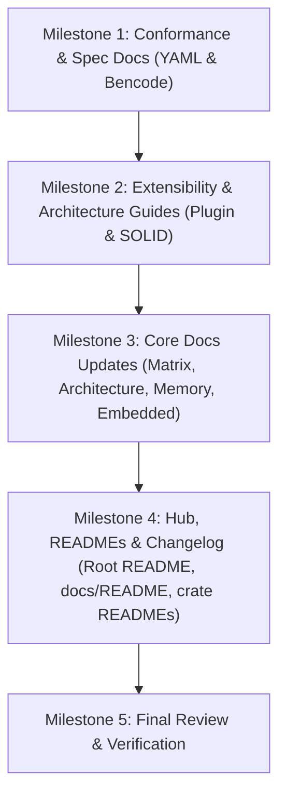

# Babbel Documentation Master Plan

A comprehensive, actionable plan to expand, update, and align the documentation across the entire Babbel workspace with the current codebase, new SOLID architecture, and polyglot format capabilities.

---

## 1. Executive Summary & Audit Findings

Following the successful execution of the 6-phase SOLID architectural refactoring (Phases 1–6), Babbel has evolved into an extensible, $O(N)$ polyglot format engine with:
- Abstract `FormatEngine` and `FormatRegistry` architecture (OCP & DIP).
- Universal decoupled conversion pipelines (`convert_format`, `convert_format_bytes`, `convert_format_bytes_to_str`).
- Infallible document navigation and unified error reporting under `BabbelError` (LSP).
- Fine-grained segregated streaming traits (`ILineReader`, `ICharStream`, etc.) and visitor traits (ISP).
- Decomposed single-responsibility format submodules (SRP).
- Strict AST node memory bounds (`size_of::<Value>() == 32 bytes`, all AST `Node` types $\le 56$ bytes).
- 100% test pass rate across all 7 workspace crates, including formal conformance suites for JSON (340 tests), TOML (148 tests), XML (1,834 tests), and YAML (1,085+ tests).

### Documentation Gap Analysis

| Document Area | Current State | Identified Gap | Action |
| :--- | :--- | :--- | :--- |
| **YAML Conformance** | Missing | Passed 1,085+ tests in official YAML 1.2 test suite; no dedicated conformance document exists. | **Create `docs/YAML_CONFORMANCE.md`** |
| **Bencode Specification** | Missing | Passed BitTorrent BEP 0003 compliance; no dedicated conformance/spec document exists. | **Create `docs/BENCODE_SPEC_AND_CONFORMANCE.md`** |
| **Plugin / Engine Extensibility** | Missing | `FormatEngine` and `FormatRegistry` introduced in Phase 4 & 5; no developer guide exists for adding custom formats. | **Create `docs/FORMAT_ENGINE_PLUGIN_GUIDE.md`** |
| **SOLID Architecture Guide** | Outdated in `ARCHITECTURE.md` | Architecture doc was drafted prior to Phases 1–6 and lacks the final `FormatEngine` / `FormatRegistry` model. | **Create `docs/SOLID_ARCHITECTURE_GUIDE.md` & Update `ARCHITECTURE.md`** |
| **Changelog & Migration** | Missing | No central log of the major SOLID refactor, API stability guarantees, or migration guide. | **Create `docs/MIGRATION_AND_CHANGELOG.md`** |
| **Documentation Hub** | Incomplete | `docs/README.md` lacks references to new format engines, registry, and new guides. | **Update `docs/README.md`** |
| **Root README** | Incomplete | `README.md` lacks documentation of `convert_format`, `FormatEngine`, and new conformance docs. | **Update `README.md`** |
| **Conversion Matrix** | Partial | `docs/CONVERSION_MATRIX.md` only details `convert_text`/`convert_bytes`; lacks `convert_format`, TOML $\leftrightarrow$ Bencode, and dynamic registry. | **Update `docs/CONVERSION_MATRIX.md`** |
| **Benchmarks & Memory** | Partial | `docs/BENCHMARKS_AND_MEMORY.md` omits `babbel_toml::Node` in the struct size table and recent optimization metrics. | **Update `docs/BENCHMARKS_AND_MEMORY.md`** |
| **Embedded Guide** | Outdated snippets | `docs/EMBEDDED_GUIDE.md` needs alignment with latest verified `babbel_core::embedded` primitives. | **Update `docs/EMBEDDED_GUIDE.md`** |
| **Crate READMEs** | Inconsistent | `crates/babbel/README.md` and `crates/babbel_core/README.md` need updates reflecting new engine APIs. | **Update `crates/babbel/README.md` & `crates/babbel_core/README.md`** |

---

## 2. New Documents to Create

### 2.1 `docs/YAML_CONFORMANCE.md`
- **Purpose**: Document Babbel's full compliance with the official YAML 1.2 Specification and the YAML Test Suite.
- **Contents**:
  1. **Conformance Overview**: Summary of 1,085+ passing tests in `tests/yaml_test_suite.rs` and `tests/yaml_test_suite_integration.rs`.
  2. **Specification Coverage**:
     - Scalars: Plain, single-quoted, double-quoted, folded (`>`) and literal (`|`) block scalars with chomping indicators (`+`, `-`).
     - Collections: Flow sequence/mapping (`[...]`, `{...}`) and block sequence/mapping (`-`, `:`).
     - Anchors & Aliases: Safe resolution, recursive cycle detection, merge keys (`<<`).
     - Tags: Standard Core Schema (`!!str`, `!!int`, `!!float`, `!!bool`, `!!null`, `!!binary`, `!!set`, `!!omap`, `!!pairs`) and explicit custom/local tags (`!local`).
     - Directives & Multi-Document Streams: `%YAML 1.2`, `%TAG`, document start (`---`) and document end (`...`).
  3. **Performance & Memory**: Inlined small scalars, compact `Node` ($\le 40$ bytes), and streaming token buffer.

### 2.2 `docs/BENCODE_SPEC_AND_CONFORMANCE.md`
- **Purpose**: Provide authoritative documentation on BitTorrent BEP 0003 Bencode specification compliance.
- **Contents**:
  1. **Specification Overview**:
     - Canonical dictionary sorting: Lexicographical byte-order key enforcement.
     - Integer representation: `i<number>e` syntax, prohibition of leading zeros (except `i0e`), negative zero (`i-0e`) rejection, and 64-bit integer limits.
     - Byte strings: `<length>:<contents>` exact byte tracking, binary-safe payload preservation.
     - Lists: `l<items>e` nested structures.
  2. **DOM vs. Borrowed vs. Iterative Modes**:
     - Owned DOM (`babbel_bencode::Node`).
     - Zero-copy borrowed parser (`babbel_bencode::borrowed::parse_borrowed`) referencing source slice directly without allocation.
     - Stack-based iterative streaming parser for memory-constrained devices.
  3. **Cross-Format Translation**: Mapping Bencode dictionaries to JSON objects, TOML tables, and XML elements.

### 2.3 `docs/FORMAT_ENGINE_PLUGIN_GUIDE.md`
- **Purpose**: Developer guide detailing how to create, test, and register a new format engine using the OCP/DIP architecture.
- **Contents**:
  1. **Architecture Overview**: `FormatEngine`, `FormatParser`, `FormatEmitter`, and `FormatRegistry`.
  2. **Step-by-Step Tutorial**: Implementing an engine for a custom format (e.g. MessagePack or CBOR):
     - Defining the engine struct implementing `FormatEngine`.
     - Implementing `FormatParser::parse_str` and `parse_bytes` producing `babbel_core::Value`.
     - Implementing `FormatEmitter::emit` and `emit_pretty` serializing `babbel_core::Value` into `IDestination`.
     - Implementing metadata (`id()`, `name()`, `primary_extension()`, `mime_types()`).
  3. **Registration Mechanisms**:
     - Dynamic registration in `FormatRegistry`: `registry.register(Box::new(CustomEngine))`.
     - Static registration via static slices and `find_engine*`.
  4. **Universal Interoperability**: Automatic participation in `convert_format`, `convert_format_bytes`, and `convert_format_bytes_to_str` with zero changes to existing format crates.

### 2.4 `docs/SOLID_ARCHITECTURE_GUIDE.md`
- **Purpose**: Comprehensive architectural whitepaper documenting the SOLID implementation across Babbel.
- **Contents**:
  1. **SRP (Single Responsibility Principle)**:
     - Deconstruction of monolithic god-files (e.g. YAML `node.rs` split into `access.rs`, `search.rs`, `convert.rs`, `scalar.rs`).
     - Decoupling I/O transport (`FileSource`, `BufferSource`) from grammar/syntax logic.
  2. **OCP (Open/Closed Principle)**:
     - Pluggable `FormatEngine` and dynamic `FormatRegistry` architecture.
     - Extensible streaming destinations (`IDestination`) and sources (`ISource`).
  3. **LSP (Liskov Substitution Principle)**:
     - Error type normalization under `BabbelError` with standard `std::error::Error` implementation.
     - Infallible document access (`at()`, `get()`, `pointer()`) returning `Option` or `Result` without runtime panics.
  4. **ISP (Interface Segregation Principle)**:
     - Granular streaming traits: `ILineReader`, `ICharStream`, `IByteStream`, `IRewindable`, `ITailInspectable`, etc.
     - Segregated visitor traits (`ValueVisitor`, `NodeVisitor`) with sensible default no-op methods, removing stub boilerplate.
  5. **DIP (Dependency Inversion Principle)**:
     - Decoupling the `babbel::convert` facade from concrete format crates, routing strictly through `FormatEngine` and `Value`.

### 2.5 `docs/MIGRATION_AND_CHANGELOG.md`
- **Purpose**: Release notes, migration guidance, and API stability guarantees for Babbel v0.1.2.
- **Contents**:
  1. **Version Highlights**:
     - Introduction of the unified SOLID architecture.
     - Standardized `FormatEngine` and dynamic `FormatRegistry`.
     - Enhanced cross-format matrix supporting 9 formats and all pairs.
  2. **Backward Compatibility Matrix**:
     - 100% backward-compatible public API across all 7 workspace crates.
     - In-place drop-in replacements for convenience conversion functions.
  3. **Performance & Memory Comparisons**:
     - Pre- vs. Post-SOLID struct sizes and benchmark metrics.
  4. **Deprecations & Recommendations**: Best practices for modern usage.

---

## 3. Existing Documents to Modify

### 3.1 `README.md` (Workspace Root)
- **Modifications**:
  - Add links in "Documentation & Guides" to the 5 new documents:
    - `docs/YAML_CONFORMANCE.md`
    - `docs/BENCODE_SPEC_AND_CONFORMANCE.md`
    - `docs/FORMAT_ENGINE_PLUGIN_GUIDE.md`
    - `docs/SOLID_ARCHITECTURE_GUIDE.md`
    - `docs/MIGRATION_AND_CHANGELOG.md`
  - Update "Key Design Principles" section with `FormatEngine`, `FormatRegistry`, `convert_format`, and `convert_format_bytes`.
  - Update test count badge and description: 3,500+ tests passing, 1,085+ YAML tests.
  - Update cross-format conversion examples to demonstrate `convert_format` and `default_registry()`.

### 3.2 `docs/README.md` (Documentation Hub)
- **Modifications**:
  - Reorganize into structured categories:
    1. **Core Architectural Guides**: `ARCHITECTURE.md`, `SOLID_ARCHITECTURE_GUIDE.md`, `FORMAT_ENGINE_PLUGIN_GUIDE.md`.
    2. **Specification & Conformance**: `JSON_CONFORMANCE.md`, `YAML_CONFORMANCE.md`, `XML_CONFORMANCE.md`, `TOML_CONFORMANCE.md`, `BENCODE_SPEC_AND_CONFORMANCE.md`.
    3. **Specialized Ecosystem Guides**: `EMBEDDED_GUIDE.md`, `TEXT_SUPPORT_GUIDE.md`, `CONVERSION_MATRIX.md`, `BENCHMARKS_AND_MEMORY.md`.
    4. **Governance & Development**: `SECURITY.md`, `DEVELOPMENT_GUIDE.md`, `CONTRIBUTING.md`, `CODE_OF_CONDUCT.md`, `MIGRATION_AND_CHANGELOG.md`.
  - Update Quickstart examples to showcase `convert_format` and dynamic `FormatRegistry`.

### 3.3 `docs/ARCHITECTURE.md`
- **Modifications**:
  - Update 3-Tier Layering diagram (Mermaid) to include `FormatEngine`, `FormatRegistry`, `FormatOptions`, and `default_registry()`.
  - Expand Section 2 (SOLID Principles in Rust) to reflect the concrete refactorings completed across Phases 1–6.
  - Update table of traits to include `FormatEngine`, `FormatParser`, `FormatEmitter`, `ValueVisitor`.

### 3.4 `docs/CONVERSION_MATRIX.md`
- **Modifications**:
  - Add documentation of `convert_format`, `convert_format_bytes`, and `convert_format_bytes_to_str`.
  - Detail dynamic conversion via `FormatRegistry` and MIME / extension lookups.
  - Update conversion pair matrix and narrative for TOML $\leftrightarrow$ Bencode, XML $\leftrightarrow$ TOML, and YAML $\leftrightarrow$ TOML.
  - Provide code examples showing custom options (`ConversionOptions::pretty()`).

### 3.5 `docs/BENCHMARKS_AND_MEMORY.md`
- **Modifications**:
  - Add `babbel_toml::Node` ($\le 56$ bytes) to the struct size table.
  - Update verified struct sizes: `Value` (32 bytes), `babbel_yaml::Node` ($\le 40$ bytes), `babbel_json::Node` ($\le 56$ bytes), `babbel_bencode::Node` ($\le 56$ bytes), `babbel_xml::NodeKind` ($\le 48$ bytes).
  - Add benchmark and throughput notes on the $O(1)$ memory streaming pull parsers.

### 3.6 `docs/EMBEDDED_GUIDE.md`
- **Modifications**:
  - Update code examples with verified `babbel_core::embedded` primitives: `SliceDestination`, `ArrayVecDestination`, `MemoryTracker`, `StackBuffer`, `CompactError`.
  - Add section on no-allocation pull parsing with `JsonPullParser`, `XmlPullParser`, `CsvPullParser`, and `IniPullParser`.

### 3.7 `crates/babbel/README.md`
- **Modifications**:
  - Update features and quickstart to highlight `convert_format`, `FormatEngine`, and `default_registry()`.
  - Update conversion matrix table to include all 9 formats with TOML $\leftrightarrow$ Bencode and XML $\leftrightarrow$ TOML.

### 3.8 `crates/babbel_core/README.md`
- **Modifications**:
  - Add `codec::FormatEngine`, `codec::FormatRegistry`, `codec::FormatOptions`, and `find_engine*` to the features and API reference.

---

## 4. Implementation Phasing & Milestones

### Milestone 1: Conformance & Specification Docs
1. [x] Author `docs/YAML_CONFORMANCE.md` based on `tests/yaml_test_suite.rs` (1,085+ tests). - **Completed**
2. [x] Author `docs/BENCODE_SPEC_AND_CONFORMANCE.md` based on BEP 0003 and Bencode tests. - **Completed**

### Milestone 2: Extensibility & Architecture Guides
1. [x] Author `docs/FORMAT_ENGINE_PLUGIN_GUIDE.md` detailing `FormatEngine` and `FormatRegistry`. - **Completed**
2. [x] Author `docs/SOLID_ARCHITECTURE_GUIDE.md` detailing the 6-phase SOLID implementation. - **Completed**

### Milestone 3: Core Docs Updates
1. [x] Update `docs/ARCHITECTURE.md` with the 3-Tier Layering diagram and SOLID implementation details. - **Completed**
2. [x] Update `docs/CONVERSION_MATRIX.md` with `convert_format` and dynamic registry. - **Completed**
3. [x] Update `docs/BENCHMARKS_AND_MEMORY.md` with TOML Node size and memory bounds. - **Completed**
4. [x] Update `docs/EMBEDDED_GUIDE.md` with verified `babbel_core::embedded` primitives and pull parsers. - **Completed**

### Milestone 4: Hub, READMEs & Changelog
1. Author `docs/MIGRATION_AND_CHANGELOG.md`.
2. Update `docs/README.md` (Documentation Hub) with the 4-tier structured layout.
3. Update root `README.md` with badges, new links, and `FormatEngine` quickstart.
4. Update `crates/babbel/README.md` and `crates/babbel_core/README.md`.

### Milestone 5: Final Review & Verification
1. Verify all markdown internal links across the workspace.
2. Verify all embedded Rust code snippets match active APIs.
3. Commit documentation suite with structured git commits.
