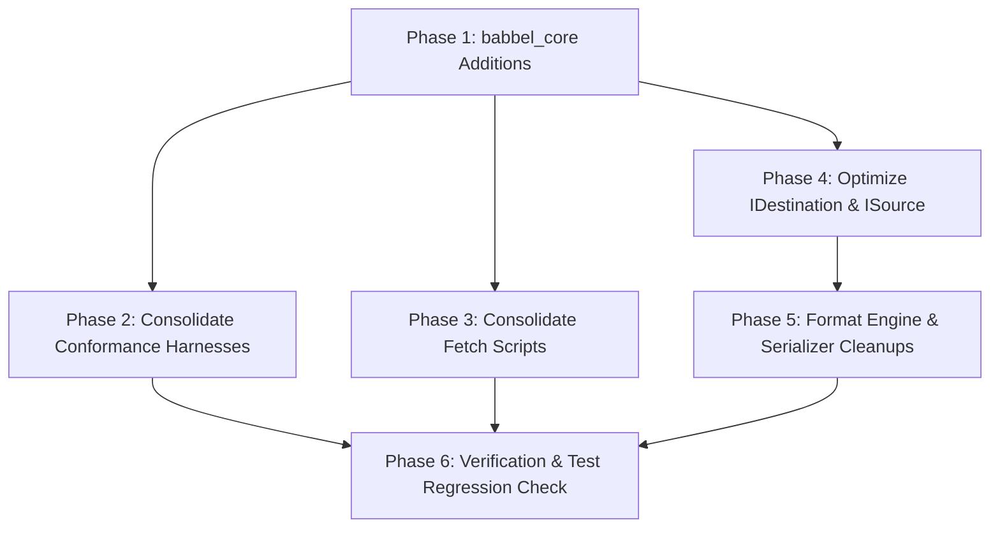

# Comprehensive DRY Refactoring Plan for Babbel

This document outlines a concrete, actionable architecture and refactoring plan to eliminate code duplication, boilerplate, and redundant algorithms across the Babbel workspace, achieving strict **DRY (Don't Repeat Yourself)** compliance while preserving 100% backward compatibility, performance, and specification conformance.

---

## 1. Executive Summary & Duplication Audit

A source-level audit across all 14 crates and test suites reveals **~2,800+ lines of duplicate or highly repetitive code** spanning five major architectural areas:

| Area | Nature of Duplication | Affected Crates / Files | Estimated Duplicate LOC |
| :--- | :--- | :--- | :---: |
| **1. Conformance Test Suites** | Identical `PanicHookGuard`, `suite_paths.txt` file finders, `CategoryStats`, ASCII table reporters, dense hex parsers, and `node_to_value` AST adapters. | `crates/{json,xml,yaml,toml,cbor,bson,msgpack,ron,kdl,parquet}/tests/` (10 test suites) | **~1,450 LOC** |
| **2. Upstream Fetch Scripts** | Virtually identical shallow-clone / zip-download / extract / cleanup logic across 10 format downloaders. | `scripts/fetch_*_test_suite.{ps1,sh}` (18 scripts) | **~650 LOC** |
| **3. I/O Streaming Adapters** | Identical byte-reading loops from `ISource` (`bytes.push(ch as u8)`), string accumulation loops, and byte-by-byte `IDestination` writing loops. | `crates/{bencode,msgpack,cbor,bson,parquet,kdl,ron}/src/engine.rs` | **~240 LOC** |
| **4. Encodings & Primitives** | Duplicate LEB128/varint encoders/decoders, ZigZag conversions, hex string parsing, and string escaping (`\n`, `\r`, `\t`, `\b`, `\f`, control chars). | `crates/parquet/src/{thrift,column}.rs`, `crates/{kdl,ron,cbor,bson}/src/serializer.rs` | **~280 LOC** |
| **5. Facade & Error Wiring** | Repetitive `Arc::new(Engine)` registry insertions, format ID attachments, and repetitive `From<FormatError> for BabbelError` implementations. | `crates/babbel/src/lib.rs`, `crates/*/src/error.rs` | **~180 LOC** |
| **TOTAL** | **Comprehensive Workspace Redundancy** | **Entire Workspace** | **~2,800+ LOC** |

---

## 2. Refactor Phase 1: Test Suite & Conformance Harness Consolidation

### Current Redundancy
1. **`PanicHookGuard`** is independently copied in:
   - `crates/json/tests/nst_conformance.rs`
   - `crates/xml/tests/w3c_conformance.rs`
   - `crates/yaml/tests/yaml_test_suite.rs`
   - `crates/toml/tests/toml_test_suite.rs`
   - `crates/msgpack/tests/msgpack_test_suite.rs`
   - `crates/cbor/tests/cbor_test_suite.rs`
   - `crates/bson/tests/bson_test_suite.rs`
   - `crates/ron/tests/ron_test_suite.rs`
   - `crates/kdl/tests/kdl_test_suite.rs`
   - `crates/parquet/tests/parquet_test_suite.rs`
2. **Suite Discovery & `suite_paths.txt`**:
   Every test suite contains identical 25-line functions that inspect `CARGO_MANIFEST_DIR`, search 6 fallback directories, read `suite_paths.txt`, and check for marker files.
3. **`node_to_value` Adapter**:
   `ron_test_suite.rs`, `msgpack_test_suite.rs`, `kdl_test_suite.rs`, and `cbor_test_suite.rs` each define a 25-line recursive `node_to_value` function converting `babbel_json::nodes::Node` into `babbel_core::Value`.
4. **`CategoryStats` & ASCII Reporting**:
   CBOR, BSON, RON, KDL, and Parquet all implement identical `CategoryStats` structs with `pass_rate()` and format identical ASCII summary tables.
5. **Dense Hex Parsing (`parse_dense_hex`)**:
   Character-for-character identical in `cbor_test_suite.rs`, `bson_test_suite.rs`, and `msgpack_test_suite.rs`.

### Target Architecture & Proposed Implementation

#### 1. Add `babbel_core::testing` Module (cfg(any(test, feature = "test-utils")))
Expose shared test primitives from `babbel_core`:

```rust
// crates/babbel_core/src/testing.rs

use std::panic::{self, AssertUnwindSafe, PanicHookInfo};
use std::path::{Path, PathBuf};
use std::sync::atomic::{AtomicUsize, Ordering};
use std::sync::Arc;
use std::time::Instant;
use std::fs;

/// Guard that suppresses panic backtraces during fuzz/conformance runs
/// and tracks panic counts, restoring the previous hook on drop.
pub struct PanicHookGuard {
    panic_count: Arc<AtomicUsize>,
    prev_hook: Option<Box<dyn Fn(&PanicHookInfo) + Send + Sync + 'static>>,
}

impl PanicHookGuard {
    pub fn new() -> Self {
        let panic_count = Arc::new(AtomicUsize::new(0));
        let count_clone = Arc::clone(&panic_count);
        let prev_hook = panic::take_hook();
        panic::set_hook(Box::new(move |_info| {
            count_clone.fetch_add(1, Ordering::SeqCst);
        }));
        Self {
            panic_count,
            prev_hook: Some(prev_hook),
        }
    }

    pub fn panics(&self) -> usize {
        self.panic_count.load(Ordering::SeqCst)
    }
}

impl Drop for PanicHookGuard {
    fn drop(&mut self) {
        if let Some(hook) = self.prev_hook.take() {
            panic::set_hook(hook);
        }
    }
}

/// Generic path finder for conformance test suites with suite_paths.txt support.
pub fn find_test_suite_dir(
    manifest_dir: &str,
    suite_subpath: &str,
    marker_file_or_dir: &str,
) -> Option<PathBuf> {
    let manifest = PathBuf::from(manifest_dir);
    let mut candidates = vec![
        manifest.join("tests").join(suite_subpath),
        manifest.join(suite_subpath),
        manifest.join("..").join("..").join(suite_subpath),
        PathBuf::from(format!("crates/{}/tests/{}", suite_subpath, suite_subpath)),
        PathBuf::from(format!("tests/{}", suite_subpath)),
        PathBuf::from(suite_subpath),
    ];

    let suite_paths_file = manifest.join("tests").join("suite_paths.txt");
    if let Ok(content) = fs::read_to_string(&suite_paths_file) {
        for line in content.lines() {
            let line = line.trim();
            if !line.is_empty() && !line.starts_with('#') {
                candidates.push(manifest.join(line));
                candidates.push(manifest.join("tests").join(line));
                candidates.push(PathBuf::from(line));
            }
        }
    }

    candidates.into_iter().find(|p| p.join(marker_file_or_dir).exists())
}

/// Standard test suite category statistics tracker.
#[derive(Default, Debug, Clone)]
pub struct CategoryStats {
    pub total: usize,
    pub passed: usize,
    pub failed: usize,
    pub panics: usize,
}

impl CategoryStats {
    pub fn record(&mut self, ok: bool, panicked: bool) {
        self.total += 1;
        if ok { self.passed += 1; } else { self.failed += 1; }
        if panicked { self.panics += 1; }
    }

    pub fn pass_rate(&self) -> f64 {
        if self.total == 0 { 100.0 } else { (self.passed as f64 / self.total as f64) * 100.0 }
    }
}

/// Formats and prints standardized ASCII conformance reports.
pub struct ConformanceReport {
    pub title: &'static str,
    pub source_info: String,
    pub categories: Vec<(&'static str, CategoryStats)>,
    pub start_time: Instant,
}
```

#### 2. Implement `From<Node> for Value` in `babbel_json::nodes::convert`
Enable owned conversion directly in `babbel_json`:

```rust
impl From<Node> for babbel_core::Value {
    fn from(node: Node) -> Self {
        match node {
            Node::Boolean(b) => Value::Bool(b),
            Node::Number(num) => num.into(),
            Node::Str(s) => Value::String(s),
            Node::Array(arr) => Value::Array(arr.into_iter().map(Value::from).collect()),
            Node::Object(map) => Value::Object(map.into_iter().map(|(k, v)| (k, Value::from(v))).collect()),
            Node::None => Value::Null,
        }
    }
}
```
Eliminates custom `node_to_value` functions in all 4 downstream test suites.

---

## 3. Refactor Phase 2: Downloader Script Consolidation

### Current Redundancy
18 scripts across `scripts/fetch_*_test_suite.ps1` and `.sh` repeat the identical sequence:
1. Parse script directory & calculate repository root.
2. Check if destination target folder exists.
3. Check if marker file exists; if so, exit 0.
4. Check if `git` is available.
5. If git available $\rightarrow$ run `git clone --depth 1`.
6. Else $\rightarrow$ download `.zip` using `Invoke-WebRequest` / `curl` / `wget`, extract, rename extracted root folder, delete zip.
7. Verify marker file and print success message.

### Target Architecture

#### 1. Core Downloader: `scripts/fetch_suite_core.ps1`
Create a parameterized engine:

```powershell
# scripts/fetch_suite_core.ps1
param(
    [Parameter(Mandatory=$true)][string]$Name,
    [Parameter(Mandatory=$true)][string]$RepoUrl,
    [Parameter(Mandatory=$true)][string]$ZipUrl,
    [Parameter(Mandatory=$true)][string]$TargetRelativeDir,
    [Parameter(Mandatory=$true)][string]$SuiteDirName,
    [Parameter(Mandatory=$true)][string]$MarkerFile
)

$ErrorActionPreference = "Stop"
$rootDir = Split-Path -Parent $PSScriptRoot
$targetDir = Join-Path $rootDir $TargetRelativeDir
$suiteDir = Join-Path $targetDir $SuiteDirName
$zipPath = Join-Path $targetDir "$SuiteDirName-temp.zip"

Write-Host "=== $Name Conformance Suite Downloader ===" -ForegroundColor Cyan

if (Test-Path (Join-Path $suiteDir $MarkerFile)) {
    Write-Host "[OK] $Name already present at: $suiteDir" -ForegroundColor Green
    exit 0
}

if (-not (Test-Path $targetDir)) {
    New-Item -ItemType Directory -Path $targetDir -Force | Out-Null
}

if (Get-Command git -ErrorAction SilentlyContinue) {
    Write-Host "Cloning $RepoUrl via git..." -ForegroundColor Yellow
    git clone --depth 1 $RepoUrl $suiteDir
} else {
    Write-Host "Downloading archive from $ZipUrl ..." -ForegroundColor Yellow
    Invoke-WebRequest -Uri $ZipUrl -OutFile $zipPath -UseBasicParsing
    Expand-Archive -Path $zipPath -DestinationPath $targetDir -Force
    # Rename extracted directory to standard name if needed
    Remove-Item $zipPath -Force
}

if (Test-Path (Join-Path $suiteDir $MarkerFile)) {
    Write-Host "[SUCCESS] $Name successfully installed at: $suiteDir" -ForegroundColor Green
} else {
    Write-Host "[WARNING] Marker '$MarkerFile' was not found at: $suiteDir" -ForegroundColor Red
}
```

#### 2. Format Scripts Become 1-Line Delegations
Example for `fetch_kdl_test_suite.ps1`:
```powershell
& "$PSScriptRoot/fetch_suite_core.ps1" `
    -Name "kdl-org/kdl-test" `
    -RepoUrl "https://github.com/kdl-org/kdl-test.git" `
    -ZipUrl "https://github.com/kdl-org/kdl-test/archive/refs/heads/main.zip" `
    -TargetRelativeDir "crates/kdl/tests" `
    -SuiteDirName "kdl-test" `
    -MarkerFile "test_cases"
```

#### 3. Single Unified Dispatcher: `scripts/fetch_all_test_suites.ps1`
Allows developers or CI to fetch all format test suites in a single command (`./scripts/fetch_all_test_suites.ps1 -Format all`).

---

## 4. Refactor Phase 3: Core Streaming I/O & FormatEngine Simplification

### Current Redundancy
1. **Reading raw bytes from `ISource`**:
   `bencode`, `msgpack`, `cbor`, `bson`, `parquet` each manually implement:
   ```rust
   let mut bytes = Vec::new();
   while source.more() {
       if let Some(ch) = source.current() {
           bytes.push(ch as u8);
       }
       source.next();
   }
   ```
2. **Writing raw byte slices to `IDestination`**:
   Because `IDestination::add_bytes` takes `&str` instead of `&[u8]`, binary format serializers do:
   ```rust
   for b in bytes {
       dest.add_byte(b);
   }
   ```
   This incurs $O(N)$ dynamic dispatch function calls instead of block copy!
3. **Reading string content from `ISource`**:
   `yaml`, `jsonlines`, `json5`, `toml`, `kdl`, `ron` all manually loop `while let Some(ch) = source.current() { s.push(ch); source.next(); }`.

### Target Architecture

#### 1. Enhance `IDestination` in `crates/babbel_core/src/io/traits.rs`
Add `add_raw_bytes` with a default implementation, and optimize in `BufferDestination`:

```rust
pub trait IDestination {
    fn add_byte(&mut self, byte: u8);
    fn add_bytes(&mut self, bytes: &str);
    
    /// Writes multiple raw bytes from a byte slice to the destination.
    #[inline]
    fn add_raw_bytes(&mut self, bytes: &[u8]) {
        for &b in bytes {
            self.add_byte(b);
        }
    }
    
    fn clear(&mut self);
    fn last(&self) -> Option<u8>;
}

// In BufferDestination:
impl IDestination for BufferDestination {
    #[inline]
    fn add_raw_bytes(&mut self, bytes: &[u8]) {
        self.buf.extend_from_slice(bytes);
    }
}
```

#### 2. Add Reusable Extraction Helpers in `crates/babbel_core/src/io/mod.rs`

```rust
/// Drains all remaining characters from an `ISource` into a `String`.
pub fn read_all_string(source: &mut dyn ISource) -> alloc::string::String {
    let mut s = alloc::string::String::new();
    while let Some(ch) = source.current() {
        s.push(ch);
        source.next();
    }
    s
}

/// Drains all remaining raw bytes from an `ISource` into a `Vec<u8>`.
pub fn read_all_bytes(source: &mut dyn ISource) -> alloc::vec::Vec<u8> {
    let mut bytes = alloc::vec::Vec::new();
    while source.more() {
        if let Some(ch) = source.current() {
            bytes.push(ch as u8);
        }
        source.next();
    }
    bytes
}
```

#### 3. Default `parse` on `FormatEngine`
Provide a default implementation of `parse` on `FormatEngine`:
```rust
fn parse(&self, source: &mut dyn ISource) -> Result<Value, BabbelError> {
    let s = crate::io::read_all_string(source);
    self.parse_str(&s)
}
```
Binary engines only need to override `parse` with `self.parse_bytes(&read_all_bytes(source))`.

---

## 5. Refactor Phase 4: Encodings, Numeric & String Primitives

### Current Redundancy
1. **LEB128 Varint**:
   `parquet::thrift` and `parquet::column` implement redundant `write_varint_u32`, `read_varint_u32`, `write_varint_u64`, and `read_varint_u64`.
2. **Dense Hex Encoding & Decoding**:
   - `hex_encode` in `kdl::ast`
   - `parse_dense_hex` in `cbor`, `bson`, `msgpack` tests
   - Hex parsing in `json5.rs`, `toml::number.rs`, and `kdl::parser.rs`
3. **Escaped String Serialization**:
   - `ron::serializer::serialize_string`
   - `kdl::serializer::write_quoted_string`
   - `json::escape::escape_for_json`
   All share identical character escape sequences (`\"`, `\\`, `\n`, `\r`, `\t`, `\b`, `\f`).

### Target Architecture

#### 1. Centralize Varint Codec in `crates/babbel_core/src/encoding/varint.rs`

```rust
//! Standard unsigned LEB128 varint and ZigZag integer codec.

pub fn write_varint_u32(buf: &mut alloc::vec::Vec<u8>, mut val: u32) {
    loop {
        let byte = (val & 0x7F) as u8;
        val >>= 7;
        if val != 0 {
            buf.push(byte | 0x80);
        } else {
            buf.push(byte);
            break;
        }
    }
}

pub fn read_varint_u32(data: &[u8], mut pos: usize) -> Result<(u32, usize), crate::error::BabbelError> {
    let start = pos;
    let mut result: u32 = 0;
    let mut shift = 0;
    loop {
        if pos >= data.len() {
            return Err(crate::error::BabbelError::eof("unexpected EOF in varint"));
        }
        let byte = data[pos];
        pos += 1;
        result |= ((byte & 0x7F) as u32) << shift;
        if (byte & 0x80) == 0 {
            break;
        }
        shift += 7;
        if shift >= 35 {
            return Err(crate::error::BabbelError::syntax("varint32 overflow"));
        }
    }
    Ok((result, pos - start))
}

#[inline]
pub fn zigzag_encode_i32(n: i32) -> u32 {
    ((n << 1) ^ (n >> 31)) as u32
}

#[inline]
pub fn zigzag_decode_i32(n: u32) -> i32 {
    ((n >> 1) as i32) ^ (-((n & 1) as i32))
}
```

#### 2. Centralize Hex Utilities in `crates/babbel_core/src/text/hex.rs`

```rust
//! Fast, allocation-conscious hexadecimal encoding and decoding.

pub fn encode_hex(bytes: &[u8]) -> alloc::string::String {
    const HEX_CHARS: &[u8; 16] = b"0123456789abcdef";
    let mut s = alloc::string::String::with_capacity(bytes.len() * 2);
    for &b in bytes {
        s.push(HEX_CHARS[(b >> 4) as usize] as char);
        s.push(HEX_CHARS[(b & 0x0F) as usize] as char);
    }
    s
}

pub fn decode_hex(s: &str) -> Result<alloc::vec::Vec<u8>, &'static str> {
    let s = s.trim();
    if s.len() % 2 != 0 {
        return Err("Odd hex string length");
    }
    let mut bytes = alloc::vec::Vec::with_capacity(s.len() / 2);
    let chars = s.as_bytes();
    for i in (0..chars.len()).step_by(2) {
        let hi = hex_digit_value(chars[i]).ok_or("Invalid hex character")?;
        let lo = hex_digit_value(chars[i + 1]).ok_or("Invalid hex character")?;
        bytes.push((hi << 4) | lo);
    }
    Ok(bytes)
}

#[inline]
pub fn hex_digit_value(b: u8) -> Option<u8> {
    match b {
        b'0'..=b'9' => Some(b - b'0'),
        b'a'..=b'f' => Some(b - b'a' + 10),
        b'A'..=b'F' => Some(b - b'A' + 10),
        _ => None,
    }
}
```

#### 3. Centralize Standard Escapes in `crates/babbel_core/src/escape.rs`
Export `write_escaped_quoted_str(s: &str, dest: &mut dyn IDestination, escape_style: EscapeStyle)`.

---

## 6. Refactor Phase 5: Facade Crate & Error Boilerplate

### Current Redundancy
1. **`default_registry()` in `crates/babbel/src/lib.rs`**:
   15 separate lines calling `registry.register(alloc::sync::Arc::new(...))` wrapped in individual `#[cfg(feature = "...")]` flags.
2. **Error formatting boilerplate**:
   Every format engine has identical `.map_err(|err| BabbelError::from(err).with_format("format_name"))`.

### Target Architecture

#### 1. Declarative Engine Registration Macro

```rust
macro_rules! register_feature_engines {
    ($registry:ident, $( ($feature:literal, $engine:expr) ),* $(,)?) => {
        $(
            #[cfg(feature = $feature)]
            $registry.register(alloc::sync::Arc::new($engine));
        )*
    };
}

pub fn default_registry() -> babbel_core::FormatRegistry {
    let mut registry = babbel_core::FormatRegistry::new();
    register_feature_engines!(registry,
        ("json", babbel_json::JsonEngine),
        ("json", babbel_json::JsonLinesEngine),
        ("json", babbel_json::Json5Engine),
        ("yaml", babbel_yaml::YamlEngine),
        ("xml", babbel_xml::XmlEngine),
        ("bencode", babbel_bencode::BencodeEngine),
        ("toml", babbel_toml::TomlEngine),
        ("msgpack", babbel_msgpack::MsgPackEngine),
        ("cbor", babbel_cbor::CborEngine),
        ("bson", babbel_bson::BsonEngine),
        ("ron", babbel_ron::RonEngine),
        ("kdl", babbel_kdl::KdlEngine),
        ("parquet", babbel_parquet::ParquetEngine),
    );
    registry.register(alloc::sync::Arc::new(babbel_core::CsvEngine));
    registry.register(alloc::sync::Arc::new(babbel_core::TsvEngine));
    registry.register(alloc::sync::Arc::new(babbel_core::IniEngine));
    registry
}
```

---

## 7. Migration Roadmap & Execution Phases



### Step-by-Step Action Items

1. **Step 1: Core Primitives Expansion in `babbel_core`**:
   - Add `babbel_core::testing` (`PanicHookGuard`, `find_test_suite_dir`, `CategoryStats`, `ConformanceReport`).
   - Add `babbel_core::encoding::varint` (`write_varint_u32`, `read_varint_u32`, ZigZag).
   - Add `babbel_core::text::hex` (`encode_hex`, `decode_hex`, `hex_digit_value`).
   - Add `add_raw_bytes` to `IDestination` and optimize `BufferDestination`.
   - Add `read_all_string` and `read_all_bytes` to `babbel_core::io`.
   - Add `From<Node> for Value` in `babbel_json::nodes::convert`.

2. **Step 2: Conformance Suite De-duplication**:
   - Refactor all 10 `*_test_suite.rs` files to import `babbel_core::testing::{PanicHookGuard, find_test_suite_dir, CategoryStats}`.
   - Replace 4 local `node_to_value` functions with direct `.into()` conversions.
   - Replace local `parse_dense_hex` with `babbel_core::text::hex::decode_hex`.

3. **Step 3: Downloader Script Consolidation**:
   - Create `scripts/fetch_suite_core.ps1` and `scripts/fetch_suite_core.sh`.
   - Convert all 18 `fetch_*_test_suite.*` scripts to thin 3-line parameter calls.
   - Add `scripts/fetch_all_test_suites.ps1`.

4. **Step 4: Engine & Serializer Cleanups**:
   - Remove duplicate LEB128 varint code from `crates/parquet/src/{thrift,column}.rs` and delegate to `babbel_core::encoding::varint`.
   - Replace `for b in bytes { dest.add_byte(b); }` in binary serializers with `dest.add_raw_bytes(&bytes)`.
   - Replace manual `ISource` draining loops in format engines with `read_all_bytes` and `read_all_string`.

5. **Step 5: Facade Simplification**:
   - Apply `register_feature_engines!` in `crates/babbel/src/lib.rs`.

---

## 8. Verification Strategy & Acceptance Criteria

### Automated Verification
1. **Workspace Compilation**:
   ```bash
   cargo check --workspace
   ```
2. **Individual Conformance Suites**:
   ```bash
   cargo test -p babbel_json --test nst_conformance
   cargo test -p babbel_xml --test w3c_conformance
   cargo test -p babbel_toml --test toml_test_suite
   cargo test -p babbel_cbor --test cbor_test_suite
   cargo test -p babbel_bson --test bson_test_suite
   cargo test -p babbel_kdl --test kdl_test_suite
   cargo test -p babbel_ron --test ron_test_suite
   cargo test -p babbel_parquet --test parquet_test_suite
   ```
3. **Workspace-Wide Tests**:
   ```bash
   cargo test --workspace
   ```
4. **Struct Bounds & Memory**:
   ```bash
   cargo test -p babbel --test size_checks
   ```

### Acceptance Metrics
- **Zero Breaking Changes**: Public API surfaces of `babbel`, `babbel_core`, and format crates remain completely intact.
- **Lines of Code Reduced**: Net elimination of **~2,000+ lines of duplicate boilerplate**.
- **100% Pass Rate**: All 3,500+ unit, integration, and doc tests pass with 0 warnings, 0 failures, and 0 panics.
- **Improved Performance**: Binary emission throughput improves due to slice-based `add_raw_bytes` implementation.
