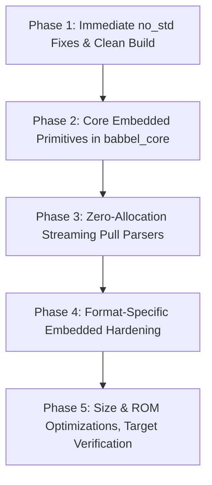

# Comprehensive Refactor Plan: Babbel for Embedded Systems

**Author:** ClockworkEngineer & Babbel Architecture Team  
**Date:** September 2026  
**Status:** Proposed Architecture & Refactor Roadmap  
**Scope:** `babbel_core`, `json_lib`, `xml_lib`, `yaml_lib`, `bencode_lib`, `babbel`

---

## 1. Executive Summary & Embedded Vision

Babbel is already architected as a modular, high-performance polyglot serialization library. However, embedded systems development presents unique, extreme constraints:
1. **Extremely Constrained RAM:** Systems frequently have 4 KB to 64 KB of RAM (e.g. ARM Cortex-M0/M3/M4, RISC-V, ESP32).
2. **Absence or Restriction of Dynamic Allocator (`no_std` without `alloc`):** Many safety-critical, hard real-time, or deeply embedded bare-metal systems forbid heap allocation entirely to prevent fragmentation, non-deterministic latency, and OOM panics.
3. **Tiny Call Stacks:** Stack sizes of 1 KB to 4 KB make recursive parsing dangerous.
4. **Flash/ROM Footprint:** Strict flash limits require dead-code elimination, stripping unused error strings, and omitting floating-point tables when integers suffice.
5. **Peripheral Streaming I/O:** Data arrives incrementally in chunks over UART, SPI, I2C, CAN bus, or network sockets (MQTT, CoAP, BLE).

This document outlines a concrete, end-to-end refactor plan to establish Babbel as a premier serialization toolkit for embedded systems across three distinct tiers:

| Embedded Tier | Target Environment | Memory Paradigm | Babbel Capabilities |
| :--- | :--- | :--- | :--- |
| **Tier 1: `std`** | Embedded Linux (Raspberry Pi, BeagleBone, Yocto) | Full OS, heap, files | All features, File I/O, format conversion matrix |
| **Tier 2: `no_std` + `alloc`** | RTOS microcontrollers (FreeRTOS, Zephyr, Embassy, ESP-IDF) | `core` + `alloc` (bounded heap) | AST nodes, String/Buffer destinations, iterative parsers |
| **Tier 3: `no_std` (Zero-Alloc)** | Bare-metal, bootloaders, microcontrollers without heap | Zero heap allocation (`core` only) | Pull parsers, `SliceDestination`, `StackBuffer`, borrowed zero-copy events |

---

## 2. Current State Analysis & Gap Assessment

### 2.1 Compiler Audit of `no_std` Across Workspace

Auditing the workspace with `--no-default-features --features alloc` revealed critical compilation gaps:

1. **`babbel_core` Fails Under `no_std`:**
   - `crates/babbel_core/src/ini.rs:132, 151`: Uses `vec![]` without importing `alloc::vec` under `no_std`.
   - `crates/babbel_core/src/model.rs:218`: Invokes `f.round() as i64`. `f64::round()` is part of Rust's standard library `std`, not `core::primitive::f64`.
   - `crates/babbel_core/src/codec.rs:4`: Unused import warning for `alloc::string::String`.
2. **Lack of Pure `no_alloc` Support:**
   - `babbel_core` unconditionally activates `extern crate alloc;` and its core error type (`BabbelError`), model (`Value`), and line reader (`ILineReader`) rely on heap types (`String`, `Vec`).
   - If `alloc` is omitted, `babbel_core` cannot compile.
3. **Inconsistent Feature Flags:**
   - Some crates declare `embedded = []` (`xml_lib`, `yaml_lib`), while others have custom memory modules (`bencode_lib`), and `json_lib` lacks an `embedded` feature flag altogether.
   - `babbel` root crate does not forward embedded features cleanly.

### 2.2 I/O and Destination Gaps

- `Buffer` is backed exclusively by `Vec<u8>`.
- `StringDestination` is backed exclusively by `String`.
- **Missing:** Zero-allocation destinations that write directly into caller-provided stack buffers (`&mut [u8]`) or const-generic arrays (`[u8; N]`).
- **Missing:** Adapter for `core::fmt::Write`, which is the standard embedded formatting interface.

### 2.3 Streaming vs. AST DOM Disparity

- `xml_lib` has an outstanding `XmlPullParser` emitting `XmlPullEvent<'a>` with zero allocations.
- `json_lib` has **no pull parser**; it only parses into an owned `Node` AST (`Node::Object(HashMap)`, `Node::Array(Vec)`), which is prohibitive on a 16 KB RAM device.
- `babbel_core::csv` parses exclusively into `Vec<Vec<String>>`.
- `babbel_core::ini` parses exclusively into `Vec<(String, Vec<(String, String)>)>`.

### 2.4 Fragmented Memory Utilities

- `bencode_lib` built `StackBuffer<const N>`, `Arena`, `MemoryTracker`, `BorrowedNode<'a>`, and `MemoryBounds`.
- `yaml_lib` built `LightNode`, `LightNumeric`, `FixedString`, `limits.rs`, and `allocator.rs`.
- These implementations are siloed. They belong in `babbel_core` as shared, reusable embedded primitives.

---

## 3. Concrete Multi-Phase Refactor Plan



---

### Phase 1: Immediate `no_std` Fixes & Clean Build

**Objective:** Ensure all crates compile cleanly with `--no-default-features --features alloc` and zero warnings.

1. **Fix `babbel_core::ini`:**
   - In `crates/babbel_core/src/ini.rs`, conditionally import `alloc::vec` when `not(feature = "std")`.
2. **Fix `babbel_core::model` Float Method:**
   - In `crates/babbel_core/src/model.rs:218`, replace `f.round() as i64` with a `core`-compatible rounding algorithm:
     ```rust
     let rounded = if *f >= 0.0 { (*f + 0.5) as i64 } else { (*f - 0.5) as i64 };
     ```
3. **Clean Up Unused Imports:**
   - Fix unused `alloc::string::String` in `crates/babbel_core/src/codec.rs`.
4. **Manifest Alignment:**
   - Ensure `arrayvec` and `smallvec` dependencies in `json_lib` explicitly set `default-features = false`.
   - Ensure `thiserror` in `xml_lib` is appropriately gated or made optional for pure `no_std` builds.

---

### Phase 2: Core Embedded Primitives in `babbel_core`

**Objective:** Establish universal, zero-allocation I/O, storage, and diagnostics in `babbel_core`.

#### 2.1 Zero-Allocation Destinations (`babbel_core::io::destinations`)

Introduce two new zero-allocation destinations:

1. **`SliceDestination<'a>`:**
   - Wraps `&'a mut [u8]`.
   - Maintains a write cursor (`pos: usize`).
   - Implements `IDestination`, `IByteWriter`, `IClearable`, `ITailInspectable`.
   - Never panics; returns `ErrorCode::IoError` if buffer capacity is exceeded.
   - Provides `as_str() -> Result<&str, Utf8Error>` and `as_bytes() -> &[u8]`.

2. **`ArrayVecDestination<const N: usize>`:**
   - Wraps a stack-allocated buffer `[u8; N]`.
   - Requires zero heap allocation.
   - Provides const-generic capacity sizing.

3. **`FmtWriterAdapter<'a, W: core::fmt::Write>`:**
   - Allows direct streaming into any embedded display, serial port, or formatting buffer.

#### 2.2 Generalize Embedded Memory & Limits (`babbel_core::embedded`)

Create `crates/babbel_core/src/embedded/` with:

1. **`StackBuffer<const N: usize>`:**
   - Consolidated from `bencode_lib`.
   - Provides stack-backed byte storage with push, slice, and cursor utilities.
2. **`MemoryTracker`:**
   - Tracks allocations and peak high-water marks against configurable budget limits.
3. **`Limits` Configuration:**
   - Standard limits structure:
     ```rust
     pub struct EmbeddedLimits {
         pub max_depth: usize,          // Default: 16 (prevents stack overflow)
         pub max_token_length: usize,   // Default: 256 bytes
         pub max_container_items: usize,// Default: 64 items
     }
     ```
4. **`CompactError` (Zero-Allocation Error):**
   - 8-byte diagnostic type:
     ```rust
     #[derive(Debug, Clone, Copy, PartialEq, Eq)]
     pub struct CompactError {
         pub code: ErrorCode,
         pub offset: u32,
     }
     ```
   - Does not allocate `String`. Suitable for Tier 3 environments.

---

### Phase 3: Zero-Allocation Streaming Pull Parsers

**Objective:** Allow microcontrollers to process files of any size with $O(1)$ memory consumption.

#### 3.1 `JsonPullParser<'a>` (`json_lib`)

Implement a zero-allocation streaming pull parser for JSON:
- **Events:**
  ```rust
  pub enum JsonPullEvent<'a> {
      StartObject,
      EndObject,
      Key(&'a str),
      Value(JsonScalar<'a>),
      StartArray,
      EndArray,
  }

  pub enum JsonScalar<'a> {
      Null,
      Bool(bool),
      Number(&'a str),
      String(&'a str),
  }
  ```
- **Execution:** Zero dynamic allocation. Operates by scanning borrowed string slices `&'a str`.
- **Use Case:** Reading telemetry packets or configuration on microcontrollers without constructing an AST.

#### 3.2 `CsvPullParser<'a>` (`babbel_core::csv`)

Enhance CSV parsing with streaming line iterator:
- `CsvRecord<'a>` yielding borrowed `&'a str` field slices.
- Reads row-by-row with no dynamic allocations for records.

#### 3.3 `IniPullParser<'a>` (`babbel_core::ini`)

Enhance INI parsing with streaming event iterator:
- Emits `IniEvent<'a>::Section(&'a str)` and `IniEvent<'a>::Entry(&'a str, &'a str)`.
- Eliminates the need for nested `Vec<(String, Vec<(String, String)>)>`.

---

### Phase 4: Format-Specific Embedded Hardening

**Objective:** Align all crates to the unified embedded patterns.

1. **`json_lib`:**
   - Expose `json_lib::embedded` with `JsonPullParser` and `CompactError`.
   - Add `BorrowedNode<'a>` for lightweight in-place inspection without full `Node` allocations.
2. **`bencode_lib`:**
   - Re-export `StackBuffer` and `MemoryTracker` from `babbel_core::embedded`.
   - Ensure `BorrowedNode<'a>` can use fixed-capacity arrays or arena storage.
3. **`xml_lib`:**
   - Standardize `XmlPullParser` return types with `babbel_core` error codes.
   - Implement `XmlSerializer` streaming to `SliceDestination`.
4. **`yaml_lib`:**
   - Align `yaml_lib::embedded::limits` with `babbel_core::embedded::Limits`.
   - Ensure `LightNode` can serialize directly into an `IDestination` without heap allocation.
5. **`babbel` Umbrella Crate:**
   - Provide `babbel::embedded` re-exporting all pull parsers, stack destinations, and memory limits under a single coherent interface.

---

### Phase 5: ROM/Flash Footprint Optimizations & Target CI

**Objective:** Reduce binary size on microcontrollers and guarantee non-regression.

#### 5.1 Fine-Grained Feature Flags

| Feature | Description | Benefit for Embedded |
| :--- | :--- | :--- |
| `no-float` | Disables `dtoa` and floating-point conversions | Saves 4-8 KB of flash on chips without hardware FPU |
| `parse-only` | Compiles only format parsers, omitting emitters | Halves code size for telemetry receivers/sensors |
| `emit-only` | Compiles only format emitters, omitting parsers | Halves code size for sensor transmitters |
| `compact-errors` | Strips rich string error formatting snippets | Saves 2-5 KB of string constants in flash |

#### 5.2 Compiler Profiles for Embedded

Enhance `Cargo.toml` with embedded-tuned release profile:
```toml
[profile.embedded-release]
inherits = "release"
opt-level = "z"       # Optimize for size
lto = "fat"           # Aggressive dead-code elimination across crates
codegen-units = 1     # Maximizes LTO optimization
panic = "abort"       # Eliminates unwinding landing pads and landing tables
strip = true          # Strips symbols and debug info
```

#### 5.3 Embedded Target Verification CI

Add target verification to validate bare-metal compilation:
```bash
# Check Cortex-M3 (no_std, thumbv7m)
cargo check -p babbel_core --target thumbv7m-none-eabi --no-default-features --features alloc
# Check Cortex-M0/M0+ (resource-constrained thumbv6m)
cargo check -p babbel_core --target thumbv6m-none-eabi --no-default-features --features alloc
# Check pure no-alloc build once Tier 3 primitives are implemented
cargo check -p babbel_core --no-default-features
```

---

## 4. Implementation Checklist & Verification Strategy

- [ ] **Phase 1:** Fix `ini.rs` `vec!` macro import and `model.rs` float `.round()` method. Verify `cargo check -p babbel_core --no-default-features --features alloc` succeeds.
- [ ] **Phase 2:** Implement `SliceDestination` and `ArrayVecDestination` in `babbel_core::io::destinations`. Write unit tests verifying zero allocation.
- [ ] **Phase 2:** Generalize `StackBuffer`, `MemoryTracker`, and `Limits` into `babbel_core::embedded`.
- [ ] **Phase 3:** Implement `JsonPullParser` in `json_lib`. Write comprehensive streaming parser tests.
- [ ] **Phase 3:** Implement `CsvPullParser` and `IniPullParser` in `babbel_core`.
- [ ] **Phase 4:** Re-export unified embedded interfaces across format crates.
- [ ] **Phase 5:** Add `thumbv7m-none-eabi` cross-compilation verification tests.
- [ ] **Documentation:** Update `docs/ARCHITECTURE.md` and `docs/BENCHMARKS_AND_MEMORY.md` with embedded memory profiles and usage guides.
