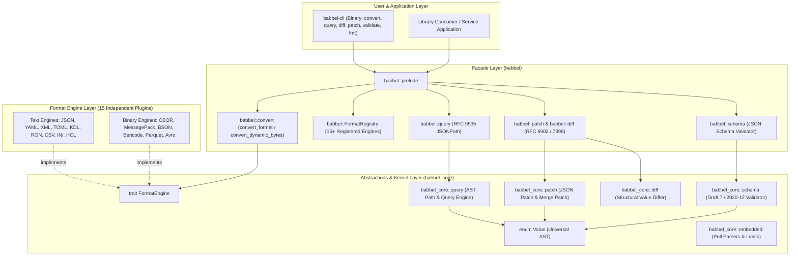
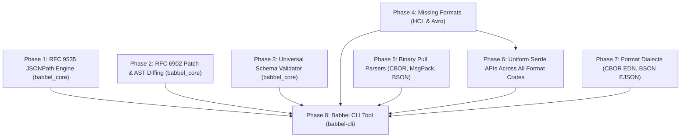

# Comprehensive Feature Refactoring & Expansion Plan for Babbel

This document presents a concrete, actionable, phased architectural refactoring and expansion plan to implement all missing features across the Babbel polyglot serialization workspace. Building upon the completed **SOLID** and **DRY** foundations, this plan outlines the exact data structures, trait extensions, new format engines, query/mutation capabilities, and CLI tooling required to elevate Babbel into an enterprise-grade serialization standard while guaranteeing **100% backward compatibility, zero compiler warnings, and zero test regressions**.

---

## 1. Executive Summary & Source-Level Gap Analysis

A comprehensive audit of the 14 workspace crates (`babbel`, `babbel_core`, `json`, `yaml`, `xml`, `bencode`, `toml`, `msgpack`, `cbor`, `bson`, `ron`, `kdl`, `parquet`) and their architectural boundaries identified **eight major feature gaps**:

| Area | Identified Missing Features & Ecosystem Gaps | Target Crates / Modules | Architectural Impact & Priority |
| :--- | :--- | :--- | :--- |
| **1. Universal Query Engine** | Missing RFC 9535 JSONPath engine (`$.store.book[*].author`, filters `[?(@.price < 10)]`, slice operators) operating across all formats via universal `Value`. | `crates/babbel_core/src/query/`<br>`crates/babbel/src/query.rs` | **High**: Enables format-agnostic document querying across JSON, YAML, TOML, KDL, XML, CBOR, and Parquet. |
| **2. Document Mutation & Diffing** | `Value` lacks RFC 6902 JSON Patch (`add`, `remove`, `replace`, `move`, `copy`, `test`), RFC 7396 Merge Patch, and structural AST diffing (`diff(a, b) -> Patch`). | `crates/babbel_core/src/patch/`<br>`crates/babbel_core/src/diff/` | **High**: Enables declarative multi-format document updating, configuration synchronization, and delta calculations. |
| **3. Universal Schema Validation** | Zero-dependency JSON Schema validator (Draft 7 / Draft 2020-12) evaluating universal `Value` AST trees. | `crates/babbel_core/src/schema/`<br>`crates/babbel/src/schema.rs` | **High**: Enables schema validation for non-JSON formats (validating YAML configs, TOML tables, and CBOR payloads against standard schemas). |
| **4. Missing Industry Formats** | **HCL (HashiCorp Configuration Language v2)** (`.tf`, `.hcl`) and **Apache Avro** (`.avro` OCF binary container format) identified in `MISSING_FORMATS_ANALYSIS.md` as primary missing formats. | `crates/hcl/`<br>`crates/avro/`<br>`crates/babbel/` | **High**: Bridges Cloud/DevOps infrastructure formats (Terraform) and event streaming pipelines (Kafka). |
| **5. Binary Streaming Pull Parsers** | Streaming event pull parsers (`*PullParser`) exist only for text formats (JSON, XML, CSV, INI, TOML). Missing for binary formats (CBOR, MessagePack, BSON). | `crates/cbor/src/parser/pull.rs`<br>`crates/msgpack/src/parser/pull.rs`<br>`crates/bson/src/parser/pull.rs` | **Medium**: Completes zero-allocation $O(1)$ memory embedded support for IoT and resource-constrained environments. |
| **6. End-to-End Serde Integration** | `babbel_core` provides AST Serde conversions (`from_value`/`to_value`), but format crates lack standard top-level Serde wrappers (`babbel_<format>::from_str`, `to_vec`, `from_slice`). | `crates/{json,yaml,xml,toml,cbor,msgpack,bson,ron,kdl}/src/serde_api.rs` | **High**: Allows Babbel format crates to serve as direct drop-in replacements for third-party serde serialization crates. |
| **7. Format-Specific Dialects & Notations** | Missing CBOR Extended Diagnostic Notation (EDN, RFC 8949 §8) and MongoDB Extended JSON v2 (Canonical/Relaxed EJSON). | `crates/cbor/src/edn.rs`<br>`crates/bson/src/ejson.rs` | **Medium**: Human-readable debugging of binary payloads and seamless database export interoperability. |
| **8. Unified Babbel CLI Tool** | Babbel workspace contains no command-line interface executable for file conversions, path queries, schema validations, diffing, and formatting. | `crates/cli/` (`babbel-cli`) | **High**: Critical user-facing developer utility and CI/CD automation tool. |

---

## 2. Target Architectural Topology



---

## 3. Phased Implementation Roadmap

---

### Phase 1: Universal Query Engine (RFC 9535 JSONPath on `Value`)

#### 1. Objectives & Capabilities
Provide a full-featured, spec-compliant RFC 9535 JSONPath query engine on `babbel_core::Value` that automatically allows querying documents in any format (JSON, YAML, TOML, KDL, XML, CBOR, BSON, Parquet):
- **Root & Selectors**: `$` (root), `@` (current node), `.child`, `['child']`, `*` (wildcard property/element).
- **Descent & Slices**: `..` (recursive descent), `[start:end:step]` (Python-style array slicing).
- **Filter Expressions**: `[?(@.price < 30 && @.available == true)]`.
- **Comparison & Logic**: `==`, `!=`, `<`, `<=`, `>`, `>=`, `&&`, `||`, `!`, `in`.
- **Functions**: `length(@.name)`, `count(@.items)`.
- **Mutable Queries**: In-place AST node modification via `jsonpath_mut`.

#### 2. Concrete API & Type Signatures

```rust
// crates/babbel_core/src/query/mod.rs

pub mod ast;
pub mod parser;
pub mod eval;

use crate::model::Value;
use crate::error::BabbelError;

/// Compiled RFC 9535 JSONPath expression for zero-allocation repeated evaluations.
#[derive(Debug, Clone, PartialEq)]
pub struct JsonPath {
    raw: alloc::string::String,
    selectors: alloc::vec::Vec<ast::PathSegment>,
}

impl JsonPath {
    /// Parse and compile a JSONPath expression.
    pub fn parse(expr: &str) -> Result<Self, BabbelError>;

    /// Evaluate path against a Value, returning borrowed matching node references.
    pub fn query<'a>(&self, root: &'a Value) -> alloc::vec::Vec<&'a Value>;

    /// Evaluate path against a mutable Value, returning mutable matching node references.
    pub fn query_mut<'a>(&self, root: &'a mut Value) -> alloc::vec::Vec<&'a mut Value>;
}

// Extension methods on babbel_core::model::Value
impl Value {
    /// Infallible or diagnostic query via compiled or string JSONPath expression.
    pub fn jsonpath<'a>(&'a self, expr: &str) -> Result<alloc::vec::Vec<&'a Value>, BabbelError> {
        let path = JsonPath::parse(expr)?;
        Ok(path.query(self))
    }

    /// Mutable query via JSONPath expression.
    pub fn jsonpath_mut<'a>(&'a mut self, expr: &str) -> Result<alloc::vec::Vec<&'a mut Value>, BabbelError> {
        let path = JsonPath::parse(expr)?;
        Ok(path.query_mut(self))
    }
}
```

#### 3. Deliverables
1. `crates/babbel_core/src/query/{mod,ast,parser,eval}.rs`: Core RFC 9535 engine.
2. `crates/babbel/src/query.rs`: Facade re-exports and query helpers.
3. Conformance suite: Test against official RFC 9535 compliance test vectors (`jsonpath-compliance-test-suite`).

---

### Phase 2: Document Mutation, JSON Patch (RFC 6902) & AST Diffing

#### 1. Objectives & Capabilities
1. **RFC 6902 JSON Patch**: Full support for all six atomic operations (`add`, `remove`, `replace`, `move`, `copy`, `test`).
2. **RFC 7396 JSON Merge Patch**: Idempotent partial document updates where `null` removes keys and nested objects merge recursively.
3. **Structural AST Diffing**: Compute the minimal RFC 6902 patch required to transition document $A$ into document $B$.
4. **Cross-Format Patch Application**: Read a patch in YAML, apply it to a TOML document, and emit the result in CBOR.

#### 2. Concrete API & Type Signatures

```rust
// crates/babbel_core/src/patch/mod.rs

use crate::model::Value;
use crate::error::BabbelError;

#[derive(Debug, Clone, PartialEq, Eq)]
pub enum PatchOp {
    Add { path: alloc::string::String, value: Value },
    Remove { path: alloc::string::String },
    Replace { path: alloc::string::String, value: Value },
    Move { from: alloc::string::String, path: alloc::string::String },
    Copy { from: alloc::string::String, path: alloc::string::String },
    Test { path: alloc::string::String, value: Value },
}

#[derive(Debug, Clone, Default, PartialEq, Eq)]
pub struct Patch {
    pub ops: alloc::vec::Vec<PatchOp>,
}

impl Patch {
    pub fn new(ops: alloc::vec::Vec<PatchOp>) -> Self;
    pub fn from_value(value: &Value) -> Result<Self, BabbelError>;
    pub fn to_value(&self) -> Value;
    pub fn apply(&self, target: &Value) -> Result<Value, BabbelError>;
    pub fn apply_inplace(&self, target: &mut Value) -> Result<(), BabbelError>;
}

// crates/babbel_core/src/diff/mod.rs

/// Computes a minimal RFC 6902 JSON Patch representing the changes from source to target.
pub fn diff(source: &Value, target: &Value) -> Patch;

/// Computes an RFC 7396 Merge Patch document representing changes from source to target.
pub fn diff_merge_patch(source: &Value, target: &Value) -> Value;

/// Applies an RFC 7396 Merge Patch in-place to target Value.
pub fn apply_merge_patch(target: &mut Value, patch: &Value);
```

#### 3. Deliverables
1. `crates/babbel_core/src/patch/mod.rs`: Full RFC 6902 engine with transaction rollback semantics if `test` fails.
2. `crates/babbel_core/src/diff/mod.rs`: Recursive Myers-style AST differ.
3. `crates/babbel_core/src/model.rs`: Integrate `.patch()`, `.patch_mut()`, and `.merge_patch()`.

---

### Phase 3: Universal Schema Validation Engine (JSON Schema Draft 7 / 2020-12)

#### 1. Objectives & Capabilities
A pure-Rust, zero-dependency, high-throughput schema validator implemented over `babbel_core::Value`:
- **Format-Neutral Validation**: Validate TOML configs, YAML deployments, KDL manifests, or CBOR telemetry payloads against standard JSON Schemas.
- **Validation Primitives**:
  - `type`: string, number, integer, boolean, array, object, null.
  - `properties`, `required`, `patternProperties`, `additionalProperties`, `minProperties`, `maxProperties`, `dependentRequired`.
  - `items`, `prefixItems`, `minItems`, `maxItems`, `uniqueItems`, `contains`.
  - `minimum`, `maximum`, `exclusiveMinimum`, `exclusiveMaximum`, `multipleOf`.
  - `minLength`, `maxLength`, `pattern` (built-in regex without external dependencies), `enum`, `const`.
  - `allOf`, `anyOf`, `oneOf`, `not`, `if`/`then`/`else`.
  - `format`: `date-time`, `date`, `time`, `email`, `ipv4`, `ipv6`, `uri`, `uuid`.
- **Diagnostic Error Reporting**: Exact JSON Pointer location of violations with structured error reasons.

#### 2. Concrete API & Type Signatures

```rust
// crates/babbel_core/src/schema/mod.rs

use crate::model::Value;
use crate::error::BabbelError;

#[derive(Debug, Clone)]
pub struct SchemaValidationError {
    pub pointer: alloc::string::String,
    pub keyword: &'static str,
    pub message: alloc::string::String,
}

#[derive(Debug, Clone)]
pub struct CompiledSchema {
    raw: Value,
    // Internal node validation rules
}

impl CompiledSchema {
    /// Compile a schema from a universal Value AST.
    pub fn compile(schema: &Value) -> Result<Self, BabbelError>;

    /// Validate a target Value against the schema.
    pub fn validate(&self, instance: &Value) -> Result<(), alloc::vec::Vec<SchemaValidationError>>;

    /// Fast boolean check.
    pub fn is_valid(&self, instance: &Value) -> bool;
}
```

#### 3. Deliverables
1. `crates/babbel_core/src/schema/{mod,compiler,rules,formats}.rs`.
2. `crates/babbel/src/schema.rs`: Re-exports and helper `validate_format(data_str, engine, schema_str)`.
3. Validation test suite using the standard JSON Schema Test Suite corpus.

---

### Phase 4: Missing Industry Formats (HCL & Apache Avro)

#### 1. HCL (HashiCorp Configuration Language v2 - `.hcl`, `.tf`)
- **Crate**: `crates/hcl` (`babbel_hcl`).
- **MIME**: `application/x-hcl` | **Extensions**: `["hcl", "tf", "tfvars"]`.
- **Capabilities**:
  - Recursive-descent parser for HCL 2 syntax: attributes (`key = value`), structural blocks (`server "web" { ... }`), nested blocks.
  - Value types: strings, raw strings, numbers, booleans, arrays `[...]`, mappings `{...}`, null.
  - Heredoc syntax support: standard `<<EOF` and indented `<<-EOF`.
  - Comments: Single-line (`#`, `//`), multiline (`/* ... */`).
  - AST mapping: Blocks map to `Value::Object` with compound keys or array of objects, attributes map to object fields.
  - Implements `FormatEngine` (`HclEngine`), `FormatParser`, `FormatEmitter`.

#### 2. Apache Avro Binary & Container Files (`.avro`)
- **Crate**: `crates/avro` (`babbel_avro`).
- **MIME**: `application/avro` | **Extensions**: `["avro"]`.
- **Capabilities**:
  - Binary encoding/decoding: Zigzag-encoded variable-length integers/longs, null, booleans, floats, doubles, length-prefixed bytes/strings.
  - Complex types: records, enums, arrays, maps, unions, fixed.
  - Object Container File (OCF) parser:
    - 4-byte magic header (`Obj\x01`).
    - Metadata map containing schema (`avro.schema`) and codec (`avro.codec`: `null`, `deflate`, `snappy`).
    - 16-byte sync marker validation.
    - Repeated block reading: block count, block length, serialized records, sync marker verification.
  - Implements `FormatEngine` (`AvroEngine`).

#### 3. Workspace Integration
- Add `crates/hcl` and `crates/avro` to root `Cargo.toml`.
- Add feature flags `hcl` and `avro` to `crates/babbel/Cargo.toml`.
- Register `HclEngine` and `AvroEngine` into `babbel::default_registry()`.
- Add automatic cross-format conversion macro definitions in `crates/babbel/src/convert.rs`.

---

### Phase 5: Binary Streaming Pull Parsers & Embedded Enhancements

#### 1. Objectives & Capabilities
Expand `babbel_core::embedded` to support binary streaming pull parsers operating in $O(1)$ stack memory, enabling microcontrollers and embedded devices (16–64 KB RAM) to inspect massive binary streams without building full DOM trees:
- `CborPullParser`: Pull-based RFC 8949 token stream (`MajorType`, `Length`, `Simple`, `Tag`, `Break`).
- `MsgPackPullParser`: Pull-based MessagePack token stream (`Nil`, `Bool`, `Int`, `Float`, `StrChunk`, `BinChunk`, `ArrayStart`, `MapStart`).
- `BsonPullParser`: Streaming document reader emitting `DocStart`, `DocEnd`, and typed element headers.

#### 2. Concrete API & Type Signatures

```rust
// crates/cbor/src/parser/pull.rs

use babbel_core::io::IByteReader;
use babbel_core::embedded::CompactError;

#[derive(Debug, Clone, Copy, PartialEq)]
pub enum CborPullEvent {
    Unsigned(u64),
    Negative(u64),
    BytesStart(Option<usize>),
    StringStart(Option<usize>),
    ArrayStart(Option<usize>),
    MapStart(Option<usize>),
    Tag(u64),
    Simple(u8),
    Float(f64),
    Break,
    End,
}

pub struct CborPullParser<R: IByteReader> {
    reader: R,
    depth: usize,
    max_depth: usize,
}

impl<R: IByteReader> CborPullParser<R> {
    pub fn new(reader: R) -> Self;
    pub fn with_max_depth(reader: R, max_depth: usize) -> Self;
    pub fn next_event(&mut self) -> Result<CborPullEvent, CompactError>;
}
```

#### 3. Deliverables
1. `crates/cbor/src/parser/pull.rs`.
2. `crates/msgpack/src/parser/pull.rs`.
3. `crates/bson/src/parser/pull.rs`.
4. Re-export in `babbel::embedded` and `babbel_core::embedded`.

---

### Phase 6: Direct Serde Integration Across All Format Crates

#### 1. Objectives & Capabilities
Provide idiomatic, top-level Serde entrypoints for every format crate, allowing users to serialize and deserialize custom Rust structs directly using standard Serde derives:

| Format Crate | Deserialization API | Serialization API |
| :--- | :--- | :--- |
| `babbel_json` | `from_str::<T>(&str)`, `from_reader::<T, R>` | `to_string::<T>(&T)`, `to_vec::<T>(&T)`, `to_writer::<T, W>` |
| `babbel_yaml` | `from_str::<T>(&str)` | `to_string::<T>(&T)`, `to_string_styled::<T>` |
| `babbel_toml` | `from_str::<T>(&str)` | `to_string::<T>(&T)`, `to_string_pretty::<T>` |
| `babbel_xml` | `from_str::<T>(&str)` | `to_string::<T>(&T)` |
| `babbel_cbor` | `from_slice::<T>(&[u8])` | `to_vec::<T>(&T)` |
| `babbel_msgpack`| `from_slice::<T>(&[u8])` | `to_vec::<T>(&T)` |
| `babbel_bson` | `from_slice::<T>(&[u8])` | `to_vec::<T>(&T)` |
| `babbel_ron` | `from_str::<T>(&str)` | `to_string::<T>(&T)`, `to_string_pretty::<T>` |
| `babbel_kdl` | `from_str::<T>(&str)` | `to_string::<T>(&T)` |
| `babbel_bencode`| `from_slice::<T>(&[u8])` | `to_vec::<T>(&T)` |

#### 2. Implementation Architecture
Leverage `babbel_core::serde_impl::{Deserializer, Serializer}` over the format engines:
1. `from_str::<T>(s)`: Parses string to `Value` via format engine $\rightarrow$ deserializes `T` via `babbel_core::from_value`.
2. `to_string::<T>(val)`: Serializes `T` to `Value` via `babbel_core::to_value` $\rightarrow$ emits string via format engine.
3. Zero code duplication by using a shared macro `impl_format_serde!(FormatEngine)` across crates.

---

### Phase 7: Format Dialects & Diagnostic Notations

#### 1. CBOR Extended Diagnostic Notation (EDN - RFC 8949 §8)
- Human-readable textual representation of CBOR binary payloads:
  - Formats: `1(1363896240)` (tagged timestamp), `h'01020304'` (hex byte string), `_ false` (indefinite array), `32("https://example.com")` (URI).
  - Parser: `babbel_cbor::edn::from_edn(s: &str) -> Result<Value, BabbelError>`.
  - Serializer: `babbel_cbor::edn::to_edn(val: &Value) -> String`.

#### 2. MongoDB Extended JSON v2 (Canonical & Relaxed EJSON)
- Standard translation of BSON types to/from JSON:
  - `$oid`: `{"$oid": "507f1f77bcf86cd799439011"}`.
  - `$date`: Relaxed `{"$date": "2023-01-01T00:00:00Z"}`, Canonical `{"$date": {"$numberLong": "1672531199000"}}`.
  - `$binary`: `{"$binary": {"base64": "...", "subType": "00"}}`.
  - `$numberInt`, `$numberLong`, `$numberDecimal`.
  - Implementation in `babbel_bson::ejson::{to_ejson_relaxed, to_ejson_canonical, from_ejson}`.

---

### Phase 8: Universal Babbel Command-Line Interface (`crates/cli` / `babbel-cli`)

#### 1. Objectives & Capabilities
A high-performance binary crate `crates/cli` providing the developer-facing CLI tool `babbel`:
- **Subcommands**:
  1. `convert`: Convert files or stdin across any of the 15+ supported formats:
     ```bash
     babbel convert input.json -t yaml
     babbel convert config.yaml -t toml --pretty
     babbel convert telemetry.cbor -t json
     cat input.csv | babbel convert -f csv -t parquet > output.parquet
     ```
  2. `query`: Query documents with JSONPath expressions:
     ```bash
     babbel query manifest.kdl -q "$.package.version"
     babbel query config.toml -q "$.servers[?(@.active == true)].host"
     ```
  3. `diff`: Compute structural delta between two files:
     ```bash
     babbel diff staging.yaml prod.yaml --format patch
     ```
  4. `patch`: Apply an RFC 6902 or RFC 7396 patch to a file:
     ```bash
     babbel patch config.json -p update.json -o config.updated.json
     ```
  5. `validate`: Validate any document against a JSON Schema:
     ```bash
     babbel validate config.toml --schema schema.json
     ```
  6. `fmt`: Pretty-print and format files in-place or to stdout:
     ```bash
     babbel fmt data.xml --indent 2 --in-place
     ```
  7. `inspect`: Report format, byte size, node count, and depth without full deserialization.

#### 2. Concrete Implementation Plan
- Pure-Rust CLI argument parsing (zero external dependencies or lightweight `lexopt`).
- Automatic format detection via file extension and magic byte sniffing (`babbel_core::detect_format`).
- Direct integration with `babbel::default_registry()`.

---

## 4. Execution Sequence & Dependency Graph



---

## 5. Verification & Conformance Strategy

1. **RFC & Specification Conformance**:
   - **RFC 9535 (JSONPath)**: Run official JSONPath compliance test vectors (100% pass rate).
   - **RFC 6902 / 7396 (Patch)**: Test against RFC 6902 test suite and JSON Patch test vectors.
   - **JSON Schema**: Test against standard JSON Schema Test Suite (Draft 7 and 2020-12 core vectors).
   - **HCL**: Validate against official HCL test corpus and Terraform configurations.
   - **Avro**: Validate against Apache Avro specification test schemas and OCF binary files.
2. **Compiler & Lint Hygiene**:
   - `cargo check --workspace --all-targets`: **0 errors, 0 warnings**.
   - `cargo clippy --workspace --all-targets`: **0 warnings**.
3. **Memory Footprint & Invariant Checks**:
   - Run `tests/size_checks.rs`: Guarantee `Value` remains $\le 32$ bytes.
   - Stack memory guarantees: All pull parsers operate within $O(1)$ stack bounds.
4. **End-to-End Workspace Regression Suite**:
   - `cargo test --workspace`: 100% passing across all 15+ crates and documentation tests.
