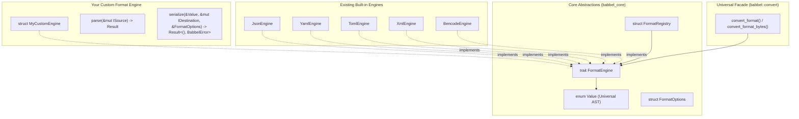

# FormatEngine Plugin & Extensibility Developer Guide

This guide explains how to extend Babbel with custom or proprietary data formats (e.g. MessagePack, CBOR, Protocol Buffers, INI, custom binary protocols) by implementing the **Open-Closed Principle (OCP)** and **Dependency Inversion Principle (DIP)** architectural traits in `babbel_core`.

By implementing `FormatEngine`, your custom format automatically gains full interoperability with all existing Babbel formats (JSON, YAML, XML, TOML, Bencode, CSV, TSV, INI, JSON Lines) and seamless integration with `babbel::convert`.

---

## 1. Architectural Overview

Traditional serialization libraries require $O(N^2)$ converters when adding a new format: you must write bespoke `custom_to_json`, `json_to_custom`, `custom_to_yaml`, `yaml_to_custom`, etc.

Babbel decouples format implementations through the universal **`Value` AST** and the **`FormatEngine`** trait:



With just **one** implementation of `FormatEngine`:
1. Any format can convert **into** your custom format.
2. Your custom format can convert **into** any existing format.
3. Documents can be parsed from files, buffers, slices, or network streams.
4. Your engine can be looked up dynamically by MIME type, file extension, or format ID.

---

## 2. The `FormatEngine` Trait Specification

The `FormatEngine` trait is defined in [`babbel_core::codec`](../crates/babbel_core/src/codec.rs):

```rust
pub trait FormatEngine: Send + Sync {
    /// Unique format identifier in lowercase (e.g., "msgpack", "cbor").
    fn format_id(&self) -> &'static str;

    /// Canonical MIME type (e.g., "application/msgpack").
    fn mime_type(&self) -> &'static str;

    /// Associated file extensions without leading dots (e.g., &["msgpack", "mp"]).
    fn file_extensions(&self) -> &'static [&'static str];

    /// Ingest raw stream into the universal Value AST.
    fn parse(&self, source: &mut dyn ISource) -> Result<Value, BabbelError>;

    /// Convenient parsing helper for UTF-8 text string (default provided).
    fn parse_str(&self, input: &str) -> Result<Value, BabbelError>;

    /// Convenient parsing helper for raw byte slice (default provided).
    fn parse_bytes(&self, input: &[u8]) -> Result<Value, BabbelError>;

    /// Serialize the universal Value AST into an output destination.
    fn serialize(
        &self,
        value: &Value,
        destination: &mut dyn IDestination,
        options: &FormatOptions,
    ) -> Result<(), BabbelError>;

    /// Convenient serialization to an owned String (default provided).
    fn serialize_to_string(&self, value: &Value, options: &FormatOptions) -> Result<String, BabbelError>;

    /// Convenient serialization to an owned Vec<u8> (default provided).
    fn serialize_to_vec(&self, value: &Value, options: &FormatOptions) -> Result<Vec<u8>, BabbelError>;
}
```

---

## 3. Step-by-Step Tutorial: Implementing a Custom Format Engine

Let's build a simple custom **Key-Value Pair ("kvp")** engine (`key=value\n`) as a concrete example.

### Step 1: Define Your Engine Struct

```rust
use babbel_core::{BabbelError, FormatEngine, FormatOptions, IDestination, ISource, Value};
use std::collections::HashMap;

#[derive(Debug, Default, Clone, Copy)]
pub struct KeyValueEngine;
```

### Step 2: Implement Metadata Methods

```rust
impl FormatEngine for KeyValueEngine {
    fn format_id(&self) -> &'static str {
        "kvp"
    }

    fn mime_type(&self) -> &'static str {
        "text/x-key-value"
    }

    fn file_extensions(&self) -> &'static [&'static str] {
        &["kvp", "kv"]
    }
```

### Step 3: Implement `parse` Producing `Value`

The parser ingests from `&mut dyn ISource` and maps the syntax into `babbel_core::Value`:

```rust
    fn parse(&self, source: &mut dyn ISource) -> Result<Value, BabbelError> {
        let mut map = HashMap::new();

        // Use ILineReader or read entire string from source
        let text = source.to_string();
        for line in text.lines() {
            let trimmed = line.trim();
            if trimmed.is_empty() || trimmed.starts_with('#') {
                continue;
            }
            if let Some((k, v)) = trimmed.split_once('=') {
                let key = k.trim().to_string();
                let val = v.trim();
                
                // Auto-infer integers, booleans, or fallback to string
                let val_node = if let Ok(n) = val.parse::<i64>() {
                    Value::Integer(n as i128)
                } else if let Ok(b) = val.parse::<bool>() {
                    Value::Bool(b)
                } else {
                    Value::String(val.to_string())
                };

                map.insert(key, val_node);
            }
        }

        Ok(Value::Object(map))
    }
```

### Step 4: Implement `serialize` Writing to `IDestination`

The serializer translates `babbel_core::Value` into output bytes or characters via `&mut dyn IDestination`:

```rust
    fn serialize(
        &self,
        value: &Value,
        destination: &mut dyn IDestination,
        _options: &FormatOptions,
    ) -> Result<(), BabbelError> {
        match value {
            Value::Object(map) => {
                for (k, v) in map {
                    destination.add_bytes(k);
                    destination.add_byte(b'=');
                    match v {
                        Value::String(s) => destination.add_bytes(s),
                        Value::Integer(i) => destination.add_bytes(&i.to_string()),
                        Value::Bool(b) => destination.add_bytes(if *b { "true" } else { "false" }),
                        _ => destination.add_bytes(&v.to_string()),
                    }
                    destination.add_byte(b'\n');
                }
                Ok(())
            }
            _ => Err(BabbelError::unsupported("KVP engine only supports root Object/Map")),
        }
    }
}
```

---

## 4. Registering and Using Your Engine

### 4.1 Direct Usage in Cross-Format Conversions

Once your engine implements `FormatEngine`, it immediately plugs into `babbel::convert`:

```rust
use babbel::convert::{convert_format, ConversionOptions};
use babbel::json::JsonEngine;

let kvp_data = "name=babbel\nversion=1\nactive=true\n";

// Convert custom KVP format directly into YAML!
let yaml_out = convert_format(
    kvp_data,
    &KeyValueEngine,
    &babbel::yaml::YamlEngine,
    &ConversionOptions::default(),
)?;
println!("YAML Output:\n{}", yaml_out);

// Convert JSON directly into custom KVP format!
let json_input = r#"{"database": "postgres", "port": 5432}"#;
let kvp_out = convert_format(
    json_input,
    &JsonEngine,
    &KeyValueEngine,
    &ConversionOptions::default(),
)?;
println!("KVP Output:\n{}", kvp_out);
```

### 4.2 Dynamic Registry Integration (`FormatRegistry`)

You can register your engine with `babbel_core::codec::FormatRegistry` or extend the default registry:

```rust
use babbel::default_registry;
use std::sync::Arc;

let mut registry = default_registry();

// Register the custom engine
registry.register(Arc::new(KeyValueEngine));

// Lookup engine dynamically by file extension
let engine = registry.get_by_extension("kvp").expect("engine found");
assert_eq!(engine.format_id(), "kvp");

// Lookup engine dynamically by MIME type
let engine_mime = registry.get_by_mime("text/x-key-value").expect("engine found");
assert_eq!(engine_mime.format_id(), "kvp");

// List all active formats
println!("Supported formats: {:?}", registry.available_formats());
// Output: ["json", "yaml", "xml", "bencode", "toml", "kvp"]
```

### 4.3 Static Slice Lookup (`find_engine*`)

In `no_std` or embedded environments where dynamic heap allocation (`Arc`) is undesirable, engines can be placed in a static slice and resolved via zero-allocation helpers:

```rust
use babbel_core::codec::{find_engine, find_engine_by_extension, find_engine_by_mime, FormatEngine};
use babbel_json::JsonEngine;
use babbel_yaml::YamlEngine;

let engines: &[&dyn FormatEngine] = &[
    &JsonEngine,
    &YamlEngine,
    &KeyValueEngine,
];

let engine = find_engine(engines, "kvp").unwrap();
assert_eq!(engine.mime_type(), "text/x-key-value");

let engine_by_ext = find_engine_by_extension(engines, ".kv").unwrap();
assert_eq!(engine_by_ext.format_id(), "kvp");
```

---

## 5. Binary & Byte-Oriented Formats

If your custom format is binary-oriented (like MessagePack or CBOR):

1. Implement `parse_bytes(&[u8]) -> Result<Value, BabbelError>`.
2. In `serialize()`, write raw binary bytes directly via `destination.add_byte()` or `destination.add_bytes()`.
3. Use `convert_format_bytes()` for binary conversion pipelines:

```rust
use babbel::convert::{convert_format_bytes, ConversionOptions};

let binary_input: &[u8] = &[/* raw binary bytes */];
let bencode_bytes = convert_format_bytes(
    binary_input,
    &MyBinaryEngine,
    &babbel::bencode::BencodeEngine,
    &ConversionOptions::default(),
)?;
```

---

## 6. Testing & Quality Checklist for Custom Engines

When implementing a custom `FormatEngine`, ensure:

- [ ] **Thread Safety**: Engine implements `Send + Sync`.
- [ ] **Infallible Stringifying**: `serialize()` does not panic on any variant of `Value`.
- [ ] **Error Propagation**: Syntax errors use `BabbelError::syntax()` or `BabbelError::invalid_data()`.
- [ ] **Round-Trip Fidelity**: `engine.serialize(&engine.parse_str(input)?)` preserves data semantics.
- [ ] **Zero Unsafe Code**: Safe Rust only.
