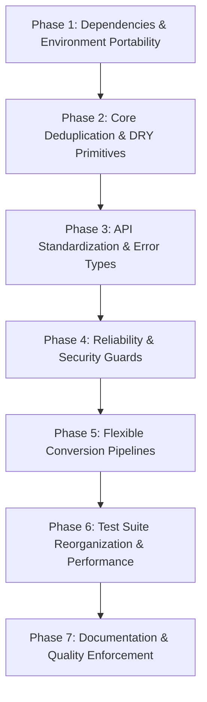

# Babbel Quality Attributes Refactoring Plan

This document outlines a comprehensive, concrete refactoring plan for the **Babbel** workspace, designed to align every crate in the repository with the 10 core software library quality attributes defined in [`notes/attributes.md`](../notes/attributes.md).

---

## 1. Quality Attributes Scorecard & Gap Analysis

Based on our architectural and source-level audit across `babbel_core`, `babbel_json`, `babbel_yaml`, `babbel_bencode`, `babbel_xml`, and the master facade `babbel`:

| Attribute | Current Score | Key Strengths | Identified Deficiencies & Anti-Patterns |
| :--- | :---: | :--- | :--- |
| **1. Intuitive API Design** | 6.5 / 10 | Clean facade re-exports in `babbel`; universal conversion matrix in `babbel::convert`. | Inconsistent parsing/serialization function verbs across crates (`parse_string` vs `from_str` vs `parse_str` vs `parse`); `bencode` returns raw `Result<Node, String>`; confusing `misc` modules; conflicting `to_json` vs `babbel::convert::json_to_yaml`. |
| **2. Comprehensive Documentation** | 7.5 / 10 | Rich Markdown docs in `docs/` and crate READMEs; architectural diagrams. | Truncated crate doc-header in `crates/yaml/src/lib.rs`; missing doctests on lower-level public APIs; incomplete `# Errors` and `# Panics` sections. |
| **3. High Reliability** | 7.0 / 10 | Zero `.unwrap()` in core library execution; extensive unit test coverage. | `babbel_bencode` uses string error messages without classification; un-preallocated string allocations in bencode parser; test file leaks into root directory. |
| **4. Performance & Efficiency** | 8.0 / 10 | Compact AST memory layouts ($\le 32$B `Value`); zero-alloc `itoa`/`dtoa`; `read_line_slice` borrowing. | Over 190 KB of duplicate point-to-point format serializers; char-by-char pushes in bencode string parsing; boilerplate trampoline buffer wrappers. |
| **5. Maintainability** | 6.0 / 10 | Modular 3-tier layering model; shared `babbel_core::io` traits. | Severe DRY violations: `MemoryTracker` and `StackBuffer` duplicated between `babbel_core` and `babbel_bencode`; file I/O repeated across crates; integration tests located in `src/`; `crates/files` is a fixture folder misplaced inside `crates/`. |
| **6. Flexibility & Customization** | 7.0 / 10 | `ParseOptions` in XML; `CsvOptions` and `IniOptions` in core; `ParserConfig` across formats. | `babbel::convert` pipelines use zero-config unit structs with no ability to pass delimiters, pretty-printing, or custom schemas; lack of a unified conversion builder. |
| **7. Strong Security** | 7.5 / 10 | XML entity expansion limits; billion laughs protection; `#![forbid(unsafe_code)]` in XML. | Bencode string length is parsed and allocated before validating remaining stream length (DoS hazard); lack of unified recursion depth limits across all recursive-descent paths. |
| **8. High Testability** | 6.5 / 10 | >3,500 tests across workspace; AST size regression suite. | `crates/xml/tests` contains 26 separate `.rs` files creating 26 standalone test binaries (slow linking on Windows); tests write directly to workspace root; integration tests inside `src/`. |
| **9. Compatibility & Portability** | 7.5 / 10 | `no_std` + `alloc` support; `ILineReader` cross-platform newline normalization. | Edition mismatch (`babbel_xml` on 2021 vs workspace on 2024); Windows file locking during tests requires manual `--jobs 2` flag due to unisolated test files. |
| **10. Low Dependency Footprint** | 7.0 / 10 | Minimal baseline dependencies (`itoa`, `dtoa`, `smallvec`, `arrayvec`). | Unused optional dependencies (`rand` in `json`, `bencode`, `yaml`); redundant feature flags (`format-bencode`, `format-yaml`, etc.) pulling in dead code. |

---

## 2. Refactoring Vision & Core Architectural Decisions

### Decision 1: Eradicate $O(M^2)$ Point-to-Point Serializers (DRY & OCP)
- **Problem**: Each format crate (`babbel_json`, `babbel_yaml`, `babbel_bencode`) contains hand-written stringifiers converting its AST into other formats (e.g. `json/src/stringify/yaml.rs`, `bencode/src/stringify/xml.rs`, etc.). This represents over **190 KB** of duplicated code that violates the architectural premise of Babbel.
- **Solution**: Consolidate all cross-format conversions through `babbel_core::model::Value` and `babbel_core::codec::{FormatParser, FormatEmitter}`. Mark crate-local point-to-point serializers as deprecated or route them through the universal intermediate `Value` AST, stripping out duplicated serialization engines.

### Decision 2: API Verb Standardization (Intuitive API Design)
- **Problem**: Users must remember different methods for every format: `from_str`, `parse_string`, `parse_str`, or `parse`.
- **Solution**: Implement uniform conventions across all format crates:
  - **Parsing**:
    - `from_str(&str) -> Result<Node, Error>` (canonical string parse)
    - `from_bytes(&[u8]) -> Result<Node, Error>` (canonical byte parse)
    - `from_source(&mut dyn ISource) -> Result<Node, Error>` (streaming parse)
    - Retain legacy names as `#[inline]` aliases for backward compatibility.
  - **Serialization**:
    - `to_string(&Node) -> Result<String, Error>`
    - `to_vec(&Node) -> Result<Vec<u8>, Error>`
    - `to_destination(&Node, &mut dyn IDestination) -> Result<(), Error>`
  - **Facade Conversions**:
    - Retain `babbel::convert::json_to_yaml(...)` convenience functions.
    - Introduce a fluent builder: `babbel::convert::from(Format::Json).to(Format::Yaml).convert(data)`.

### Decision 3: Error Handling Modernization (High Reliability & Maintainability)
- **Problem**: `babbel_bencode::parse` returns `Result<Node, String>`.
- **Solution**: Refactor `babbel_bencode` to return `Result<Node, BencodeError>`. Ensure `BencodeError`, `ParseError`, `YamlError`, and `XmlError` all implement `std::error::Error`, provide `ErrorCode`, and implement `From<Error> for BabbelError`.

### Decision 4: Single Source of Truth for Embedded & I/O Primitives (DRY)
- **Problem**: `MemoryTracker` and `StackBuffer` exist in both `babbel_core::embedded` and `babbel_bencode::memory`. File reading and BOM detection wrappers are duplicated across crates.
- **Solution**: `babbel_core` remains the sole authority for `StackBuffer`, `MemoryTracker`, `Buffer`, `FileSource`, and `FileDestination`. Sub-crates re-export directly from `babbel_core` without creating wrapper layers or duplicate test suites.

### Decision 5: Test Suite Consolidation & Clean Directory Layout (High Testability)
- **Problem**:
  - `crates/xml/tests` compiles 26 separate integration test executables.
  - `crates/json/src/integration_tests` and `crates/bencode/src/integration_tests` violate Rust packaging conventions.
  - `crates/files` is a test fixtures directory placed alongside workspace crates.
- **Solution**:
  - Move `crates/files` to `tests/fixtures/` at workspace root.
  - Relocate all `src/integration_tests` to `tests/` directories.
  - Consolidate XML tests into grouped integration modules to drastically reduce link times on Windows.
  - Migrate all file-writing tests to use `tempfile::tempdir()` to eliminate Windows file locking and parallel test execution conflicts.

---

## 3. Detailed Phased Implementation Plan



### Phase 1: Dependencies & Environment Portability (Attributes 9 & 10)
**Goal**: Normalize compiler edition, purge dead dependencies, and streamline Cargo features.

1. **Rust 2024 Edition Normalization**:
   - Update `crates/xml/Cargo.toml` from `edition = "2021"` to `edition = "2024"`.
   - Verify zero compiler warnings with Rust 1.88+.
2. **Remove Unused Dependencies**:
   - Remove `rand = { version = "0.10.0", optional = true }` from `crates/json/Cargo.toml`.
   - Remove `rand` optional dependency from `crates/bencode/Cargo.toml`.
   - Ensure `rand` in `crates/yaml/Cargo.toml` is confined to `[dev-dependencies]` for property testing.
3. **Feature Cleanup**:
   - Deprecate point-to-point format features (`format-bencode`, `format-yaml`, `format-xml`, `format-toml`) in individual format crates.
   - Standardize core feature flags across all crates:
     - `std` (default): standard library support.
     - `alloc`: heap allocation for `no_std` targets.
     - `embedded`: zero-allocation streaming mode.
     - `file-io`: file system support.

### Phase 2: Core Deduplication & DRY Primitives (Attributes 4 & 5)
**Goal**: Remove duplicate code, eliminate boilerplate trampoline wrappers, and correct project layout.

1. **Relocate Test Fixtures**:
   - Move `crates/files` $\rightarrow$ `tests/fixtures`.
   - Update fixture path references across tests.
2. **Deduplicate Embedded Primitives**:
   - In `crates/bencode/src/memory/mod.rs`: Replace duplicate implementations of `MemoryTracker` and `StackBuffer` with re-exports from `babbel_core::embedded`.
   - Retain `Arena` allocator in `babbel_bencode` or move to `babbel_core::embedded` if generally useful.
3. **Consolidate File & Unicode Utilities**:
   - Remove redundant `file.rs` wrappers in `crates/json/src/file` and `crates/yaml/src/file`.
   - Re-export `babbel_core::file::{Format, detect_format, read_file_to_string, write_file_from_string}` directly.
4. **Remove Redundant Point-to-Point Serializers**:
   - Refactor `bencode/src/stringify/{json, xml, yaml, toml}.rs`, `json/src/stringify/{bencode, xml, yaml, toml}.rs`, and `yaml/src/stringify/{bencode, json, xml, toml}.rs`.
   - Route their execution through `babbel_core::model::Value` or `babbel::convert`.

### Phase 3: Intuitive API Standardization & Error Types (Attributes 1 & 3)
**Goal**: Provide predictable, discoverable, and type-safe APIs across all crates.

1. **Standardize Format Entry Points**:
   - Provide standard verbs in each format crate:
     ```rust
     // Parsing
     pub fn from_str(s: &str) -> Result<Node, Error>;
     pub fn from_bytes(b: &[u8]) -> Result<Node, Error>;
     pub fn from_source(s: &mut dyn ISource) -> Result<Node, Error>;

     // Stringifying
     pub fn to_string(node: &Node) -> Result<String, Error>;
     pub fn to_vec(node: &Node) -> Result<Vec<u8>, Error>;
     pub fn to_destination(node: &Node, dest: &mut dyn IDestination) -> Result<(), Error>;
     ```
   - Provide backward-compatible aliases for existing methods (`parse`, `stringify`, `parse_string`, `parse_bytes`).
2. **Structured Error Types in Bencode**:
   - Replace `Result<Node, String>` in `babbel_bencode` with `Result<Node, BencodeError>`.
   - Implement `Display`, `Error`, and `From<BencodeError> for BabbelError`.
3. **Clean Up `misc` Modules**:
   - Move `get_version` to top-level `version()`.
   - Move file read/write helpers to `fs` module or re-export from core.
   - Deprecate `misc` namespaces.
4. **Prune Facade Aliases**:
   - Remove deprecated `json_lib`, `yaml_lib`, `xml_lib`, `bencode_lib` aliases from `babbel/src/lib.rs` (or mark with `#[deprecated]`).

### Phase 4: Reliability & Security Hardening (Attributes 3 & 7)
**Goal**: Enforce strict parsing boundaries, DoS protection, and robust error recovery.

1. **Bencode Allocation Hardening**:
   - In `bencode::parse_string`: Validate that string length `len` does not exceed input bounds before allocating.
   - Pre-allocate string buffer capacity with `String::with_capacity(len)` rather than repeated reallocations.
   - Handle raw binary slices safely without converting invalid UTF-8 into corrupt characters.
2. **Unified Resource & Recursion Limits**:
   - Standardize `ParserConfig`:
     - `max_depth` (default: 128 / 64 on embedded)
     - `max_string_size` (default: 16 MB)
     - `max_total_allocations` (default: 128 MB)
   - Ensure recursion depth checks are invoked in all nested parsing loops (JSON arrays/objects, YAML mappings/sequences, XML element trees, Bencode lists/dicts).
3. **XML Security Guardrails**:
   - Ensure external DTD and entity resolution default to safe offline modes (`EntityPolicy::DisallowExternal`).
   - Validate attribute count limits per element.

### Phase 5: Flexible Conversion Pipelines (Attribute 6)
**Goal**: Allow granular customization of cross-format conversions.

1. **Conversion Configuration Builder**:
   - Introduce `ConversionOptions`:
     ```rust
     #[derive(Debug, Clone)]
     pub struct ConversionOptions {
         pub pretty: bool,
         pub indent: usize,
         pub csv_delimiter: u8,
         pub xml_root_tag: String,
     }
     ```
   - Introduce a fluent conversion API in `babbel::convert`:
     ```rust
     let yaml = babbel::convert::from_str(json_str)
         .with_format(Format::Json)
         .to_format(Format::Yaml)
         .pretty(true)
         .run()?;
     ```
2. **Streaming Conversion Pipeline**:
   - Add `convert_stream<P: FormatParser, E: FormatEmitter>(src: &mut dyn ISource, dest: &mut dyn IDestination) -> Result<(), BabbelError>`.

### Phase 6: Test Suite Reorganization & Performance (Attribute 8)
**Goal**: Accelerate test compilation and ensure robust test isolation on Windows.

1. **Consolidate Integration Tests**:
   - Relocate `crates/json/src/integration_tests/` $\rightarrow$ `crates/json/tests/`.
   - Relocate `crates/bencode/src/integration_tests/` $\rightarrow$ `crates/bencode/tests/`.
   - Group `crates/xml/tests/` (26 standalone files) into 4 cohesive test suites (`tests/xml_dom.rs`, `tests/xml_validation.rs`, `tests/xml_c14n.rs`, `tests/xml_xpath.rs`).
   - This reduces Windows compilation linking overhead from 26 link steps to 4.
2. **Eliminate Workspace Root File Contention**:
   - Refactor tests in `babbel_core/src/file.rs`, `json/src/file/file.rs`, and `yaml/src/file/file.rs` to write temporary test files to `std::env::temp_dir()` or use in-memory mock streams.
   - Remove `--jobs 2` workaround requirement from documentation.

### Phase 7: Comprehensive Documentation & Quality Gates (Attribute 2)
**Goal**: Complete doc coverage and automate quality checks.

1. **Doc Header Repair**:
   - Fix truncated top-level module documentation in `crates/yaml/src/lib.rs`.
2. **Exhaustive Public API Doctests**:
   - Ensure all public functions have executable doctests verified by `cargo test --doc`.
   - Document error cases with `# Errors` sections.
3. **Continuous Enforcement**:
   - Add `#![warn(missing_docs)]` to `babbel`, `babbel_core`, `babbel_json`, `babbel_yaml`, `babbel_xml`, and `babbel_bencode`.
   - Configure CI lints: `cargo clippy --workspace --all-targets -- -D warnings`.

---

## 4. Work Breakdown Structure & Impacted Files

| File / Component | Phase | Action | Rationale |
| :--- | :---: | :--- | :--- |
| `crates/xml/Cargo.toml` | 1 | Update edition to `2024` | Compatibility & Portability (Attr 9) |
| `crates/json/Cargo.toml` | 1 | Remove unused `rand` dependency & unused format features | Low Dependency Footprint (Attr 10) |
| `crates/bencode/Cargo.toml` | 1 | Remove unused `rand` dependency | Low Dependency Footprint (Attr 10) |
| `crates/yaml/Cargo.toml` | 1 | Move `rand` to `dev-dependencies` | Low Dependency Footprint (Attr 10) |
| `crates/files/` $\rightarrow$ `tests/fixtures/` | 2 | Move test directory to workspace root | Maintainability & Project Layout (Attr 5) |
| `crates/bencode/src/memory/mod.rs` | 2 | Replace `MemoryTracker` and `StackBuffer` with `babbel_core` imports | Maintainability & DRY (Attr 4, 5) |
| `crates/*/src/stringify/*.rs` | 2 | Eliminate hand-rolled cross format emitters; route through `Value` | DRY & Performance (Attr 4, 5) |
| `crates/yaml/src/lib.rs` | 3, 7 | Fix truncated doc comment; expose `from_str`/`to_string` | Intuitive API & Docs (Attr 1, 2) |
| `crates/bencode/src/lib.rs` & `parser/` | 3, 4 | Standardize APIs; return `BencodeError` instead of `String` | API & Reliability (Attr 1, 3) |
| `crates/json/src/lib.rs` | 3 | Expose `to_string`, `to_vec`; deprecate `misc` | Intuitive API Design (Attr 1) |
| `crates/babbel/src/convert.rs` | 5 | Add `ConversionOptions` and fluent conversion builder | Flexibility & Customization (Attr 6) |
| `crates/bencode/src/parser/default.rs` | 4 | Add bounds checks on string length; preallocate string buffers | Strong Security & Performance (Attr 4, 7) |
| `crates/json/src/integration_tests/` | 6 | Move to `crates/json/tests/` | High Testability (Attr 8) |
| `crates/bencode/src/integration_tests/` | 6 | Move to `crates/bencode/tests/` | High Testability (Attr 8) |
| `crates/xml/tests/` | 6 | Consolidate 26 test files into 4 grouped test suites | Test Compilation Performance (Attr 4, 8) |
| `crates/*/src/file/file.rs` | 6 | Use `tempfile` or in-memory streams; eliminate root pollution | Testability & Windows Portability (Attr 8, 9) |

---

## 5. Verification & Acceptance Criteria

To ensure the refactoring strictly improves the library without introducing regressions, execution must validate:

1. **API Consistency**:
   - `from_str` and `to_string` exist and pass doctests across all format crates.
   - All legacy functions remain available with zero breaking changes for existing code.
2. **Clean Compilation**:
   - `cargo check --workspace --all-targets` passes with zero warnings.
   - `cargo clippy --workspace --all-targets -- -D warnings` passes cleanly.
3. **Full Test Suite & Windows Performance**:
   - `cargo test --workspace` passes without requiring `--jobs 2`.
   - `cargo test --workspace --doc` passes all doctests.
   - Struct size checks in `crates/babbel/tests/size_checks.rs` continue to assert that all node types remain within tight byte limits.
4. **Memory & Binary Footprint**:
   - Binary footprint of standalone crates (`babbel_json`, `babbel_bencode`, `babbel_yaml`) decreases following removal of redundant cross-format serializers.
