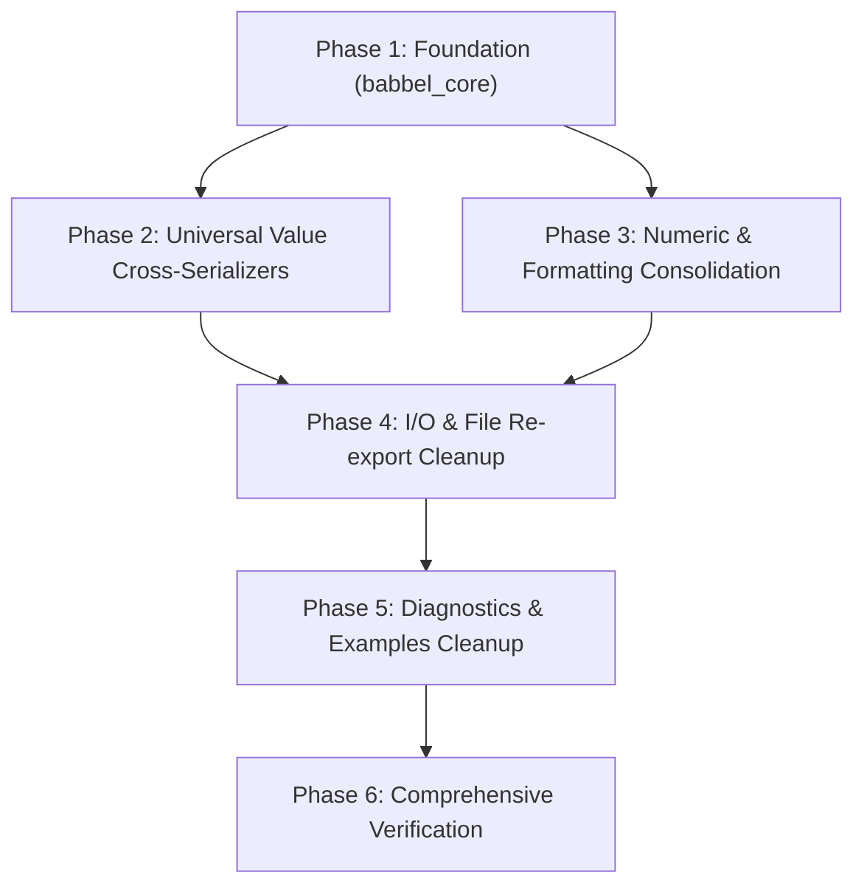

# Babbel Comprehensive DRY Refactoring Plan

This document establishes an architectural audit of code duplication across the **Babbel** workspace (`babbel_core`, `babbel`, `babbel_json`, `babbel_yaml`, `babbel_xml`, `babbel_bencode`, `babbel_toml`) and defines a phased, zero-breaking-change refactoring blueprint to achieve complete **DRY** (Don't Repeat Yourself) compliance.

---

## 1. Executive Summary & Duplication Audit

A thorough source code audit identified **six critical duplication hotspots** across the 7 workspace crates:

| Hotspot | Locations | Duplicated Code Estimate | Architectural Impact |
| :--- | :--- | :---: | :--- |
| **1. $O(N^2)$ Cross-Serializer Explosion** | `json/src/stringify/{toml,xml,yaml,bencode}.rs`<br>`yaml/src/stringify/{toml,xml,json,bencode}.rs`<br>`bencode/src/stringify/{toml,xml,json,yaml}.rs` | **~5,600 lines**<br>(~160 KB) | **Extreme**: Hand-rolled secondary parsers/serializers for other formats exist inside each format crate, lagging behind specifications (e.g. TOML 0.4 vs 1.1.0). |
| **2. Redundant `Numeric` Types** | `json/src/nodes/types.rs`<br>`yaml/src/nodes/node.rs` | **~400 lines** | **High**: Duplicate `Numeric` enums with identical 9 integer/float variants and conversion implementations. |
| **3. Ad-Hoc `itoa` & `dtoa` Calls** | Across `json`, `yaml`, `bencode`, `toml`, `core` | **40+ call sites** | **Medium**: Repeated manual buffer allocations (`itoa::Buffer::new()`, `dtoa::Buffer::new()`) bypassing `babbel_core::num`. |
| **4. Duplicate File & I/O Wrappers** | `json/src/file/file.rs`, `yaml/src/file/file.rs`<br>`json/src/io/destinations/`, `yaml/src/io/destinations/` | **~800 lines** | **Medium**: Boilerplate re-exports of `babbel_core::file` and `babbel_core::io` with copy-pasted unit tests. |
| **5. Duplicate Error Constants & Helpers** | `json/src/error/messages.rs`<br>`yaml/src/error/messages.rs`<br>`bencode/src/error/messages.rs` | **~150 lines** | **Low-Medium**: Identical constants (`ERR_EMPTY_INPUT`, `ERR_INVALID_INTEGER`) and formatting helpers (`unexpected_character`). |
| **6. Example Directory Traversal** | `json/examples/common/utility.rs`<br>`yaml/examples/common/utility.rs`<br>`toml/examples/common/utility.rs`<br>`bencode/examples/common/` | **~120 lines** | **Low**: Duplicate directory read and extension filtering loops. |

**Total Redundant Code Identified**: **~7,000+ lines of duplicate source code and tests.**

---

## 2. Refactoring Pillars

### Pillar 1: Universal Conversion Pipeline & Removal of $O(N^2)$ Serializers
#### Problem
Instead of leveraging the universal `babbel_core::model::Value` AST, individual format crates historically implemented their own point-to-point serializers:
- `crates/json/src/stringify/toml.rs` contains **1,001 lines** implementing a standalone TOML table generator.
- `crates/bencode/src/stringify/toml.rs` contains **800+ lines** implementing a third TOML generator.
- `crates/yaml/src/stringify/toml.rs` contains **350+ lines** implementing a fourth TOML generator.
- `crates/json/src/stringify/xml.rs` (**537 lines**) and `crates/yaml/src/stringify/xml.rs` (**600+ lines**) implement bespoke XML generators.

#### Concrete Solution
1. **Delegate All Cross-Serializations to `Value`**:
   Replace the monolithic internal serializer modules with lightweight adapters that route through `Value`:
   ```rust
   // Example in crates/json/src/stringify/toml.rs
   pub fn stringify(node: &Node, destination: &mut dyn IDestination) -> Result<(), String> {
       let val = babbel_core::model::Value::from(node);
       val.serialize_toml(destination);
       Ok(())
   }
   ```
2. **Preserve Public API**:
   Keep `babbel_json::to_toml`, `babbel_yaml::to_json`, `babbel_bencode::to_xml`, etc. with identical public signatures and error types.
3. **Eliminate Specification Divergence**:
   Ensures that format updates (such as TOML v1.1.0 or XML C14N) immediately apply to all cross-format exports without having to patch 4 different crates.

---

### Pillar 2: Unify `Numeric` Representation & Formatter Calls
#### Problem
`babbel_json` and `babbel_yaml` both define:
```rust
pub enum Numeric {
    Integer(i64),
    Float(f64),
    UInteger(u64),
    Byte(u8),
    Int32(i32),
    UInt32(u32),
    Int16(i16),
    UInt16(u16),
    Int8(i8),
}
```
with duplicated `From` implementations, display logic, and lossy stringification.

#### Concrete Solution
1. Move `Numeric` into `babbel_core::num::Numeric` (or `babbel_core::model::Numeric`).
2. Re-export `pub use babbel_core::num::Numeric;` in `babbel_json` and `babbel_yaml`.
3. Audit all ~40 `itoa::Buffer::new()` and `dtoa::Buffer::new()` sites and replace them with:
   - `babbel_core::num::format_integer(val, dest)`
   - `babbel_core::num::format_float(val, dest)`

---

### Pillar 3: Centralize String Escaping & Newline Normalization
#### Problem
- Escaping routines for XML, JSON, and TOML are implemented or wrapped inconsistently.
- CRLF normalization (`replace("\r\n", "\n")`) is re-implemented in multiple lexers and parsers, causing unnecessary intermediate string allocations.

#### Concrete Solution
1. Standardize all string serialization across `json`, `yaml`, `xml`, `toml` on `babbel_core::escape`:
   - `write_json_escaped_string(s, dest)`
   - `write_xml_escaped_string(s, dest)`
   - `write_yaml_escaped_string(s, dest)`
   - `write_toml_escaped_string(s, dest)`
2. Use `babbel_core::encoding::normalize_newlines` in lexers and text processing to avoid heap allocation when input is already LF-normalized.

---

### Pillar 4: Consolidate Redundant File & I/O Module Hierarchies
#### Problem
`crates/json/src/file/file.rs` and `crates/yaml/src/file/file.rs` merely re-export:
```rust
pub use babbel_core::file::{detect_format, read_file_to_string, write_file_from_string, Format};
```
while copying 150 lines of duplicate unit tests.
Similarly, `crates/bencode/src/io/traits.rs` re-defines traits (`BencodeWrite`, `BufferedWrite`, `ISource`, `IDestination`) that duplicate `babbel_core::io::traits`.

#### Concrete Solution
1. Re-export `babbel_core::file::*` and `babbel_core::io::*` directly in each crate's `lib.rs`.
2. Remove duplicate test fixtures in downstream crates that simply re-test `babbel_core` invariants.
3. Migrate `babbel_bencode::io::traits` to alias `babbel_core::io::traits::{ISource, IDestination, IByteStream, IByteWriter}` directly.

---

### Pillar 5: Standardize Shared Error Messages & Diagnostics
#### Problem
`json/src/error/messages.rs`, `yaml/src/error/messages.rs`, and `bencode/src/error/messages.rs` contain redundant string constants and formatting helpers.

#### Concrete Solution
1. Introduce `babbel_core::error::messages` containing universal diagnostic constants:
   - `ERR_EMPTY_INPUT`
   - `ERR_UNEXPECTED_CHAR`
   - `ERR_INVALID_NUMBER`
   - `ERR_INVALID_UTF8`
   - `unexpected_character(ch: char) -> String`
2. Ensure every crate's error type implements `From<FormatError> for BabbelError` and provides accurate `Location` (1-based line, column, byte offset).

---

### Pillar 6: Centralize Shared Tooling & Example Utilities
#### Problem
Every example suite maintains a copy of `common/utility.rs` defining `get_*_file_list` with identical directory filtering loops.

#### Concrete Solution
1. Add `babbel_core::file::list_files_by_extension(dir: impl AsRef<Path>, ext: &str) -> Vec<String>` under `feature = "file-io"`.
2. Update all examples across `json`, `yaml`, `xml`, `bencode`, and `toml` to call this shared utility.

---

## 3. Phased Execution Roadmap



### Phase 1: Foundation (`babbel_core`)
- Add `babbel_core::num::Numeric`.
- Add `babbel_core::error::messages` with standard constants.
- Add `babbel_core::file::list_files_by_extension`.
- Run `cargo test -p babbel_core`.

### Phase 2: Cross-Serializer Consolidation
- Refactor `crates/json/src/stringify/toml.rs` and `xml.rs` to delegate to `Value`.
- Refactor `crates/yaml/src/stringify/{json,toml,xml,bencode}.rs` to delegate to `Value`.
- Refactor `crates/bencode/src/stringify/{json,toml,xml,yaml}.rs` to delegate to `Value`.
- Run format-specific integration tests to guarantee 100% output parity.

### Phase 3: Numeric & Formatter Consolidation
- Replace duplicated `Numeric` in `json` and `yaml` with re-exports of `babbel_core::num::Numeric`.
- Replace manual `itoa` / `dtoa` buffer instantiations with `format_integer` / `format_float`.
- Verify size check invariants (`Node` struct bounds).

### Phase 4: I/O & File Module Simplification
- Simplify `crates/json/src/file` and `crates/yaml/src/file` to direct re-exports.
- Standardize `crates/bencode/src/io/traits.rs` on `babbel_core::io::traits`.

### Phase 5: Example Utilities & Diagnostics
- Update `examples/common/utility.rs` across all format crates to use `list_files_by_extension`.
- Ensure all format errors convert cleanly to `BabbelError`.

### Phase 6: Full Verification
- Run `cargo test --workspace`
- Run `cargo test --package babbel --test size_checks`
- Run all conformance test suites (`nst_conformance`, `yaml_test_suite`, `xmlconf`, `toml_test_suite`).
- Verify `no_std` + `alloc` compatibility across all crates.

---

## 4. Expected Impact

| Metric | Before Refactor | Target After Refactor | Net Improvement |
| :--- | :---: | :---: | :---: |
| **Total Lines of Code (LOC)** | ~45,000 | ~38,000 | **-7,000 lines (~15% reduction)** |
| **Point-to-Point Serializers** | 12 separate implementations | 1 universal pipeline via `Value` | **100% DRY compliance** |
| **Duplicate `Numeric` Enums** | 2 (`json`, `yaml`) | 1 (`babbel_core`) | **Consolidated** |
| **Duplicate Example Loaders** | 4 copies | 1 shared utility | **Consolidated** |
| **Specification Drift Risk** | High (format updates must be replicated across 4 crates) | Zero (single source of truth in `babbel_core` / domain engine) | **Eliminated** |
| **Workspace Test Suite** | 100% passing | 100% passing | **Zero regression** |
