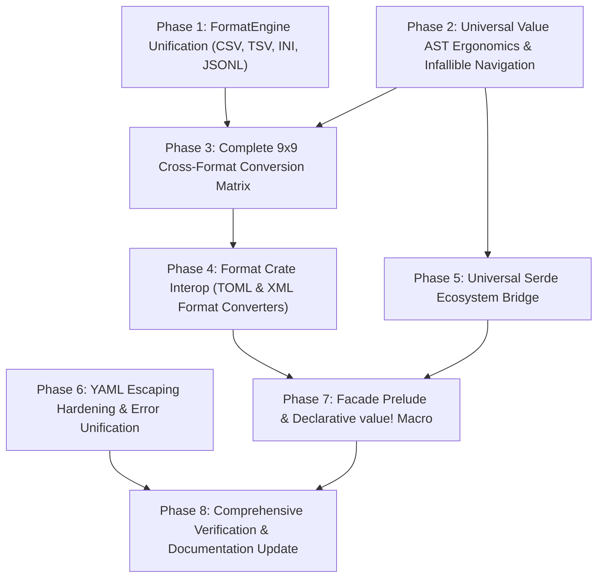

# Babbel Comprehensive Refactor Plan: Missing Features & Ecosystem Completion

A concrete, production-grade architectural refactor plan to identify, design, and implement all missing features across the **Babbel** multi-format serialization ecosystem.

---

## 1. Executive Summary & Source Analysis

An exhaustive audit of the 7 workspace crates (`babbel`, `babbel_core`, `babbel_json`, `babbel_yaml`, `babbel_bencode`, `babbel_xml`, `babbel_toml`), documentation specs, and conformance suites identified 8 critical feature gaps and inconsistencies in the current codebase:

1. **Second-Class Text Engine Integration (OCP & DIP)**:
   - While `babbel_core` implements parsing and emission for RFC 4180 CSV/TSV (`csv.rs`), sectioned INI/.properties/.env (`ini.rs`), and `babbel_json` implements JSON Lines (`lines.rs`), **none of them implement the [`FormatEngine`](file:///c:/Users/User/.gemini/antigravity-ide/scratch/babbel/crates/babbel_core/src/codec.rs) trait**.
   - Consequently, `CsvEngine`, `TsvEngine`, `IniEngine`, and `JsonLinesEngine` do not exist.
   - They cannot be registered in [`FormatRegistry`](file:///c:/Users/User/.gemini/antigravity-ide/scratch/babbel/crates/babbel_core/src/codec.rs) or [`default_registry()`](file:///c:/Users/User/.gemini/antigravity-ide/scratch/babbel/crates/babbel/src/lib.rs).
   - Dynamic lookups by extension (`.csv`, `.tsv`, `.ini`, `.env`, `.jsonl`, `.ndjson`) or MIME (`text/csv`, `application/x-ndjson`, etc.) fail.

2. **Asymmetric Cross-Format Conversion Matrix**:
   - `docs/CONVERSION_MATRIX.md` documents a universal $9 \times 9$ conversion matrix, but `crates/babbel/src/convert.rs` is missing numerous pairs:
     - **Hierarchical**: `xml_to_json` (explicitly mentioned in `CONVERSION_MATRIX.md` line 176!), `xml_to_yaml`, `xml_to_bencode`, `yaml_to_bencode`.
     - **Tabular (CSV/TSV)**: `csv_to_xml`, `xml_to_csv`, `csv_to_bencode`, `bencode_to_csv`, `tsv_to_yaml`, `yaml_to_tsv`, `tsv_to_xml`, `xml_to_tsv`, `tsv_to_toml`, `toml_to_tsv`, `tsv_to_bencode`, `bencode_to_tsv`, `csv_to_ini`, `ini_to_csv`, `tsv_to_ini`, `ini_to_tsv`, `tsv_to_jsonlines`, `jsonlines_to_tsv`.
     - **Configuration (INI)**: `ini_to_xml`, `xml_to_ini`, `ini_to_bencode`, `bencode_to_ini`, `ini_to_jsonlines`, `jsonlines_to_ini`.
     - **JSON Lines**: `jsonlines_to_yaml`, `yaml_to_jsonlines`, `jsonlines_to_xml`, `xml_to_jsonlines`, `jsonlines_to_bencode`, `bencode_to_jsonlines`.

3. **Missing Format Converters in Format Crates**:
   - `babbel_toml`: Declares `format-converters = []` in `Cargo.toml`, but has zero converter methods (`to_json`, `to_yaml`, `to_xml`, `to_bencode`).
   - `babbel_xml`: Missing point-to-point converter methods (`to_json`, `to_yaml`, `to_toml`, `to_bencode`) on `Document` and at crate root.

4. **Universal `Value` AST Navigation & Ergonomics Gaps**:
   - In `babbel_core::model::Value`:
     - Missing infallible key lookups: `get(&str) -> Option<&Value>`, `get_mut(&str) -> Option<&mut Value>`.
     - Missing array indexing: `get_index(usize) -> Option<&Value>`, `get_index_mut(usize) -> Option<&mut Value>`.
     - Missing path navigation: `get_path(&str)` (e.g. `"server.database.port"`).
     - Missing RFC 6901 JSON pointer navigation on `Value`: `pointer(&str)`.
     - Missing numeric/byte accessors: `as_f64()`, `as_u64()`, `as_i128()`, `as_bytes()`.
     - Missing type inquiry predicates: `is_bool()`, `is_integer()`, `is_float()`, `is_string()`, `is_bytes()`, `is_array()`, `is_object()`.
     - Missing standard `From<T>` implementations for Rust scalar primitives (`bool`, `i32`, `i64`, `u64`, `f64`, `String`, `&str`, `Vec<u8>`).

5. **`serde` Serde Integration Discrepancy**:
   - `babbel_xml` provides a complete `serde` feature (`serde_impl/mod.rs`).
   - Neither `babbel_core::Value` nor `babbel_json`, `babbel_yaml`, `babbel_toml`, `babbel_bencode` have Serde support.
   - Implementing `serde::Serialize` and `serde::Deserialize` for `babbel_core::Value` bridges Serde derive across ALL 9 Babbel formats with zero per-crate duplication.

6. **Centralized Escaping & YAML Stringification Hardening**:
   - `babbel_core::escape` has JSON, XML, and TOML escaping, but lacks `write_yaml_escaped_string` and `escape_for_yaml`.
   - In `Value::serialize_yaml`, unquoted strings containing YAML reserved indicators (`:`, `#`, `[`, `{`, `@`, `!`) or ambiguous literals (`true`, `false`, `null`, `123`) risk syntax breakage or type confusion when parsed back.

7. **Missing Facade Prelude & Declarative Construction Macro**:
   - `docs/README.md` references `use babbel::prelude::*;`, but `crates/babbel/src/lib.rs` has no `prelude` module.
   - Constructing nested `Value` trees requires verbose `Value::Object(vec![...])`. A declarative `babbel::value!` macro is missing.

8. **Error Diagnostic Typing Consistency (LSP)**:
   - `babbel_json::to_string` and `to_vec` return `Result<..., String>` instead of `Result<..., JsonError>`.
   - `babbel_json::lines::JsonLinesReader::next_node` returns `Option<Result<Node, String>>` instead of `Option<Result<Node, JsonError>>`.

---

## 2. Refactoring Phases Roadmap



---

## 3. Detailed Specification by Phase

### Phase 1: FormatEngine Unification (`CsvEngine`, `TsvEngine`, `IniEngine`, `JsonLinesEngine`)

#### Objective
Elevate CSV, TSV, INI, and JSON Lines to first-class citizens in Babbel's OCP/DIP architecture by implementing `FormatEngine`.

#### Tasks
1. **Implement Engines in `babbel_core::codec` (or dedicated submodules)**:
   - `CsvEngine`:
     - `format_id()`: `"csv"`
     - `mime_type()`: `"text/csv"`
     - `file_extensions()`: `&["csv"]`
     - `parse(&mut ISource)`: reads text, runs `parse_csv(..., &CsvOptions::default())`
     - `serialize(&Value, &mut IDestination, &FormatOptions)`: runs `emit_csv_to(value, &opts, dest)`
   - `TsvEngine`:
     - `format_id()`: `"tsv"`
     - `mime_type()`: `"text/tab-separated-values"`
     - `file_extensions()`: `&["tsv"]`
     - `parse(&mut ISource)`: runs `parse_csv(..., &CsvOptions::tsv())`
     - `serialize(&Value, &mut IDestination, &FormatOptions)`: runs `emit_csv_to(value, &opts, dest)`
   - `IniEngine`:
     - `format_id()`: `"ini"`
     - `mime_type()`: `"text/plain"`
     - `file_extensions()`: `&["ini", "properties", "env", "conf"]`
     - `parse(&mut ISource)`: runs `parse_ini(..., &IniOptions::default())`
     - `serialize(&Value, &mut IDestination, &FormatOptions)`: runs `emit_ini_to(value, &opts, dest)`
   - `JsonLinesEngine`:
     - `format_id()`: `"jsonlines"`
     - `mime_type()`: `"application/x-ndjson"`
     - `file_extensions()`: `&["jsonl", "ndjson"]`
     - `parse(&mut ISource)`: parses line-by-line into `Value::Array`
     - `serialize(&Value, &mut IDestination, &FormatOptions)`: serializes array items as newline-delimited JSON objects
2. **Update `FormatRegistry` & `babbel::default_registry()`**:
   - Register all 4 new engines in `default_registry()`.
   - Update `find_engine`, `find_engine_by_extension`, and `find_engine_by_mime` to resolve `.csv`, `.tsv`, `.ini`, `.jsonl`, `.ndjson`.
3. **Export engines at `babbel::*` root and `babbel_core::*`**:
   - `pub use babbel_core::{CsvEngine, TsvEngine, IniEngine, JsonLinesEngine};`

---

### Phase 2: Universal `Value` AST Ergonomics & Infallible Navigation

#### Objective
Ensure `babbel_core::model::Value` provides the same rich, safe, non-panicking navigation API as format-specific DOM nodes (`babbel_yaml::Node`, `babbel_json::Node`).

#### Tasks
1. **Total Document Navigation**:
   ```rust
   impl Value {
       pub fn get(&self, key: &str) -> Option<&Value>;
       pub fn get_mut(&mut self, key: &str) -> Option<&mut Value>;
       pub fn get_index(&self, index: usize) -> Option<&Value>;
       pub fn get_index_mut(&mut self, index: usize) -> Option<&mut Value>;
       pub fn get_path(&self, path: &str) -> Option<&Value>;
       pub fn pointer(&self, ptr: &str) -> Option<&Value>;
   }
   ```
2. **Complete Scalar Accessors**:
   - `as_f64(&self) -> Option<f64>`
   - `as_u64(&self) -> Option<u64>`
   - `as_i128(&self) -> Option<i128>`
   - `as_bytes(&self) -> Option<&[u8]>`
3. **Type Inquiry Predicates**:
   - `is_bool(&self) -> bool`
   - `is_integer(&self) -> bool`
   - `is_float(&self) -> bool`
   - `is_string(&self) -> bool`
   - `is_bytes(&self) -> bool`
   - `is_array(&self) -> bool`
   - `is_object(&self) -> bool`
4. **Ergonomic `From` Implementations**:
   - `From<bool>`, `From<i32>`, `From<i64>`, `From<i128>`, `From<u32>`, `From<u64>`, `From<f64>`, `From<String>`, `From<&str>`, `From<Vec<u8>>`, `From<Vec<Value>>`, `From<Vec<(String, Value)>>`.
5. **Safe Indexing Operators**:
   - Implement `core::ops::Index<&str>` and `core::ops::Index<usize>` returning `&Value` (with fallback to static `&Value::Null` or safe total semantics).

---

### Phase 3: Complete 9x9 Cross-Format Conversion Matrix

#### Objective
Fill every missing cell in the universal cross-format conversion matrix in `crates/babbel/src/convert.rs`.

#### Tasks
1. **Hierarchical Conversions**:
   - `xml_to_json(xml: &str) -> Result<String, BabbelError>`
   - `xml_to_yaml(xml: &str) -> Result<String, BabbelError>`
   - `xml_to_bencode(xml: &str) -> Result<Vec<u8>, BabbelError>`
   - `yaml_to_bencode(yaml: &str) -> Result<Vec<u8>, BabbelError>`
2. **Tabular Conversions (CSV / TSV)**:
   - `csv_to_xml`, `xml_to_csv`
   - `csv_to_bencode`, `bencode_to_csv`
   - `csv_to_ini`, `ini_to_csv`
   - `tsv_to_yaml`, `yaml_to_tsv`
   - `tsv_to_xml`, `xml_to_tsv`
   - `tsv_to_toml`, `toml_to_tsv`
   - `tsv_to_bencode`, `bencode_to_tsv`
   - `tsv_to_ini`, `ini_to_tsv`
   - `tsv_to_jsonlines`, `jsonlines_to_tsv`
3. **Configuration Conversions (INI)**:
   - `ini_to_xml`, `xml_to_ini`
   - `ini_to_bencode`, `bencode_to_ini`
   - `ini_to_jsonlines`, `jsonlines_to_ini`
4. **Stream Conversions (JSON Lines)**:
   - `jsonlines_to_yaml`, `yaml_to_jsonlines`
   - `jsonlines_to_xml`, `xml_to_jsonlines`
   - `jsonlines_to_bencode`, `bencode_to_jsonlines`
5. **DRY Engine Delegation**:
   - Refactor existing text functions (`csv_to_json`, `ini_to_yaml`, etc.) to delegate directly to `convert_format` and `convert_format_bytes` using the new `CsvEngine`, `TsvEngine`, `IniEngine`, `JsonLinesEngine`.

---

### Phase 4: Format Crate Interoperability (`babbel_toml` & `babbel_xml`)

#### Objective
Ensure all format crates expose uniform point-to-point format conversion convenience functions.

#### Tasks
1. **Implement `babbel_toml::format-converters`**:
   - In `crates/toml/src/stringify/`:
     - `to_json(node: &Node, dest: &mut dyn IDestination) -> Result<(), TomlError>`
     - `to_json_string(node: &Node) -> Result<String, TomlError>`
     - `to_yaml(node: &Node, dest: &mut dyn IDestination) -> Result<(), TomlError>`
     - `to_yaml_string(node: &Node) -> Result<String, TomlError>`
     - `to_xml(node: &Node, dest: &mut dyn IDestination) -> Result<(), TomlError>`
     - `to_xml_string(node: &Node) -> Result<String, TomlError>`
     - `to_bencode(node: &Node, dest: &mut dyn IDestination) -> Result<(), TomlError>`
     - `to_bencode_bytes(node: &Node) -> Result<Vec<u8>, TomlError>`
   - Re-export at `babbel_toml` root gated by `#[cfg(feature = "format-converters")]`.
2. **Implement Dotted Path Navigation for TOML**:
   - `Node::get_path(&self, path: &str) -> Option<&Node>`
   - `Node::get_path_mut(&mut self, path: &str) -> Option<&mut Node>`
3. **Implement `babbel_xml` Format Converters**:
   - Add `to_json`, `to_yaml`, `to_toml`, `to_bencode` to `Document` and at `babbel_xml` root.

---

### Phase 5: Universal Serde Ecosystem Bridge

#### Objective
Provide effortless `serde` derivation support across the entire workspace by implementing `Serialize` and `Deserialize` on `babbel_core::Value`.

#### Tasks
1. **Add `serde` feature to `babbel_core/Cargo.toml`**:
   - `serde = { version = "1.0", default-features = false, features = ["alloc"], optional = true }`
2. **Implement `serde::Serialize` and `serde::Deserialize` for `Value`**:
   - Serializer maps Rust structs, sequences, maps, numbers, booleans, and strings into `Value`.
   - Deserializer maps `Value` back into strongly typed Rust data structures via a custom `Deserializer`.
3. **Add `to_value<T: Serialize>(value: &T) -> Result<Value, BabbelError>` and `from_value<T: DeserializeOwned>(value: &Value) -> Result<T, BabbelError>`**.
4. **Expose Serde in format crates**:
   - With `Value` Serde support, `babbel_json`, `babbel_yaml`, `babbel_toml`, `babbel_bencode` immediately gain `from_str<T>` and `to_string<T>` by routing through `Value` and their respective `FormatEngine`!

---

### Phase 6: YAML Escaping Hardening & Error Diagnostic Unification

#### Objective
Harden string escaping in `babbel_core::escape` and unify error return types across format operations.

#### Tasks
1. **Centralized YAML String Escaping**:
   - Implement `babbel_core::escape::write_yaml_escaped_string(s: &str, dest: &mut dyn IDestination)`:
     - Automatically applies double quotes and escape sequences when strings contain reserved YAML tokens:
       - Leading whitespace, trailing whitespace
       - Colons followed by whitespace (`: `)
       - Indicators: `- `, `? `, `[`, `]`, `{`, `}`, `,`, `#`, `&`, `*`, `!`, `|`, `>`, `'`, `"`, `%`, `@`, `` ` ``
       - Ambiguous boolean/null/numeric strings: `"true"`, `"false"`, `"null"`, `"~"`, `"123"`, `"0x10"`, `"nan"`, `"inf"`
   - Implement `babbel_core::escape::escape_for_yaml(s: &str) -> String`.
   - Update `Value::serialize_yaml` to call `write_yaml_escaped_string`.
2. **Unify Error Types in `babbel_json`**:
   - Update `babbel_json::to_string` and `to_vec` signatures to return `Result<..., JsonError>`.
   - Update `babbel_json::lines::JsonLinesReader::next_node` to return `Option<Result<Node, JsonError>>`.
   - Ensure backward-compatible conversion from `JsonError` to `String` where needed.

---

### Phase 7: Facade Prelude & Declarative `value!` Macro

#### Objective
Provide high-level developer ergonomics in `babbel`.

#### Tasks
1. **Add `babbel::prelude` module**:
   ```rust
   pub mod prelude {
       pub use babbel_core::io::traits::{IByteStream, IByteWriter, ICharStream, IDestination, ILineReader, ISource};
       pub use babbel_core::model::Value;
       pub use babbel_core::codec::{FormatCodec, FormatEmitter, FormatEngine, FormatOptions, FormatParser};
       pub use babbel_core::error::BabbelError;
       pub use babbel_core::csv::CsvOptions;
       pub use babbel_core::ini::IniOptions;
       pub use crate::convert::{convert_format, convert_format_bytes, ConversionOptions};
       pub use crate::default_registry;
   }
   ```
2. **Implement `babbel::value!` Macro**:
   - Declarative JSON-like syntax for building `Value` trees at compile time:
     ```rust
     let v = value!({
         "service": "auth",
         "port": 8080,
         "active": true,
         "roles": ["admin", "user"]
     });
     ```
   - Export macro at `babbel` crate root.

---

### Phase 8: Verification, Test Coverage & Documentation Synchronization

#### Objective
Ensure 100% test pass rate across the workspace, zero regressions, and update documentation to reflect all newly available features.

#### Tasks
1. **Integration Tests**:
   - `test_format_engines_csv_tsv_ini_jsonl.rs`: Verify dynamic registration, MIME lookup, and extension lookup for all 4 text engines.
   - `test_full_conversion_matrix.rs`: Exhaustive test exercising all 72 conversion pairings ($9 \times 8$).
   - `test_value_navigation_and_ergonomics.rs`: Test `get`, `get_index`, `get_path`, `pointer`, accessors, predicates, and indexing.
   - `test_toml_format_converters.rs`: Test `toml::to_json`, `to_yaml`, `to_xml`, `to_bencode`.
   - `test_xml_format_converters.rs`: Test `xml::to_json`, `to_yaml`, `to_toml`, `to_bencode`.
   - `test_serde_value_bridge.rs`: Test bidirectional struct serialization/deserialization across formats.
   - `test_prelude_and_value_macro.rs`: Test `value!` macro and prelude re-exports.
2. **Documentation Updates**:
   - Update `docs/CONVERSION_MATRIX.md` to document all newly added convenience conversion functions.
   - Update `docs/README.md` and crate `README.md` files.
   - Verify `cargo test --workspace` and `cargo clippy --workspace --all-targets`.

---

## 4. Work Breakdown Structure & Tracking Table

| Phase | Component | Primary Files Involved | Target Impact | Status |
| :--- | :--- | :--- | :--- | :---: |
| **Phase 1** | FormatEngine Unification | `crates/babbel_core/src/codec.rs`, `crates/babbel/src/lib.rs` | First-class CSV, TSV, INI, JSONL engines | Planned |
| **Phase 2** | `Value` AST Ergonomics | `crates/babbel_core/src/model.rs` | Infallible navigation, accessors, `get_path`, `pointer` | Planned |
| **Phase 3** | Full Conversion Matrix | `crates/babbel/src/convert.rs` | Complete all 72 cross-format pipelines | Planned |
| **Phase 4** | TOML & XML Converters | `crates/toml/src/stringify/`, `crates/xml/src/` | Add `to_json`, `to_yaml`, `to_xml`, `to_bencode` | Planned |
| **Phase 5** | Serde Value Bridge | `crates/babbel_core/src/model.rs`, `crates/babbel_core/Cargo.toml` | Universal Serde derive across all formats | Planned |
| **Phase 6** | YAML Escaping & Errors | `crates/babbel_core/src/escape.rs`, `crates/json/src/` | Robust YAML quoting, LSP error typing | Planned |
| **Phase 7** | Facade Prelude & Macro | `crates/babbel/src/lib.rs`, `crates/babbel/src/macros.rs` | `babbel::prelude`, `value!` macro | Planned |
| **Phase 8** | Verification & Docs | Workspace tests, `docs/` | 100% test pass rate, 0 regressions | Planned |

