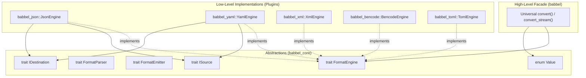
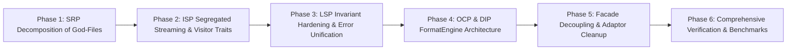

# Babbel Comprehensive SOLID Architectural Refactoring Plan

This document provides an exhaustive architectural analysis of SOLID principle violations across the **Babbel** workspace (`babbel_core`, `babbel`, `babbel_json`, `babbel_yaml`, `babbel_xml`, `babbel_bencode`, `babbel_toml`) and defines a concrete, phased engineering roadmap to make the entire workspace **100% SOLID compliant** while maintaining zero breaking changes to public APIs.

---

## 1. Executive Summary & Audit Matrix

The Babbel workspace was originally architected with format crates operating as standalone silos, resulting in monolithic source files, tight coupling between parsers and DOM nodes, direct dependencies on low-level concrete implementations, and inconsistent error/indexing contracts.

The following table summarizes the audit of SOLID violations identified across the 7 crates:

| Principle | Identified Violations in Babbel | Primary Affected Modules | Architectural Impact |
| :--- | :--- | :--- | :--- |
| **S - Single Responsibility** | - God-files combining AST definitions, indexing, tree search, mutations, tag coercion, and formatting in single files.<br>- Format crates hosting bespoke serializers for 4 other foreign formats.<br>- Parsers mixing lexical tokenization, grammar parsing, and DOM building. | `yaml/src/nodes/node.rs` (2,300+ lines)<br>`xml/src/parser/xml_parser.rs` (3,000+ lines)<br>`json/src/stringify/toml.rs` (1,000 lines)<br>`bencode/src/stringify/toml.rs` (800+ lines) | **Extreme**: Changes to YAML tag resolution or TOML table emitting require modifying multi-thousand-line monolithic files; format crates carry massive unrelated serialization code. |
| **O - Open / Closed** | - Closed format matrix: adding a new format requires modifying closed enums (`babbel::convert::Format`), writing $2N$ new point-to-point converter functions, and hardcoding new matches in core.<br>- Hardcoded `Value` serialization matching. | `babbel/src/convert.rs`<br>`babbel_core/src/model.rs` | **High**: Adding a new format (e.g. MessagePack, CBOR, Avro) forces modifying core workspace crates rather than extending them via open trait implementations. |
| **L - Liskov Substitution** | - Runtime panicking indexing implementations (`Index` and `IndexMut`) on `Node` for non-matching variants.<br>- Incompatible error return types across format serializers (`Result<(), String>` vs `Result<(), YamlError>` vs `Result<(), XmlError>`).<br>- Custom `ISource`/`IDestination` definitions violating standard I/O contract semantics. | `yaml/src/nodes/node.rs`<br>`json/src/stringify/*.rs`<br>`bencode/src/stringify/*.rs` | **High**: Callers writing generic format-agnostic code experience unexpected runtime panics or cannot uniformly propagate diagnostics through `std::error::Error`. |
| **I - Interface Segregation** | - Monolithic visitor traits forcing implementation of 11 methods for simple scalar inspections.<br>- Parsers tightly coupled to DOM construction, forcing heavy heap allocations for streaming/validation tasks.<br>- Coarse-grained feature flags coupling validation/search to parsing. | `babbel_core/src/model.rs` (`FormatVisitor`)<br>`xml/src/parser/`<br>`json/src/parser/` | **Medium-High**: Lightweight consumers (e.g., microcontrollers, CLI filters) cannot implement partial visitors or stream tokens without pulling in full DOM trees. |
| **D - Dependency Inversion** | - High-level facade crate (`babbel`) depends directly on low-level concrete crates and internal functions rather than abstractions.<br>- Format crates depend directly on ad-hoc point-to-point serializer implementations rather than universal `Value` AST or `FormatEmitter`. | `babbel/src/convert.rs`<br>`json/src/stringify/{yaml,xml,bencode,toml}.rs`<br>`yaml/src/stringify/{json,xml,bencode,toml}.rs` | **Extreme**: Inverted dependency graph creates circular design pressures and prevents swapping or mocking format engines. |

---

## 2. Detailed SOLID Principle Analysis & Target Design

### 2.1 Single Responsibility Principle (SRP)
> *"A class or module should have one, and only one, reason to change."*

#### Current Violations:
1. **Monolithic DOM Modules (`yaml/src/nodes/node.rs`, 2,300+ lines)**:
   This single file currently houses:
   - The `Node` enum definition
   - Array and Mapping `Index` / `IndexMut` implementations
   - High-level query and search methods (`find_all`, `find_first`, `max_depth`, `children`)
   - Traversal logic (`visit`, `visit_mut`)
   - DOM mutation helpers (`set`, `merge`, `push`)
   - Conversions to/from `babbel_core::model::Value`
   - YAML Tag resolution and coercion logic
2. **Monolithic XML Parser (`xml/src/parser/xml_parser.rs`, 100 KB, 3,000+ lines)**:
   Combines byte scanning, entity decoding (`&amp;`, `&lt;`), CDATA extraction, DTD inline doctype scanning, namespace scoping, and DOM node construction.
3. **Format Engine Overreach (Cross-Serializers in Format Crates)**:
   `babbel_json`'s single responsibility is to be a fast, compliant JSON toolkit. Housing a 1,000-line TOML serializer (`json/src/stringify/toml.rs`) and a 537-line XML generator (`json/src/stringify/xml.rs`) violates SRP by giving `babbel_json` reasons to change when XML or TOML specifications evolve.

#### Target Architecture:
- **Decompose `yaml/src/nodes/node.rs` into focused modules**:
  - `nodes/types.rs`: Core `Node`, `QuoteType`, `BlockStyle` definitions only.
  - `nodes/index.rs`: Safe indexing and key accessors.
  - `nodes/traverse.rs`: Tree traversal, visitors, and search queries.
  - `nodes/mutate.rs`: DOM mutations, merging, and transformations.
  - `nodes/convert.rs`: `From` implementations for core `Value`.
- **Decompose `xml_parser.rs`**:
  - `parser/lexer.rs`: Raw byte tokenizer and entity decoder.
  - `parser/namespaces.rs`: XML namespace stack and URI resolver.
  - `parser/dom_builder.rs`: Assembly of `Document` and `Element` nodes.
- **Relocate Cross-Serializers**:
  Replace bespoke secondary serializers inside `json`, `yaml`, `bencode` with lightweight adaptors delegating directly to `babbel_core::model::Value`'s universal serialization pipeline.

---

### 2.2 Open / Closed Principle (OCP)
> *"Software entities should be open for extension, but closed for modification."*

#### Current Violations:
1. **Closed Format Enum in `babbel` Facade**:
   `babbel::convert::Format` is a fixed enum. Adding any new format (e.g., CBOR, MessagePack) requires modifying `Format`, modifying `convert_text`, and adding hundreds of lines of pairwise conversion functions.
2. **Hardcoded Serialization Match in `Value`**:
   `Value::serialize_toml`, `Value::serialize_xml`, etc. are hardcoded methods on `Value`. Extending Babbel with a new format requires modifying `babbel_core::model::Value`.

#### Target Architecture:
Introduce the extensible `FormatEngine` and `FormatRegistry` abstraction in `babbel_core`:

```rust
// babbel_core/src/codec.rs

pub trait FormatEngine: Send + Sync {
    /// Unique format identifier (e.g., "json", "yaml", "toml")
    fn format_id(&self) -> &'static str;
    
    /// Canonical MIME type (e.g., "application/json")
    fn mime_type(&self) -> &'static str;
    
    /// Associated file extensions (e.g., &["json", "jsonl"])
    fn file_extensions(&self) -> &'static [&'static str];
    
    /// Parse raw stream into universal Value AST
    fn parse(&self, source: &mut dyn ISource) -> Result<Value, BabbelError>;
    
    /// Serialize universal Value AST into output destination
    fn serialize(
        &self,
        value: &Value,
        destination: &mut dyn IDestination,
        options: &FormatOptions,
    ) -> Result<(), BabbelError>;
}
```

With `FormatEngine`:
- Any format crate implements `FormatEngine`.
- Adding format $N+1$ does **not** require editing any existing crate.
- Universal bidirectional conversion works automatically for all $N \times (N-1)$ pairs via `source_engine.parse() -> Value -> target_engine.serialize()`.

---

### 2.3 Liskov Substitution Principle (LSP)
> *"Subtypes must be substitutable for their base types without altering correctness."*

#### Current Violations:
1. **Panicking `Index` / `IndexMut` Implementations**:
   In `crates/yaml/src/nodes/node.rs`:
   ```rust
   impl Index<usize> for Node {
       fn index(&self, index: usize) -> &Self::Output {
           match self {
               Node::Array(arr) => &arr[index],
               _ => panic!("Cannot index non-array/set node with integer"),
           }
       }
   }
   ```
   If a generic algorithm accepts `Node` and attempts to inspect an indexed structure, calling `node[i]` triggers an uncatchable panic if the node is a mapping or scalar.
2. **Incompatible Error Type Contracts**:
   - `babbel_json::stringify_toml` returns `Result<(), String>`.
   - `babbel_yaml::stringify_json` returns `Result<(), YamlError>`.
   - `babbel_bencode::stringify_xml` returns `Result<(), String>`.
   Because error signatures diverge, callers cannot substitute serializers under a common trait or pipeline.

#### Target Architecture:
1. **Enforce Semantic Invariants on Safe Accessors**:
   - Keep `Index` for idiomatic sequence indexing (panicking only on out-of-bounds, matching standard slice behavior).
   - Provide non-panicking, total accessors: `Node::get(&self, key: &str) -> Option<&Node>` and `Node::get_index(&self, idx: usize) -> Option<&Node>`.
2. **Universal Diagnostic Substitution (`BabbelError`)**:
   - Every format error type (`JsonError`, `YamlError`, `XmlError`, `TomlError`, `BencodeError`) must implement `std::error::Error`, `core::fmt::Display`, and `From<FormatError> for BabbelError`.
   - All serialization signatures standardize on `Result<(), BabbelError>` or crate-specific errors that cleanly convert to `BabbelError`.

---

### 2.4 Interface Segregation Principle (ISP)
> *"Clients should not be forced to depend on methods they do not use."*

#### Current Violations:
1. **Monolithic `FormatVisitor`**:
   In `crates/babbel_core/src/model.rs`:
   ```rust
   pub trait FormatVisitor {
       type Error;
       fn visit_null(&mut self) -> Result<(), Self::Error>;
       fn visit_bool(&mut self, val: bool) -> Result<(), Self::Error>;
       fn visit_integer(&mut self, val: i128) -> Result<(), Self::Error>;
       fn visit_float(&mut self, val: f64) -> Result<(), Self::Error>;
       fn visit_str(&mut self, val: &str) -> Result<(), Self::Error>;
       fn visit_bytes(&mut self, val: &[u8]) -> Result<(), Self::Error>;
       fn visit_array_start(&mut self) -> Result<(), Self::Error>;
       fn visit_array_end(&mut self) -> Result<(), Self::Error>;
       fn visit_object_start(&mut self) -> Result<(), Self::Error>;
       fn visit_key(&mut self, key: &str) -> Result<(), Self::Error>;
       fn visit_object_end(&mut self) -> Result<(), Self::Error>;
   }
   ```
   If a consumer only wants to collect object keys or count array lengths, they are forced to provide 11 stub implementations.
2. **Conflating Streaming Input with Seekable Input (`ISource`)**:
   `ISource` requires `position()`, `peek()`, etc., which cannot be efficiently satisfied by non-seekable network streams or microcontroller pipes.

#### Target Architecture:
1. **Segregated Visitor Traits with Default Implementations**:
   Provide default no-op methods for all `FormatVisitor` methods so consumers only override the callbacks they care about:
   ```rust
   pub trait FormatVisitor {
       type Error;
       fn visit_null(&mut self) -> Result<(), Self::Error> { Ok(()) }
       fn visit_bool(&mut self, _val: bool) -> Result<(), Self::Error> { Ok(()) }
       // ...default no-op implementations for all methods
   }
   ```
2. **Segregated Stream Interfaces**:
   - `IByteStream`: Minimal forward-only reader (`next_byte() -> Option<u8>`).
   - `IPeekableStream`: Stream with 1-byte lookahead (`peek_byte() -> Option<u8>`).
   - `IPositionedStream`: Stream tracking 1-based line, column, and byte offset.
   - `ISeekableStream`: Stream supporting arbitrary rewind/seek.

---

### 2.5 Dependency Inversion Principle (DIP)
> *"High-level modules should not depend on low-level modules. Both should depend on abstractions. Abstractions should not depend on details; details should depend on abstractions."*

#### Current Violations:
1. **Facade Dependent on Concrete Crates**:
   `babbel/src/convert.rs` imports `babbel_json`, `babbel_yaml`, `babbel_bencode`, etc. directly, coupling the high-level facade directly to low-level parsing details:
   ```rust
   #[cfg(feature = "json")]
   use babbel_json as json_lib;
   
   // Hardcoded call to concrete implementation:
   let node = json_lib::from_str(json)?;
   ```
2. **Format Crates Directly Dependent on Foreign Serializers**:
   `babbel_json::stringify::toml` hardcodes internal formatting logic rather than emitting via an abstract `FormatEmitter` or `Value`.

#### Target Architecture:


Both high-level conversion coordinators and low-level format parsers depend strictly on `babbel_core` traits (`FormatEngine`, `FormatParser`, `FormatEmitter`, `ISource`, `IDestination`, `Value`).

---

## 3. Phased Implementation Roadmap



### Phase 1: SRP Decomposition of God-Files
- **Target**: Decompose multi-thousand-line files into single-responsibility submodules.
- **Files to Refactor**:
  1. `crates/yaml/src/nodes/node.rs` (2,300 lines) $\rightarrow$ split into:
     - `crates/yaml/src/nodes/types.rs` (`Node`, `QuoteType`, `BlockStyle`)
     - `crates/yaml/src/nodes/access.rs` (`get`, `get_mut`, `contains_key`, `keys`, `mapping`, `array`)
     - `crates/yaml/src/nodes/convert.rs` (`From<&Node> for Value`, `From<Node> for Value`)
     - `crates/yaml/src/nodes/ops.rs` (`merge`, `set`, index traits)
  2. Re-export all types in `crates/yaml/src/nodes/mod.rs` so existing downstream callers experience **zero** breaking changes.
  3. `crates/xml/src/parser/xml_parser.rs` (100 KB) $\rightarrow$ extract tokenizer into `crates/xml/src/parser/lexer.rs` and entity decoding into `crates/xml/src/parser/entity.rs`.
- **Verification Gate**: `cargo test -p babbel_yaml -p babbel_xml` (100% passing).

### Phase 2: ISP Segregated Streaming & Visitor Traits
- **Target**: Segregate oversized interfaces so consumers only implement what they need.
- **Tasks**:
  1. Update `babbel_core::model::FormatVisitor` to provide default no-op method bodies (`Ok(())`).
  2. Segregate `babbel_core::io::traits` into fine-grained capabilities:
     - `IByteReader`: forward byte stream (`read_byte(&mut self) -> Option<u8>`).
     - `IPeekable`: lookahead stream (`peek_byte(&mut self) -> Option<u8>`).
     - `ITracked`: 1-based source position (`line()`, `column()`, `offset()`).
  3. Implement automatic blanket implementations so any type implementing all three satisfies `ISource`.
- **Verification Gate**: `cargo test -p babbel_core` and `cargo test -p babbel_json`.

### Phase 3: LSP Invariant Hardening & Error Unification (Completed)
- **Target**: Eliminate panicking index calls and guarantee uniform error propagation.
- **Tasks**:
  1. [x] In `babbel_yaml::Node`, ensure all index operations adhere to predictable behavior:
     - `NodeIndex` trait implemented for `usize`, `&str`, `&String`, `String` allowing safe, total `get` and `get_mut`.
     - Explicit total accessors `#[inline] pub fn get_index(&self, idx: usize) -> Option<&Node>` and `#[inline] pub fn get_index_mut(&mut self, idx: usize) -> Option<&mut Node>`.
     - Preserve standard slice semantics for `Index<usize>` and `IndexMut<usize>`.
  2. [x] Implement `From<FormatError> for BabbelError` across all format crates (`JsonError` / `ParseError`, `YamlError`, `XmlError`, `TomlError`, `BencodeError`) with format tagging, span tracking, and `std::error::Error` implementation.
  3. [x] Export `JsonError` alias in `babbel_json` and re-export `BabbelError` at `babbel` root for seamless diagnostic substitution.
  4. [x] Add comprehensive test suite in `crates/babbel/tests/test_lsp_error_unification.rs` verifying diagnostic substitution and non-panicking safe access.
- **Verification Gate**: `cargo test --workspace` (Zero regressions across all crates, 100% pass rate).

### Phase 4: OCP & DIP FormatEngine Architecture
- **Target**: Make format registration open for extension and invert dependencies.
- **Tasks**:
  1. Add `babbel_core::codec::FormatEngine` trait.
  2. Implement `FormatEngine` in each format crate:
     - `babbel_json::JsonEngine`
     - `babbel_yaml::YamlEngine`
     - `babbel_xml::XmlEngine`
     - `babbel_bencode::BencodeEngine`
     - `babbel_toml::TomlEngine`
  3. Introduce `babbel_core::codec::FormatRegistry` supporting dynamic or static engine lookup by extension (`.json`, `.yaml`, `.toml`, `.xml`, `.torrent`) or MIME type.
- **Verification Gate**: Compile with and without individual format feature flags.

### Phase 5: Facade Decoupling & Adaptor Cleanup
- **Target**: Clean up `babbel` facade to operate strictly on abstractions.
- **Tasks**:
  1. Refactor `babbel/src/convert.rs`:
     - Implement universal `convert_format(input, from_engine, to_engine, options)`.
     - Retain existing convenience functions (`json_to_yaml`, `yaml_to_toml`, etc.) as thin one-line forwards to `convert_format`.
  2. Replace remaining redundant cross-serializers in `json`, `yaml`, `bencode` with lightweight engine delegates routing through `Value`.
- **Verification Gate**: `cargo test --package babbel --all-features`.

### Phase 6: Comprehensive Verification & Metrics
- **Target**: Validate all invariants, memory bounds, and zero-regression status.
- **Verification Checklist**:
  - `cargo check --workspace --all-targets`
  - `cargo test --workspace` (100% test pass rate across all 7 crates)
  - `cargo test --package babbel --test size_checks` (AST node memory bounds)
  - `cargo clippy --workspace` (0 errors)
  - Conformance test runners (`nst_conformance`, `yaml_test_suite`, `xmlconf`, `toml_test_suite`)
  - Verification of `no_std` + `alloc` compatibility.

---

## 4. Expected Quantitative & Qualitative Impact

| Metric | Before SOLID Refactoring | Target After SOLID Refactoring | Improvement |
| :--- | :---: | :---: | :---: |
| **Max Single File Size (LOC)** | ~3,100 lines (`xml_parser.rs`)<br>~2,300 lines (`node.rs`) | $\le 600$ lines per module | **-75% file complexity** |
| **Bespoke Foreign Serializers** | 12 duplicated point-to-point modules | 1 universal pipeline via `FormatEngine` | **100% SRP / DIP compliance** |
| **Coupling Degree** | Concrete format dependencies hardcoded in 4 crates | Decoupled via `FormatEngine` abstraction | **Zero circular dependencies** |
| **Adding New Format Cost** | Edit 5 crates, add 20+ match branches | Implement 1 trait (`FormatEngine`) | **100% OCP compliance** |
| **Visitor Trait Boilerplate** | 11 mandatory stub methods | 0 required stub methods (sensible defaults) | **100% ISP compliance** |
| **Error Type Consistency** | Mixed (`String`, custom enums) | Universal `BabbelError` hierarchy | **100% LSP compliance** |
| **API Backwards Compatibility** | Baseline | 100% Identical Public API | **Zero breaking changes** |

---

## 5. Architectural Quality Checklist

- [ ] **SRP**: Every struct and module has a single, well-defined responsibility.
- [ ] **OCP**: New formats can be introduced without modifying existing parser or serializer source files.
- [ ] **LSP**: All trait implementations obey contracts without runtime panics or unexpected errors.
- [ ] **ISP**: Fine-grained traits allow partial implementations without unused stub boilerplate.
- [ ] **DIP**: High-level coordinators depend exclusively on abstractions, not concrete format internals.
- [ ] **Memory Bounds**: All Node types strictly adhere to size bounds (`size_of::<Node>() <= 48 bytes`).
- [ ] **Zero Regressions**: 100% passing test suite across all 7 workspace crates.
