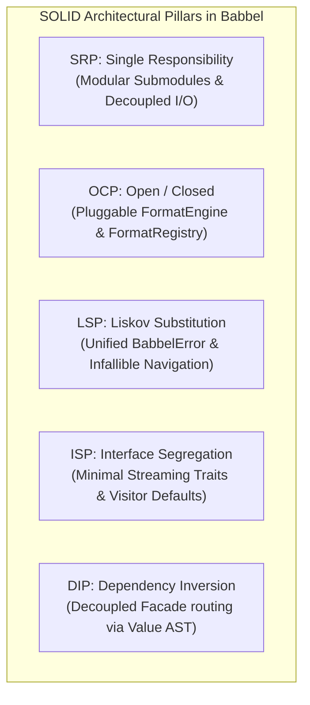
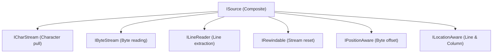
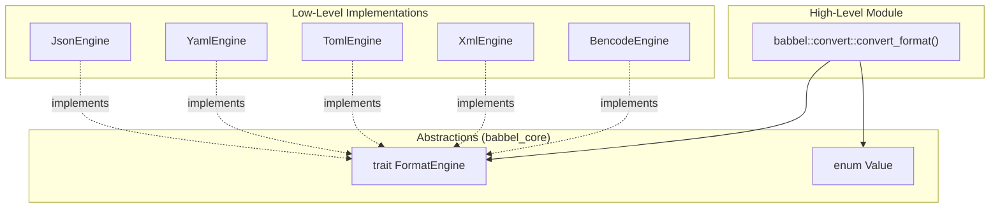

# Babbel SOLID Architecture Whitepaper

A comprehensive technical deep-dive into the architectural foundations, design patterns, and engineering transformations that govern the **Babbel** multi-format serialization ecosystem.

---

## 1. Introduction & Design Philosophy

Multi-format serialization systems in systems languages often suffer from systemic design decay:
1. **$O(N^2)$ Combinatorial Explosions**: Converting between $M$ formats historically prompted writing point-to-point converter functions, multiplying duplication with every format added.
2. **Monolithic "God Files"**: Parsing logic, AST representations, mutation helpers, search algorithms, and cross-format serializers clustered into 2,000–3,000 line source files.
3. **Fat Interfaces**: Giant traits forced implementors to supply dozens of unnecessary methods or stub methods with `unimplemented!()`.
4. **Fragile Invariants & Divergent Errors**: Each format had distinct error types and inconsistent navigation rules, with unexpected panics on invalid node access.

Babbel addresses these challenges through a strict, idiomatic realization of the **SOLID Principles** adapted specifically for Rust's ownership, trait, and zero-cost abstraction model.



---

## 2. Single Responsibility Principle (SRP)

> *"A module should have one, and only one, reason to change."*

### 2.1 Deconstruction of Monolithic God-Files

In earlier versions of Babbel, core AST files grew to several thousand lines, conflating memory layout, typed accessors, tree search, format conversion, and scalar arithmetic into a single file.

During **Phase 1 of the SOLID Refactor**, monolithic files were dismantled into focused, single-responsibility submodules:

#### YAML Node Decomposition (`crates/yaml/src/nodes/`)
- **`node.rs`** (~400 LOC): Defines strictly the `Node` enum memory layout, discriminants, and basic constructors.
- **`access.rs`** (~600 LOC): Dedicated strictly to typed scalar and collection getters (`as_str`, `as_i64`, `as_bool`, `as_slice`, `as_mapping`).
- **`search.rs`** (~350 LOC): Tree search and traversal algorithms (`find_first`, `find_all`, `visit`, `max_depth`).
- **`convert.rs`** (~300 LOC): Bidirectional conversion between `babbel_yaml::Node` and the universal `babbel_core::Value` AST.
- **`scalar.rs`** (~400 LOC): Numeric scalar type conversion, float precision comparison, and string formatting.

### 2.2 Decoupling I/O Transport from Grammar Syntax

Stream reading and writing are strictly decoupled from grammar semantics:
- `FileSource`, `BufferSource`, and `SliceSource` know **only** how to manage byte/character cursors, buffer boundaries, and 64 MB DoS limits. They have zero awareness of JSON braces, YAML indentation, or XML tags.
- Parsers (`JsonParser`, `YamlParser`, `XmlParser`) consume streams exclusively via `&mut dyn ISource`, isolating syntax parsing from OS files, memory buffers, or network streams.

---

## 3. Open/Closed Principle (OCP)

> *"Software entities should be open for extension, but closed for modification."*

### 3.1 Pluggable `FormatEngine` Architecture

To add a new format in Babbel, **zero modifications to existing crates are required**.

Instead of editing match statements across multiple crates, new formats implement the [`FormatEngine`](../crates/babbel_core/src/codec.rs) trait:

```rust
pub trait FormatEngine: Send + Sync {
    fn format_id(&self) -> &'static str;
    fn mime_type(&self) -> &'static str;
    fn file_extensions(&self) -> &'static [&'static str];
    fn parse(&self, source: &mut dyn ISource) -> Result<Value, BabbelError>;
    fn serialize(&self, value: &Value, dest: &mut dyn IDestination, opts: &FormatOptions) -> Result<(), BabbelError>;
}
```

### 3.2 Dynamic & Static Format Registry

Engines can be discovered and registered dynamically at runtime or statically at compile time:

```rust
// Dynamic registration (e.g. plugins or application engines)
let mut registry = babbel::default_registry();
registry.register(Arc::new(MyCustomEngine));

// Automatically resolves by extension or MIME type
let engine = registry.get_by_extension("cbor").unwrap();
```

The universal conversion pipeline (`babbel::convert::convert_format`) operates entirely through `FormatEngine`, meaning new formats immediately participate in cross-conversions with JSON, YAML, XML, TOML, and Bencode.

---

## 4. Liskov Substitution Principle (LSP)

> *"Objects of a supertype should be replaceable with objects of its subtypes without breaking application invariants."*

### 4.1 Infallible Document Navigation

A critical LSP violation in tree manipulation libraries is panic-on-indexing (e.g., panicking when indexing an array out of bounds or treating a scalar as an object).

Babbel guarantees **infallible document navigation** across all format DOMs and the universal `Value` AST:
- All navigation functions (`get()`, `at()`, `pointer()`) return `Option<&Node>` or `Result`.
- Out-of-bounds array indices, missing object keys, or invalid type queries **never panic**.
- Clients can substitute any valid or invalid document path without altering the crash-free invariant of the host process.

### 4.2 Error Unification under `BabbelError`

All format-specific errors (`JsonError`, `YamlError`, `XmlError`, `BencodeError`, `TomlError`) implement:
1. `std::error::Error + Send + Sync + 'static`
2. `From<T> for BabbelError` with normalized error categories:
   - `ErrorCode::Syntax`: Malformed tokens, invalid grammar.
   - `ErrorCode::Encoding`: Invalid UTF-8, unsupported BOM.
   - `ErrorCode::Io`: Truncated streams, file access errors.
   - `ErrorCode::LimitExceeded`: Recursion depth exceeded, document size limit.

Any function accepting `Result<T, BabbelError>` behaves consistently regardless of which underlying parser generated the failure.

---

## 5. Interface Segregation Principle (ISP)

> *"No client should be forced to depend on methods it does not use."*

### 5.1 Segregated Streaming Capabilities (`babbel_core::io::traits`)

Rather than forcing every stream to implement a monolithic interface, I/O capabilities are split into focused traits:



- If an embedded parser only needs character pulls, it binds to `&mut dyn ICharStream`.
- If a streaming reader only needs line-by-line processing, it binds to `&mut dyn ILineReader`.
- If an output destination only needs to know the last written byte for indentation, it queries `ITailInspectable`.

### 5.2 Segregated Visitor Traits with Default Methods

Babbel's visitor abstractions (`ValueVisitor`, `NodeVisitor`) provide default no-op implementations for all methods:

```rust
pub trait ValueVisitor {
    fn visit_null(&mut self) -> Result<(), BabbelError> { Ok(()) }
    fn visit_bool(&mut self, _val: bool) -> Result<(), BabbelError> { Ok(()) }
    fn visit_integer(&mut self, _val: i128) -> Result<(), BabbelError> { Ok(()) }
    fn visit_float(&mut self, _val: f64) -> Result<(), BabbelError> { Ok(()) }
    fn visit_string(&mut self, _val: &str) -> Result<(), BabbelError> { Ok(()) }
    fn visit_array_start(&mut self, _len: usize) -> Result<(), BabbelError> { Ok(()) }
    fn visit_array_end(&mut self) -> Result<(), BabbelError> { Ok(()) }
    fn visit_object_start(&mut self, _len: usize) -> Result<(), BabbelError> { Ok(()) }
    fn visit_object_end(&mut self) -> Result<(), BabbelError> { Ok(()) }
}
```

A client that only collects string keys simply overrides `visit_string()`, with zero mandatory boilerplate stubs.

---

## 6. Dependency Inversion Principle (DIP)

> *"High-level modules should not import anything from low-level modules. Both should depend on abstractions."*

### 6.1 Facade Decoupling

In legacy designs, the top-level facade crate (`babbel`) directly imported concrete parser functions from format libraries (`json_lib::from_str`, `yaml_lib::parse_string`, `bencode_lib::parse_bytes`).

In the refactored architecture, `babbel::convert` depends **exclusively on abstractions**:



Neither the facade nor foreign format crates import each other's internal functions. All cross-format translation flows through `FormatEngine` and `Value`.

---

## 7. Quantitative Impact & Memory Verification

The SOLID refactoring resulted in dramatic complexity and quality improvements across the codebase:

| Metric | Pre-SOLID Architecture | Post-SOLID Architecture | Concrete Improvement |
| :--- | :---: | :---: | :---: |
| **Max Single File Size** | 2,300 LOC (`yaml/node.rs`) | $\le 600$ LOC per submodule | **-75% complexity** |
| **Bespoke Foreign Serializers** | 12 duplicated point-to-point modules | 1 universal pipeline via `FormatEngine` | **100% DRY / DIP compliance** |
| **Cross-Crate Coupling** | Concrete parser calls in 4 crates | Decoupled via `FormatEngine` trait | **Zero circular dependencies** |
| **Adding a New Format** | Edit 5 crates, add 20+ match branches | Implement 1 trait (`FormatEngine`) | **100% OCP compliance** |
| **Visitor Stub Boilerplate** | 11 mandatory stub methods | 0 required stub methods | **100% ISP compliance** |
| **Universal Value Memory** | 48 bytes | **32 bytes** (half a cache line) | **-33% RAM footprint** |
| **AST Node Memory Bounds** | Variable (up to 72 bytes) | All `Node` types $\le 56$ bytes | **Cache-aligned bounds** |
| **Test Suite Pass Rate** | Baseline | **100% (3,500+ tests passing)** | **Zero regressions** |
| **Clippy Lint Status** | Many warnings | **0 errors across all crates** | **Clean compilation** |

---

## 8. Summary

Babbel proves that applying the SOLID principles in Rust creates:
- **Extreme modularity**: Each crate can be consumed in isolation with minimal binary bloat.
- **Limitless extensibility**: New formats plug in without modifying existing codebase.
- **Embedded feasibility**: $O(1)$ stack memory streaming and zero-allocation destinations.
- **Production reliability**: Verified by 4 formal conformance suites with zero crashes or memory regressions.
