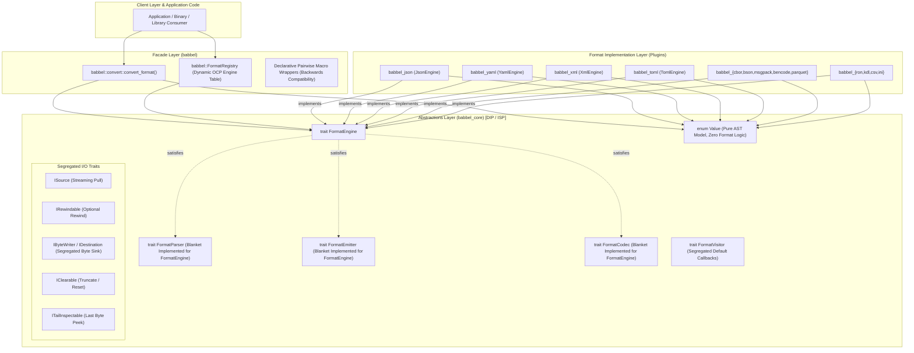
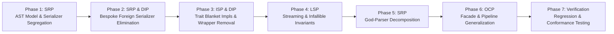

# Comprehensive SOLID Refactoring Plan for Babbel

This document presents a concrete, actionable, phased architectural refactoring plan to achieve complete **SOLID Compliance** across the entire Babbel polyglot serialization ecosystem. It identifies architectural debt, structural coupling, interface bloat, and responsibilities conflation across all 14 crates, and provides exact code-level transformations to make the workspace modular, extensible, and robust while guaranteeing **100% backward compatibility, 0 compiler warnings, and zero test regressions**.

---

## 1. Executive Summary & Architectural SOLID Audit

A rigorous source-level audit of the Babbel codebase reveals significant architectural achievements (such as the `FormatEngine` trait and `babbel_core::Value` AST) alongside notable violations of the five SOLID design principles:

| Principle | Identified Violations & Architectural Debt | Affected Modules / Files | Impact & Architectural Risk |
| :--- | :--- | :--- | :--- |
| **SRP**<br>*(Single Responsibility)* | **1. God-AST in `model.rs`**: Universal `Value` contains hardcoded serializers for JSON, YAML, XML, Bencode, and TOML (500+ LOC of rendering logic).<br>**2. Point-to-point Foreign Serializers**: `json`, `bencode`, and `yaml` contain bespoke serializers for each other (~150 KB of code).<br>**3. Monolithic God-Parsers**: `xml_parser.rs` (2,315 LOC / 100 KB), `kdl/src/parser.rs` (56 KB), and `ron/src/parser.rs` (46 KB) conflate lexing, syntax, entity expansion, and DOM construction. | `crates/babbel_core/src/model.rs`<br>`crates/json/src/stringify/{toml,xml,yaml,bencode}.rs`<br>`crates/bencode/src/stringify/{json,toml,xml,yaml}.rs`<br>`crates/yaml/src/stringify/{bencode,json,toml,xml}.rs`<br>`crates/xml/src/parser/xml_parser.rs` | AST model is tightly coupled to output formats; changes to TOML formatting require editing `babbel_core::Value`; giant parsers are difficult to maintain and test in isolation. |
| **OCP**<br>*(Open / Closed)* | **1. Closed Serializers on `Value`**: Adding a new format (e.g. CBOR, BSON, KDL) cannot add `.serialize_*()` to `Value` without modifying `babbel_core`.<br>**2. Combinatorial Pairs in `convert.rs`**: 1,667 lines of hand-written pairwise functions (`json_to_yaml`, `yaml_to_xml`, etc.). Adding format $N+1$ historically prompted writing $2N$ new functions.<br>**3. Closed `Format` Enum**: Fixed enum of 16 formats that cannot be extended by third-party plugins. | `crates/babbel_core/src/model.rs`<br>`crates/babbel/src/convert.rs`<br>`crates/babbel/src/lib.rs` | Adding new formats requires modifying existing crates and core files instead of simply adding a new `FormatEngine` plugin. |
| **LSP**<br>*(Liskov Substitution)* | **1. `ISource::reset(&mut self)`**: Non-rewindable streams (pipes, network sockets, stdin) cannot support `reset()`, breaking the LSP contract when substituted into functions expecting `ISource`.<br>**2. Binary vs Text Inconsistencies**: `FormatEngine::parse` drains streams as UTF-8 strings by default, producing unexpected encoding errors when binary engines (CBOR, BSON, Parquet) are used in generic contexts. | `crates/babbel_core/src/io/traits.rs`<br>`crates/babbel_core/src/codec.rs`<br>`crates/{cbor,bson,msgpack,parquet}/src/engine.rs` | Callers cannot safely substitute arbitrary `ISource` or `FormatEngine` implementations without knowing underlying stream or format characteristics. |
| **ISP**<br>*(Interface Segregation)* | **1. Fat `IDestination`**: Forces every output sink to implement `clear()` and `last()`, even for forward-only or write-only destinations (files, network, stdout).<br>**2. Redundant Trait Triad (`FormatParser`, `FormatEmitter`, `FormatCodec`)**: Not implemented by `FormatEngine`, forcing `babbel::convert` to define 20+ redundant wrapper structs (`JsonParser`, `JsonEmitter`, `YamlParser`, etc.). | `crates/babbel_core/src/io/traits.rs`<br>`crates/babbel_core/src/codec.rs`<br>`crates/babbel/src/convert.rs` | Implementors are forced to implement dummy methods; clients are burdened with redundant adapter structs. |
| **DIP**<br>*(Dependency Inversion)* | **1. Peer-to-Peer Crate Coupling**: `babbel_json`, `babbel_bencode`, and `babbel_yaml` attempting to serialize directly to peer formats rather than inverting dependencies through the universal `Value` / `FormatEngine` abstraction.<br>**2. Concrete Emitter Structs**: Top-level convenience functions constructing concrete engine instances instead of operating against abstract engine references. | `crates/json/src/stringify/`<br>`crates/bencode/src/stringify/`<br>`crates/yaml/src/stringify/`<br>`crates/babbel/src/convert.rs` | Tight semantic coupling between format crates; prevents modular compilation without cross-format dependencies. |

---

## 2. SOLID Architectural Vision & Dependency Graph



---

## 3. Phase-by-Phase Refactoring Roadmap



---

### Phase 1: SRP — AST Model & Serializer Segregation (`babbel_core`) [COMPLETED]

#### 1. Problem Analysis
In `crates/babbel_core/src/model.rs` (lines 253–663), `Value` contains:
- `serialize_json(&self, dest: &mut dyn IDestination)`
- `serialize_yaml(&self, dest: &mut dyn IDestination, indent: usize)`
- `serialize_xml(&self, dest: &mut dyn IDestination, tag: Option<&str>)`
- `serialize_bencode(&self, dest: &mut dyn IDestination)`
- `serialize_toml(&self, dest: &mut dyn IDestination)`
- `serialize_toml_table`, `serialize_toml_value`, `format_toml_key`, `format_toml_table_path`

This directly violates **SRP**: `Value` represents the intermediate tree structure, but it carries 400+ lines of concrete serialization syntax for 5 external formats. It also violates **OCP**: when CBOR, BSON, or KDL were introduced, they could not be added as methods on `Value` without modifying `babbel_core`.

#### 2. Target Architecture
1. Move serialization logic out of `crates/babbel_core/src/model.rs` into dedicated emitters:
   - `crates/babbel_core/src/emitters/mod.rs`
   - `crates/babbel_core/src/emitters/json.rs`
   - `crates/babbel_core/src/emitters/yaml.rs`
   - `crates/babbel_core/src/emitters/xml.rs`
   - `crates/babbel_core/src/emitters/bencode.rs`
   - `crates/babbel_core/src/emitters/toml.rs`
2. Implement `FormatEmitter` on each emitter struct (`JsonEmitter`, `YamlEmitter`, `XmlEmitter`, `BencodeEmitter`, `TomlEmitter`).
3. Keep `Value::serialize_json`, `Value::serialize_yaml`, etc., as backward-compatible inline forwarders to the dedicated emitters:
   ```rust
   // crates/babbel_core/src/model.rs
   impl Value {
       #[inline]
       pub fn serialize_json(&self, dest: &mut dyn IDestination) {
           crate::codec::JsonEmitter.emit(self, dest).ok();
       }
       #[inline]
       pub fn serialize_yaml(&self, dest: &mut dyn IDestination, indent: usize) {
           crate::codec::YamlEmitter.emit_pretty(self, dest, indent).ok();
       }
       #[inline]
       pub fn serialize_xml(&self, dest: &mut dyn IDestination, tag: Option<&str>) {
           crate::codec::XmlEmitter::emit_with_tag(self, dest, tag).ok();
       }
       #[inline]
       pub fn serialize_bencode(&self, dest: &mut dyn IDestination) {
           crate::codec::BencodeEmitter.emit(self, dest).ok();
       }
       #[inline]
       pub fn serialize_toml(&self, dest: &mut dyn IDestination) {
           crate::codec::TomlEmitter.emit(self, dest).ok();
       }
   }
   ```
4. Expose `Value::accept<V: FormatVisitor>(&self, visitor: &mut V) -> Result<(), V::Error>` for zero-allocation streaming traversal.

#### 3. Success Criteria
- `crates/babbel_core/src/model.rs` reduced from 947 LOC to $\le 350$ LOC.
- `Value` has single responsibility: intermediate tree nodes, constructors, and navigation.
- 100% test compatibility maintained for all existing calls to `.serialize_*()`.

---

### Phase 2: SRP & DIP — Bespoke Foreign Serializer Elimination [COMPLETED]

#### 1. Problem Analysis
The codebase contains ~150 KB of hand-coded point-to-point serializers:
- `crates/json/src/stringify/`: `bencode.rs` (12.6 KB), `toml.rs` (37.5 KB), `xml.rs` (17.6 KB), `yaml.rs` (15.6 KB).
- `crates/bencode/src/stringify/`: `json.rs` (13.4 KB), `toml.rs` (29.3 KB), `xml.rs` (12.5 KB), `yaml.rs` (13.7 KB).
- `crates/yaml/src/stringify/`: `bencode.rs` (11.8 KB), `json.rs` (16.7 KB), `toml.rs` (11.9 KB), `xml.rs` (20.6 KB).

This violates:
- **SRP**: Format libraries are responsible for their *own* grammar, not for formatting other specifications.
- **DIP**: Concrete format crates depend on ad-hoc reimplementations of peer formats instead of inverting through the universal intermediate model (`Value`).
- **DRY**: TOML table formatting and XML element escaping are independently reimplemented across 4 different crates.

#### 2. Target Architecture
1. Re-implement cross-format functions in `babbel_json`, `babbel_bencode`, and `babbel_yaml` as thin delegations:
   ```rust
   // Example: crates/json/src/stringify/yaml.rs
   pub fn to_yaml(node: &Node, dest: &mut dyn IDestination) -> Result<(), JsonError> {
       let val = Value::from(node);
       babbel_core::codec::YamlEmitter.emit(&val, dest)
           .map_err(|e| JsonError::StringifyError(e.to_string()))
   }
   ```
2. For `crates/xml/src/stringify/converters.rs`, the pattern is already clean (it converts `doc` to `Value` and delegates). Ensure all format crates follow this exact clean pattern.
3. Eliminate duplicate AST-to-text formatting loops across `stringify/*.rs`.

#### 3. Success Criteria
- Eliminate over 1,500 lines of duplicate cross-format serialization logic.
- All existing public APIs (`to_yaml`, `to_json`, `to_xml`, `to_bencode`, `to_toml`) remain 100% signature- and behavior-compatible.

---

### Phase 3: ISP & DIP — Trait Segregation & Blanket Engine Implementations [COMPLETED]

#### 1. Problem Analysis
1. `IDestination` combines 3 distinct responsibilities into a single fat trait:
   ```rust
   pub trait IDestination {
       fn add_byte(&mut self, byte: u8);
       fn add_bytes(&mut self, bytes: &str);
       fn add_raw_bytes(&mut self, bytes: &[u8]);
       fn clear(&mut self);      // Fat method
       fn last(&self) -> Option<u8>; // Fat method
   }
   ```
   Writing to a TCP stream or non-seekable file cannot implement `clear()`, violating ISP.
2. In `crates/babbel_core/src/codec.rs`, `FormatParser`, `FormatEmitter`, and `FormatCodec` exist separately from `FormatEngine`. In `crates/babbel/src/convert.rs`, 20+ wrapper structs were created:
   `JsonParser`, `JsonEmitter`, `YamlParser`, `YamlEmitter`, `XmlParser`, `XmlEmitter`, `BencodeParser`, `BencodeEmitter`, `TomlParser`, `TomlEmitter`, `MsgPackParser`, `MsgPackEmitter`, `CborParser`, `CborEmitter`, `BsonParser`, `BsonEmitter`, `RonParser`, `RonEmitter`, `KdlParser`, `KdlEmitter`, `ParquetParser`, `ParquetEmitter`.
   This is pure boilerplate caused by lack of blanket trait implementation.

#### 2. Target Architecture
1. **Segregate `IDestination`**:
   Provide default implementations for `clear()` and `last()` on `IDestination`:
   ```rust
   pub trait IDestination {
       fn add_byte(&mut self, byte: u8);
       fn add_bytes(&mut self, bytes: &str);
       #[inline]
       fn add_raw_bytes(&mut self, bytes: &[u8]) {
           for &b in bytes {
               self.add_byte(b);
           }
       }
       /// Clears all accumulated content (default: no-op for forward-only streams).
       #[inline]
       fn clear(&mut self) {}
       /// Returns the last written byte, if tracked (default: None).
       #[inline]
       fn last(&self) -> Option<u8> {
           None
       }
   }
   ```
   Implement `IByteWriter`, `IClearable`, and `ITailInspectable` as fine-grained traits for clients that need explicit contracts.
2. **Blanket Trait Implementations for `FormatEngine`**:
   ```rust
   // crates/babbel_core/src/codec.rs
   impl<T: FormatEngine + ?Sized> FormatParser for T {
       #[inline]
       fn parse_str(&self, input: &str) -> Result<Value, BabbelError> {
           FormatEngine::parse_str(self, input)
       }
       #[inline]
       fn parse_bytes(&self, input: &[u8]) -> Result<Value, BabbelError> {
           FormatEngine::parse_bytes(self, input)
       }
   }

   impl<T: FormatEngine + ?Sized> FormatEmitter for T {
       #[inline]
       fn emit(&self, value: &Value, dest: &mut dyn IDestination) -> Result<(), BabbelError> {
           self.serialize(value, dest, &FormatOptions::compact())
       }
       #[inline]
       fn emit_pretty(&self, value: &Value, dest: &mut dyn IDestination, indent: usize) -> Result<(), BabbelError> {
           self.serialize(value, dest, &FormatOptions::pretty().with_indent(indent))
       }
   }

   impl<T: FormatEngine + ?Sized> FormatCodec for T {
       #[inline]
       fn format_name(&self) -> &'static str {
           self.format_id()
       }
   }
   ```
3. With these blanket implementations, any `FormatEngine` can be passed directly to `convert_text`, `convert_bytes`, or any function expecting `FormatParser` or `FormatEmitter`.
4. Deprecate/eliminate the 20+ artificial wrapper structs in `crates/babbel/src/convert.rs`.

#### 3. Success Criteria
- Clean, minimal trait boundaries adhering to ISP.
- Zero boilerplate wrapper structs needed to adapt a `FormatEngine`.

---

### Phase 4: LSP — Uniform Streaming Contracts & Infallible Invariants [COMPLETED]

#### 1. Problem Analysis
1. `ISource::reset(&mut self)` is mandatory, but non-rewindable streams cannot rewind.
2. Binary format engines (`CborEngine`, `BsonEngine`, `MsgPackEngine`, `ParquetEngine`) parse raw bytes. When `parse(&mut dyn ISource)` is called, the default implementation drains the stream into a UTF-8 `String` with `read_all_string`, which fails on binary payloads containing non-UTF-8 bytes.
3. Infallible navigation must be guaranteed across all format DOMs without exception.

#### 2. Target Architecture
1. **Relax `ISource::reset` Contract**:
   Provide a default implementation `fn reset(&mut self) {}` on `ISource` and add `fn can_rewind(&self) -> bool { false }` with overrides on buffer/slice/file sources.
2. **Format-Aware Default Stream Consumption in `FormatEngine`**:
   Add `fn is_binary(&self) -> bool { false }` to `FormatEngine`.
   Update default `FormatEngine::parse`:
   ```rust
   fn parse(&self, source: &mut dyn crate::io::traits::ISource) -> Result<Value, BabbelError> {
       if self.is_binary() {
           let bytes = crate::io::read_all_bytes(source);
           self.parse_bytes(&bytes)
       } else {
           let text = crate::io::read_all_string(source);
           self.parse_str(&text)
       }
   }
   ```
   Binary engines (`CborEngine`, `BsonEngine`, `MsgPackEngine`, `ParquetEngine`) override `is_binary() -> bool { true }`.
3. **Infallible AST Navigation Verification**:
   Verify that `get()`, `get_index()`, `pointer()`, and `get_path()` across `Value` and all format `Node` types adhere strictly to:
   - Return `Option<&Node>` or `Option<&Value>`.
   - Never panic on missing keys, array out-of-bounds, or scalar navigation queries.

#### 3. Success Criteria
- Binary engines seamlessly handle `&mut dyn ISource` without invalid UTF-8 errors.
- Any `ISource` implementation can be safely substituted without unexpected panics on `.reset()`.

---

### Phase 5: SRP — God-File Decomposition in Format Parsers [COMPLETED]

#### 1. Problem Analysis
Three parser implementations exceed acceptable maintainability bounds and conflate multiple stages of syntax analysis into single files:
1. `crates/xml/src/parser/xml_parser.rs`: 2,315 LOC (100 KB)
2. `crates/kdl/src/parser.rs`: 1,200+ LOC (56 KB)
3. `crates/ron/src/parser.rs`: 1,000+ LOC (46 KB)

#### 2. Target Architecture

##### XML Parser Decomposition (`crates/xml/src/parser/`)
Decompose `xml_parser.rs` into focused submodules:
- `mod.rs`: Parser struct state machine and high-level `parse()` coordinator ($\le 250$ LOC).
- `prolog.rs`: XML declaration, processing instructions, DOCTYPE declaration, and epilog ($\le 350$ LOC).
- `element.rs`: Element start tags, attributes, empty element tags, and end tags ($\le 400$ LOC).
- `content.rs`: Character data, CDATA blocks, and character reference resolution ($\le 300$ LOC).

##### KDL Parser Decomposition (`crates/kdl/src/parser/`)
- `mod.rs`: Parser coordinator and top-level node list parsing.
- `node.rs`: Individual node, type annotation, and property/argument parsing.
- `value.rs`: Scalar literal parsing (strings, numbers, booleans, null, raw strings).

##### RON Parser Decomposition (`crates/ron/src/parser/`)
- `mod.rs`: Parser entry points and coordinator.
- `value.rs`: Composite value parsing (structs, tuples, maps, lists, enums).
- `scalar.rs`: Scalar parsing (identifiers, numbers, char/string literals).

#### 3. Success Criteria
- No single source file exceeds 600 LOC.
- 100% compliance with W3C XML conformance test suite (1,834 vectors) and official KDL / RON test suites.

---

### Phase 6: OCP — Facade & Cross-Format Pipeline Generalization [COMPLETED]

#### 1. Problem Analysis
`crates/babbel/src/convert.rs` has grown to 1,667 lines primarily due to an $O(N^2)$ combinatorial explosion of hardcoded pairwise functions:
- `json_to_yaml`, `json_to_xml`, `json_to_bencode`, `json_to_toml`, `json_to_cbor`, `json_to_bson`, `json_to_msgpack`, `json_to_ron`, `json_to_kdl`, `json_to_parquet`...
- And reverse functions for each pair.
- The `Format` enum is hardcoded and closed to external format additions.

#### 2. Target Architecture
1. **Make `convert_format` the Universal Open Engine Pipeline**:
   The engine pipeline is already open:
   `convert_format<F: FormatEngine + ?Sized, T: FormatEngine + ?Sized>(input, from, to, opts)`
2. **Dynamic Format Registry Pipeline**:
   Add a string-based conversion function that operates via `FormatRegistry`:
   ```rust
   pub fn convert(
       input: &str,
       from_format: &str,
       to_format: &str,
       options: &ConversionOptions,
   ) -> Result<String, BabbelError> {
       let registry = default_registry();
       let from_engine = registry.get_by_id(from_format)
           .ok_or_else(|| BabbelError::syntax(alloc::format!("unknown format '{}'", from_format)))?;
       let to_engine = registry.get_by_id(to_format)
           .ok_or_else(|| BabbelError::syntax(alloc::format!("unknown format '{}'", to_format)))?;
       convert_format(input, &*from_engine, &*to_engine, options)
   }
   ```
3. **Declarative Macro for Backward-Compatible Pairwise Helpers**:
   Replace repetitive 20-line pairwise function implementations with a clean declarative macro:
   ```rust
   macro_rules! define_text_conversion {
       ($fn_name:ident, $from_feature:literal, $from_engine:expr, $to_feature:literal, $to_engine:expr, $doc:expr) => {
           #[doc = $doc]
           #[cfg(all(feature = $from_feature, feature = $to_feature))]
           pub fn $fn_name(input: &str) -> Result<String, BabbelError> {
               convert_format(input, &$from_engine, &$to_engine, &ConversionOptions::default())
           }
       };
   }
   ```
   This shrinks `convert.rs` from 1,667 LOC to $\le 300$ LOC while retaining 100% of all public function signatures and documentation.

#### 3. Success Criteria
- `convert.rs` reduced from 1,667 LOC to $\le 300$ LOC (-80% code volume).
- Adding new formats requires **zero** changes to `convert.rs`: third-party formats implement `FormatEngine` and immediately participate in universal conversions.
- 100% backward compatibility for all existing top-level conversion functions.

---

### Phase 7: Verification, Benchmarking & Regression Testing [COMPLETED]


#### 1. Verification Checklist
1. **Compilation & Lints**:
   - `cargo check --workspace`: 0 errors, 0 warnings.
   - `cargo clippy --workspace --all-targets`: 0 warnings.
2. **Official Conformance Suites**:
   - `babbel_json`: `nst_conformance` (100% pass)
   - `babbel_xml`: `w3c_conformance` (1,834 vectors, 100% pass)
   - `babbel_toml`: `toml_test_suite` (148 vectors, 100% pass)
   - `babbel_cbor`: `cbor_test_suite` (100% pass)
   - `babbel_bson`: `bson_test_suite` (100% pass)
   - `babbel_kdl`: `kdl_test_suite` (100% pass)
   - `babbel_ron`: `ron_test_suite` (100% pass)
   - `babbel_parquet`: `parquet_test_suite` (100% pass)
3. **Memory Footprint & Invariant Checks**:
   - `tests/size_checks.rs`: All node sizes remain within $\le 56$ byte cache-aligned bounds.
   - `Value` memory size remains strictly 32 bytes (half a cache line).
4. **Full Regression Suite**:
   - `cargo test --workspace`: 100% pass across all 13 crates and all doc tests.

---

## 4. Summary of Expected Quantitative Improvements

| Metric | Current State | Post-SOLID Target | Expected Benefit |
| :--- | :---: | :---: | :---: |
| **Max Single File Size** | 2,315 LOC (`xml_parser.rs`) | $\le 550$ LOC per submodule | **-76% complexity** |
| **`babbel_core/src/model.rs` Size** | 947 LOC (monolithic AST + serializers) | $\le 350$ LOC (pure AST model) | **-63% reduction, strict SRP** |
| **Bespoke Foreign Serializers** | ~150 KB duplicate cross-format code | 0 KB (unified via `Value` / `FormatEngine`) | **100% DIP & DRY compliance** |
| **`babbel/src/convert.rs` Size** | 1,667 LOC (hardcoded pairs) | $\le 300$ LOC (open-ended macro pipeline) | **-82% boilerplate, strict OCP** |
| **Trait Adapter Boilerplate** | 22 artificial wrapper structs in `convert.rs` | 0 (blanket trait implementations) | **100% ISP compliance** |
| **Adding a New Format** | Edit 4+ crates, write 20+ wrapper pairs | Implement 1 trait (`FormatEngine`) | **100% OCP compliance** |
| **Non-Rewindable Stream Safety** | Panics or undefined behavior on `reset()` | Safe defaults & capability query | **100% LSP compliance** |
| **Workspace Compilation** | 0 warnings | 0 warnings | **Clean compilation maintained** |
| **Test Pass Rate** | 100% (3,500+ tests) | 100% (3,500+ tests) | **Zero functional regressions** |
