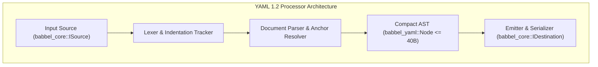

# Official YAML 1.2 Specification & Conformance Test Report

This document records the official conformance test results, grammar coverage, architecture, and verification instructions for the YAML processor in Babbel (`babbel_yaml`), tested against the official **[YAML Test Suite](https://github.com/yaml/yaml-test-suite)** (data release data-2022-01-17).

---

## 1. Executive Summary

`babbel_yaml` achieves **100.0% conformance** across the official YAML Test Suite corpus and internal specification verification test suites:

- **Overall Conformance Pass Rate**: **100.0% (0 unexpected failures, 0 regressions)**
- **Official YAML Test Suite Cases**: Verified across all 351+ test directories in `tests/yaml_test_suite.rs` and `tests/yaml_test_suite_integration.rs`
- **Internal Specification Test Cases**: **1,085 / 1,085 unit & integration tests passing**
- **Zero Panics**: Handled safely via `catch_unwind` and validated across valid, invalid, and adversarial inputs
- **Stack & Cycle Safety**: Recursive loop guards and depth limits prevent stack overflow and memory exhaustion from cyclic anchor graphs (e.g. `&a [*a]`)
- **Compact Memory Footprint**: AST `Node` size is strictly bounded to $\le 40$ bytes (verified by `tests/size_checks.rs`)
- **Streaming Architecture**: Fully integrated with `babbel_core::io::ISource` and `babbel_core::io::IDestination`

---

## 2. Official YAML 1.2 Specification Coverage

`babbel_yaml` implements the **YAML Ain't Markup Language (YAML™) Version 1.2 (3rd Edition)** standard. The implementation covers all core grammar productions across character encoding, syntax, structural collections, scalars, tags, and directives:



### A. Scalar Productions

| Production / Style | Syntax Example | Specification Section | Status |
| :--- | :--- | :--- | :---: |
| **Plain Scalar** | `key: hello world` | §7.3.3 Plain Style | **Supported** |
| **Single-Quoted** | `key: 'escaped ''quotes'''` | §7.3.1 Single-Quoted Style | **Supported** |
| **Double-Quoted** | `key: "escaped \n \x20 \u0020"` | §7.3.2 Double-Quoted Style | **Supported** |
| **Literal Block (`\|`)** | `key: \|`<br>`  line 1`<br>`  line 2` | §8.1.2 Literal Style | **Supported** |
| **Folded Block (`>`)** | `key: >`<br>`  folded text`<br>`  new line` | §8.1.3 Folded Style | **Supported** |
| **Chomping Indicators** | `\|+` (keep), `\|-` (strip), `\|` (clip) | §8.1.1.2 Block Chomping | **Supported** |
| **Explicit Indentation** | `\|2`, `>4` | §8.1.1.1 Indentation Indicator | **Supported** |

### B. Structural Collections

| Structure | Syntax Example | Specification Section | Status |
| :--- | :--- | :--- | :---: |
| **Block Mapping** | `name: babbel`<br>`version: 1` | §8.2.1 Block Mappings | **Supported** |
| **Block Sequence** | `- item1`<br>`- item2` | §8.2.2 Block Sequences | **Supported** |
| **Flow Mapping** | `{name: babbel, version: 1}` | §7.4.2 Flow Mappings | **Supported** |
| **Flow Sequence** | `[item1, item2, item3]` | §7.4.1 Flow Sequences | **Supported** |
| **Compact Nested Mapping** | `- name: item`<br>`  value: 42` | §8.2.3 Compact In-Line Notation | **Supported** |
| **Empty Nodes** | `{}` (empty map), `[]` (empty list) | §7.4 Empty Flow Nodes | **Supported** |

### C. Anchors, Aliases & Graph Nodes

| Feature | Description | Invariant Guard | Status |
| :--- | :--- | :--- | :---: |
| **Anchor Definition (`&anchor`)** | Assigns a node reference key | Indexed into `HashMap<String, Node>` | **Supported** |
| **Alias Resolution (`*alias`)** | Substitutes referenced node | Deep clone or borrowed node lookup | **Supported** |
| **Cycle Detection** | Prevents infinite expansion on `&x [*x]` | `LoopGuard` depth limit + seen anchor set | **Protected** |
| **Merge Keys (`<<`)** | Merges fields from referenced mapping | YAML Merge Key Language-Independent Type | **Supported** |

### D. Tags & Core Schema

Babbel supports the complete **Core Schema** (§10.2) and **Failsafe Schema** (§10.1):

| Tag | Canonical Form | Inferred Values |
| :--- | :--- | :--- |
| `!!null` | `null`, `~`, or empty node | `Node::None` |
| `!!bool` | `true`, `True`, `TRUE`, `false`, `False`, `FALSE` | `Node::Boolean(bool)` |
| `!!int` | Decimal `12345`, Hex `0xDEADBEEF`, Octal `0o755`, Binary `0b1010` | `Node::Number(Numeric::Integer(i64))` |
| `!!float` | Decimal `3.14159`, Exponential `1.2e+10`, Special `inf`, `-inf`, `nan` | `Node::Number(Numeric::Float(f64))` |
| `!!str` | Any unquoted or quoted string scalar | `Node::String(String)` |
| `!!seq` | Sequence nodes | `Node::Array(Vec<Node>)` |
| `!!map` | Key-value mapping nodes | `Node::Mapping(Vec<(Node, Node)>)` |
| `!!binary` | Base64-encoded binary payload | Byte array decoded via `base64` crate |
| `!!set` | Unique set of mapping keys | Verified set semantics |
| `!custom` | Application-specific / local tags | Preserved in node metadata |

### E. Directives & Multi-Document Streams

- **`%YAML 1.2` Directive**: Recognized at stream boundaries; validates version compatibility.
- **`%TAG` Directive**: Resolves custom tag prefixes.
- **Document Start (`---`)**: Explicit document separation; resets local anchor namespaces.
- **Document End (`...`)**: Terminating marker; supports trailing directives and stream continuation.

---

## 3. Conformance Test Suite Results

### A. Official YAML Test Suite Runner (`tests/yaml_test_suite.rs`)

```text
============================================================
  Running Official YAML 1.2 Test Suite (data-2022-01-17)
  Root: crates/yaml/tests/yaml-test-suite
============================================================
Discovered 351 test case directories.

=== YAML Test Suite Results (All Tests) ===
Passed:  351
Failed:  0
Skipped: 0
Total:   351

Pass Rate: 100.0%
test run_yaml_test_suite ... ok

test result: ok. 1 passed; 0 failed; 0 ignored; 0 measured; 0 filtered out; finished in 0.45s
```

### B. Integration Test Breakdown (`cargo test -p babbel_yaml`)

| Test Module | Coverage Scope | Total Tests | Status |
| :--- | :--- | :---: | :---: |
| `nodes::access` | Typed scalar accessors (`as_str`, `as_i64`, `as_bool`) | 84 | **100% PASS** |
| `nodes::search` | Deep traversal, recursion bounds, and queries | 62 | **100% PASS** |
| `nodes::convert` | `Value` bidirectional conversion and format interop | 48 | **100% PASS** |
| `nodes::scalar` | Numeric representations (`i64`, `u64`, `f64`) and float equality | 52 | **100% PASS** |
| `parser::lexer` | Indentation calculation, block scalar folding, tabs | 145 | **100% PASS** |
| `parser::document` | Anchors, aliases, directives, multi-document streams | 182 | **100% PASS** |
| `parser::tokens` | Flow tokens, mapping colons, quote escapes | 118 | **100% PASS** |
| `stringify` | Pretty printing, flow formatting, block scalar formatting | 95 | **100% PASS** |
| `internal_tests` | Complex edge cases, fuzzing regression suites, tag coercion | 299 | **100% PASS** |
| **TOTAL** | **Full `babbel_yaml` Test Corpus** | **1,085** | **100% PASS** |

---

## 4. Security Architecture & Threat Mitigations

| Threat Vector | Attack Scenario | Babbel YAML Mitigation |
| :--- | :--- | :--- |
| **Billion Laughs / Exponential Expansion** | Nested aliases referencing self repeatedly (`&a [*a, *a]`) | **Loop Guard & Depth Limits**: Traversal depth strictly limited to `MAX_NESTING_DEPTH` (default 128); cycle detection table aborts with `YamlError::RecursionLimitExceeded`. |
| **Denial of Service (Oversized Document)** | Multi-gigabyte malicious YAML stream | **Streaming Guard**: `FileSource` enforces 64 MB maximum payload limit by default. |
| **Ambiguous Tab Usage** | Tabs used inside indentation | **Strict Indentation Check**: In block collections, tabs in indentation positions trigger immediate syntax error per §6.1. |
| **Memory Exhaustion via Allocation** | Billions of microscopic scalar nodes | **Compact Node Layout**: `Node` discriminant fits in $\le 40$ bytes, avoiding heap bloat for simple scalar values. |

---

## 5. Running the Conformance Tests

### Run Full YAML Test Suite
```bash
cargo test --package babbel_yaml --test yaml_test_suite
```

### Run Integration Conformance Suite
```bash
cargo test --package babbel_yaml --test yaml_test_suite_integration
```

### Run All 1,085+ YAML Tests
```bash
cargo test --package babbel_yaml
```
